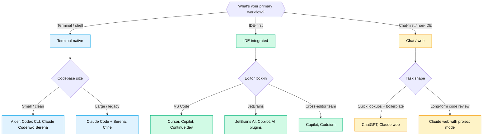

There are roughly forty AI coding tools that get mentioned with a straight face in 2026. Most "top 10" articles are written by people who haven't used eight of the ten they're ranking. I won't pretend to be different. So this isn't a ranking. It's a decision framework, plus an honest take on the four tools I do use day-to-day and a short list of the ones I'm watching from the sideline.

If you're reading this hoping for a single answer, the honest one is: the right tool depends on your workflow, your team, your codebase, and your appetite for change. That's frustrating. It's also true.

---

## Why "best" is the wrong question

The market has already split into roughly four categories, each optimised for a different way of working:

- **Terminal-native agents** (Claude Code, Codex CLI, Aider): you stay in the shell, the AI navigates your repo.
- **IDE-integrated assistants** (Cursor, Windsurf, GitHub Copilot, JetBrains AI Assistant): the AI lives inside your editor.
- **Inline completion** (Copilot at its core, Tabnine, Codeium baseline): pattern-completion as you type.
- **Autonomous agents** (Devin, Sweep, parts of Claude Code's agent mode): multi-hour tasks, repository-level changes, less hand-holding.

A "top 10" that mixes these is ranking apples against pickup trucks. The category that fits your work matters more than the rank within a category.

---

## Five dimensions that move the needle

When I'm evaluating a tool for a team I work with, these are the five axes I weight:

### 1. Workflow shape

Are you most productive in a terminal, in an IDE, or in a chat window? AI tools are not neutral about this. They're built around one workflow and feel awkward in the others. A team that lives in JetBrains will not love a terminal-first tool, no matter how good the model is.

This is the dimension I weight highest. The friction from "wrong workflow shape" outlasts every model improvement.

### 2. Context handling

How does the tool decide what code to read before generating? The two extremes:

- **Manual context curation**: you tell it which files matter. Cheap on tokens, slow on discovery.
- **Automatic codebase indexing**: the tool reads everything, decides what's relevant. Expensive on tokens, fast on discovery.

There's no right answer. Codebases with consistent naming and clean structure benefit from manual curation (cheaper, more deterministic). Legacy codebases benefit from automatic indexing (you don't know where things are). Tools like Serena bring semantic navigation to terminal-native flows. Tools like Cursor build indexing into the editor.

### 3. Code quality and hallucination control

How often does the tool invent libraries, fake APIs, or generate plausible-looking-but-wrong code? Frontier models all hallucinate sometimes. What varies is how aggressively the tool corrects itself when given evidence (a failing test, a wrong import, a missing file).

This is harder to evaluate without using the tool. Benchmark scores (SWE-bench, HumanEval) are useful directionally but don't tell you whether the tool will hallucinate a non-existent Spring annotation on your fourth prompt of the day.

### 4. Pricing and access model

The pricing structures matter more than people admit. The three patterns:

- **Per-seat subscription** (Copilot, Cursor, JetBrains AI): predictable cost, capped value.
- **Usage-based / API** (Claude Code, Codex via API): variable cost, unbounded value.
- **Open-source plus your own API key** (Aider, Cline, Continue.dev, OpenCode): low fixed cost, you bring the model.

If your team needs predictable budgeting, per-seat wins. If individual engineers run heavy AI workloads, usage-based often comes out cheaper at the high end. If you have engineers who want to swap models monthly, open-source-plus-key gives them that freedom.

### 5. Privacy and data control

Where does your code go? Who can see prompts? Is there a "zero data retention" mode? In fintech, health, or regulated industries this isn't optional. In a personal side project it doesn't matter at all.

The honest version: most of the polished commercial tools have similar privacy postures (no training on your code, configurable retention). Open-source tools depend on which API you point them at. Local-only inference is still rare and slow for serious code work.

---

## The decision framework

Putting the five dimensions together into a rough flow:

That tree won't give you a perfect answer. It will narrow the search space from forty tools to three or four. Pick two of those, try them on a real task for two weeks, then decide.

---

## The four tools I use, with the dimensions applied

This is the part where I'm allowed to have opinions.

### Claude Code (terminal-native)

What it's good at: deep multi-file edits, long agentic loops on a single task, codebase reasoning when paired with Serena. The 1M-token context window matters more than the per-call quality for the kind of work I do (architecture changes across many files).

Where it's a bad fit: if your team lives in an IDE and resents the terminal. The integration story for non-CLI workflows is fine but not the strength.

Pricing model is usage-based, which I prefer for variable workloads. A heavy week costs more, a light week costs less.

### Codex (via OpenAI API or the new Codex CLI)

What it's good at: tight, focused code generation. The output style tends to be more compact and conventional than Claude's. For short tasks (write a function, refactor a class), it's often faster to converge.

Where it's a bad fit: very long agentic tasks. The cost curve gets steep, and the multi-file reasoning isn't as patient as Claude's. I'd use it for boilerplate and inline assistance, less for "go figure out why this fails in production."

### Gemini (Code Assist and the API)

What it's good at: cost. The free tier is generous, the paid tier is competitively priced, and the model is solid for typical workloads. If price is the binding constraint (student, indie dev, startup watching burn), this is where I'd start.

Where it's a bad fit: edge-case code, exotic libraries, very long context. The 2-million-token window is impressive on paper, but the practical reasoning beyond ~200k starts to feel thinner than Claude.

### GitHub Copilot (IDE-integrated, Copilot X agent mode)

What it's good at: inline completion. The "ghost text" experience is still the gold standard for in-editor flow. With Copilot X's agent mode it's caught up to the agentic frontier somewhat, though I still find Claude Code or Cursor more capable for multi-file work.

Where it's a bad fit: if you want the same tool across IDE and terminal. Copilot is excellent in the editor and weak outside it.

Pricing is per-seat, which makes it the easy choice for a team that wants budget predictability.

---

## Tools I'm watching but haven't put in production hours on

The honest part. I've read about these, watched demos, talked to people who use them, but I haven't shipped real work with them. Take the impressions accordingly.

- **Cursor**: the consensus pick for AI-first IDE. Engineers I trust who use it describe it as "Copilot but the agent half is much better." If your team is on VS Code and willing to swap editors, this seems like the strongest IDE-integrated option in 2026.

- **Windsurf** (formerly Codeium): the closest competitor to Cursor. Newer, free tier is meaningful, "Arena Mode" for comparing models head-to-head is a feature I'd like to see more places.

- **Kimi**: the model has good benchmark scores, and the API is cheap. The tooling around it (compared to Claude Code or Cursor) is less mature in my reading. Worth watching if cost is your top constraint.

- **Aider** (open source, terminal): the open-source answer to Claude Code, bring-your-own-API-key. Mature, small community, more configurable than the commercial tools. Worth a look if you want full control over which model gets called.

- **Cline** (VS Code extension, open source): similar idea to Aider but inside VS Code. Reportedly strong on multi-step file changes.

- **JetBrains AI Assistant**: the in-house IDE assistant. Good if you live in IntelliJ/PyCharm and don't want to add another vendor. The community reports it's improved noticeably in the last year.

That's not a top-10 ranking. It's six things I'd evaluate before claiming the framework is wrong.

---

## What I'd do if I were starting

The advice I'd give an engineer or a team picking their first AI tool in 2026:

1. **Run the decision tree above.** Narrow to three candidates.
2. **Try two of them for two weeks each** on real work. Not a tutorial. An actual task you'd otherwise do without AI.
3. **Measure friction, not output quality.** The model differences at the top of the market are small. The workflow-fit differences are large.
4. **Pick the one your team will keep using.** A worse tool that gets used daily beats a better tool that requires a workflow change nobody completes.
5. **Revisit in six months.** The market moves quickly. Re-running the framework annually is reasonable.

The framework matters more than the ranking. The ranking will change. The fact that you have to pick based on workflow shape, context, quality, price, and privacy will not.

---

## Sources / further reading

- [LogRocket: AI dev tool power rankings, March 2026](https://blog.logrocket.com/ai-dev-tool-power-rankings/) - useful for the weighted-criteria approach.
- [Faros: Best AI coding agents for 2026, real-world developer reviews](https://www.faros.ai/blog/best-ai-coding-agents-2026) - their five-dimension evaluation framework influenced mine.
- [NxCode: Best AI Coding Tools 2026 ranking](https://www.nxcode.io/resources/news/best-ai-for-coding-2026-complete-ranking) - benchmark-focused if that's your weighting.
- [Checkmarx: Top 12 AI Developer Tools 2026](https://checkmarx.com/learn/ai-security/top-12-ai-developer-tools-in-2026-for-security-coding-and-quality/) - security-leaning angle.

Most of those are rankings. None of them are wrong. None of them are the framework you'll want for your team.
