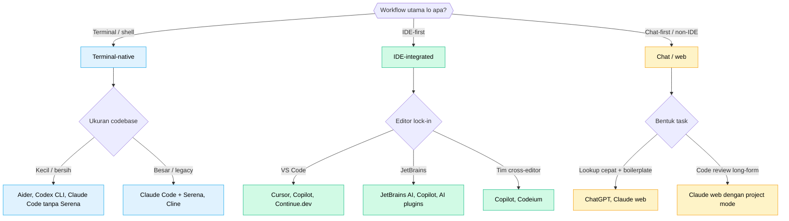

Ada sekitar empat puluh AI coding tool yang masih disebut orang dengan muka serius di 2026. Mayoritas artikel "top 10" ditulis sama orang yang nggak pakai delapan dari sepuluh tool yang mereka ranking. Gw nggak bakal pura-pura beda. Jadi ini bukan ranking. Ini decision framework, plus opini jujur soal empat tool yang gw pakai sehari-hari dan list pendek yang gw watching dari sideline.

Kalau lo baca ini berharap satu jawaban final, jawaban jujurnya: tool yang tepat tergantung workflow lo, tim lo, codebase lo, dan tolerance lo ke perubahan. Itu frustrating. Itu juga true.

---

## Kenapa "best" itu pertanyaan yang salah

Market udah split jadi sekitar empat kategori, masing-masing optimized buat cara kerja yang beda:

- **Terminal-native agent** (Claude Code, Codex CLI, Aider): lo tetep di shell, AI navigate repo lo.
- **IDE-integrated assistant** (Cursor, Windsurf, GitHub Copilot, JetBrains AI Assistant): AI tinggal di dalam editor lo.
- **Inline completion** (Copilot di core-nya, Tabnine, Codeium baseline): pattern-completion sambil lo ngetik.
- **Autonomous agent** (Devin, Sweep, sebagian Claude Code mode agent): task multi-jam, perubahan level repository, less hand-holding.

"Top 10" yang campur empat kategori ini sama aja kayak ranking apel sama pickup truck. Kategori yang cocok sama kerjaan lo itu lebih penting daripada rank di dalam kategorinya.

---

## Lima dimensi yang gerakin needle

Pas gw evaluate tool buat tim yang gw temenin, ini lima axis yang gw kasih bobot:

### 1. Bentuk workflow

Lo paling produktif di terminal, di IDE, atau di chat window? AI tool itu nggak netral soal ini. Mereka dibangun di sekitar satu workflow dan kerasa kagok di yang lain. Tim yang hidup di JetBrains nggak bakal suka tool terminal-first, sebagus apapun model-nya.

Ini dimensi yang gw kasih bobot paling tinggi. Friction dari "workflow shape yang salah" itu bertahan lebih lama daripada setiap model improvement.

### 2. Context handling

Tool mutusin baca kode apa sebelum generate? Dua ekstrim-nya:

- **Manual context curation**: lo bilangin file mana yang penting. Hemat token, lambat discovery.
- **Automatic codebase indexing**: tool baca semua, mutusin sendiri yang relevan. Mahal token, cepat discovery.

Nggak ada jawaban yang bener. Codebase dengan naming konsisten dan struktur bersih lebih untung di manual curation (lebih murah, lebih deterministic). Codebase legacy lebih untung di automatic indexing (lo nggak tau di mana barangnya). Tool kayak Serena bawa semantic navigation ke flow terminal-native. Tool kayak Cursor bangun indexing ke dalam editor.

### 3. Kualitas kode dan kontrol halusinasi

Seberapa sering tool ngarang library, fake API, atau generate kode yang kelihatan plausible tapi salah? Frontier model semua kadang halusinasi. Yang variasi itu seberapa aggressive tool koreksi diri pas dikasih bukti (failing test, import salah, file yang nggak ada).

Ini lebih susah di-evaluate tanpa pakai tool-nya. Benchmark score (SWE-bench, HumanEval) berguna directionally tapi nggak ngasih tau lo apakah tool bakal ngarang Spring annotation yang nggak exist di prompt keempat hari ini.

### 4. Pricing dan access model

Struktur pricing itu lebih penting daripada yang orang mau akuin. Tiga pattern-nya:

- **Per-seat subscription** (Copilot, Cursor, JetBrains AI): cost predictable, value capped.
- **Usage-based / API** (Claude Code, Codex via API): cost variable, value unbounded.
- **Open-source plus API key sendiri** (Aider, Cline, Continue.dev, OpenCode): fixed cost rendah, lo bawa model sendiri.

Kalau tim lo butuh budgeting yang predictable, per-seat menang. Kalau engineer individual jalanin AI workload yang berat, usage-based sering keluar lebih murah di high end. Kalau lo punya engineer yang mau swap model tiap bulan, open-source-plus-key kasih mereka freedom itu.

### 5. Privacy dan data control

Kode lo ke mana? Siapa yang bisa lihat prompt? Ada mode "zero data retention"? Di fintech, health, atau industri regulated ini nggak optional. Di personal side project nggak matter sama sekali.

Versi jujurnya: mayoritas tool komersial yang polished punya posture privacy yang mirip (no training on your code, retention configurable). Tool open-source tergantung lo arahin ke API mana. Local-only inference masih jarang dan lambat buat kerjaan kode yang serius.

---

## Decision framework

Lima dimensi tadi digabung jadi flow kasar:

Tree itu nggak bakal kasih jawaban perfect. Tapi dia narrow search space dari empat puluh tool ke tiga atau empat. Pilih dua, coba di kerjaan real selama dua minggu, baru putusin.

---

## Empat tool yang gw pakai, dengan dimensi-dimensi tadi diaplikasiin

Ini bagian di mana gw boleh punya opini.

### Claude Code (terminal-native)

Yang dia jago: edit multi-file yang dalem, loop agentic panjang di satu task, codebase reasoning kalau dipasangin sama Serena. Context window 1M-token itu lebih matter daripada kualitas per-call buat tipe kerjaan yang gw lakuin (architecture change di banyak file).

Di mana dia bad fit: kalau tim lo hidup di IDE dan males ke terminal. Cerita integration buat workflow non-CLI fine tapi bukan strength-nya.

Pricing model usage-based, yang gw prefer buat workload yang variable. Minggu berat cost lebih banyak, minggu santai cost lebih dikit.

### Codex (via OpenAI API atau Codex CLI baru)

Yang dia jago: generate kode yang ketat, fokus. Style output-nya cenderung lebih compact dan conventional dibanding Claude. Buat task pendek (tulis function, refactor class), sering lebih cepet converge.

Di mana dia bad fit: task agentic yang sangat panjang. Cost curve-nya jadi steep, dan reasoning multi-file nggak se-patient Claude. Gw bakal pakai dia buat boilerplate dan inline assistance, less buat "pergi cari tau kenapa ini fail di production".

### Gemini (Code Assist dan API)

Yang dia jago: cost. Free tier-nya generous, paid tier-nya competitively priced, dan model-nya solid buat workload typical. Kalau price itu binding constraint (student, indie dev, startup yang lagi awasin burn), ini tempat gw bakal mulai.

Di mana dia bad fit: kode edge-case, library exotic, context yang sangat panjang. Window 2-juta-token impressive di paper, tapi reasoning praktis di atas ~200k mulai kerasa lebih tipis dibanding Claude.

### GitHub Copilot (IDE-integrated, Copilot X agent mode)

Yang dia jago: inline completion. Experience "ghost text"-nya masih gold standard buat in-editor flow. Dengan Copilot X agent mode dia udah ngejar frontier agentic agak banyak, walau gw masih nemu Claude Code atau Cursor lebih capable buat kerjaan multi-file.

Di mana dia bad fit: kalau lo mau tool yang sama di IDE dan terminal. Copilot excellent di editor dan weak di luar itu.

Pricing per-seat, yang bikin dia pilihan gampang buat tim yang mau predictable budget.

---

## Tool yang gw watching tapi belum gw pakai serius

Bagian jujurnya. Gw udah baca soal mereka, nonton demo, ngobrol sama orang yang pakai, tapi gw belum ship kerjaan real pakai mereka. Terima impression-nya accordingly.

- **Cursor**: pilihan consensus buat IDE AI-first. Engineer yang gw percaya yang pakai Cursor bilang "kayak Copilot tapi setengah agent-nya jauh lebih bagus". Kalau tim lo di VS Code dan rela swap editor, ini kayaknya opsi IDE-integrated paling kuat di 2026.

- **Windsurf** (dulu Codeium): kompetitor paling deket sama Cursor. Lebih baru, free tier-nya meaningful, "Arena Mode" buat banding model head-to-head itu feature yang gw pengen ada di lebih banyak tempat.

- **Kimi**: model-nya punya benchmark score bagus, dan API-nya murah. Tooling di sekitarnya (dibanding Claude Code atau Cursor) less mature di bacaan gw. Worth watching kalau cost adalah constraint top lo.

- **Aider** (open source, terminal): jawaban open-source ke Claude Code, bring-your-own-API-key. Mature, komunitas kecil, lebih configurable dibanding tool komersial. Worth dilirik kalau lo mau kontrol penuh soal model mana yang dipanggil.

- **Cline** (VS Code extension, open source): ide mirip Aider tapi di dalem VS Code. Katanya kuat di file change multi-step.

- **JetBrains AI Assistant**: IDE assistant in-house. Bagus kalau lo hidup di IntelliJ atau PyCharm dan males nambah vendor lagi. Komunitas bilang dia improve noticeable di tahun terakhir.

Itu bukan ranking top-10. Itu enam hal yang bakal gw evaluate sebelum bilang framework-nya salah.

---

## Yang bakal gw lakuin kalau gw mulai dari nol

Saran yang bakal gw kasih ke engineer atau tim yang lagi milih AI tool pertama mereka di 2026:

1. **Jalanin decision tree di atas.** Narrow ke tiga kandidat.
2. **Coba dua di antaranya selama dua minggu masing-masing** di kerjaan real. Bukan tutorial. Task asli yang biasanya lo kerjain tanpa AI.
3. **Ukur friction, bukan output quality.** Perbedaan model di top market itu kecil. Perbedaan workflow-fit itu besar.
4. **Pilih yang tim lo bakal tetep pakai.** Tool yang lebih jelek tapi dipakai harian kalah sama tool yang lebih bagus tapi butuh perubahan workflow yang nggak ada yang nyelesain.
5. **Revisit dalam enam bulan.** Market gerak cepet. Re-run framework setahun sekali itu reasonable.

Framework lebih matter daripada ranking. Ranking bakal berubah. Fakta bahwa lo harus milih berdasarkan workflow shape, context, quality, price, dan privacy itu nggak berubah.

---

## Sumber / bacaan lanjutan

- [LogRocket: AI dev tool power rankings, March 2026](https://blog.logrocket.com/ai-dev-tool-power-rankings/) - berguna buat pendekatan weighted-criteria.
- [Faros: Best AI coding agents for 2026, real-world developer reviews](https://www.faros.ai/blog/best-ai-coding-agents-2026) - framework lima dimensi mereka influence punya gw.
- [NxCode: Best AI Coding Tools 2026 ranking](https://www.nxcode.io/resources/news/best-ai-for-coding-2026-complete-ranking) - benchmark-focused kalau itu weighting lo.
- [Checkmarx: Top 12 AI Developer Tools 2026](https://checkmarx.com/learn/ai-security/top-12-ai-developer-tools-in-2026-for-security-coding-and-quality/) - angle security-leaning.

Mayoritas dari itu ranking. Nggak ada yang salah. Nggak ada yang framework yang bakal lo butuhin buat tim lo.
