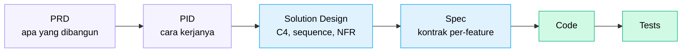

Ada pola yang saya lihat berulang di banyak tim engineering: AI dipakai untuk generate kode, tapi tidak untuk hal-hal yang terjadi *sebelum* kode ditulis.

PRD masih ditulis manual. Solution design masih sepenuhnya dipikirkan dari nol. Sequence diagram masih digambar sendiri. Spesifikasi teknis masih dikerjakan tanpa bantuan.

Lalu ketika kode sudah jadi dan ternyata salah arah, semua disalahkan ke AI.

Masalahnya bukan AI-nya. Masalahnya adalah *di mana* AI dipakai.

---

## Bottleneck Sebenarnya Ada di Upstream

Coba hitung berapa waktu yang habis sebelum engineer pertama menulis baris kode pertama:

| Aktivitas | Tanpa AI | Dengan AI |
|---|---|---|
| Drafting PRD | 2–4 hari | 2–4 jam |
| Solution Design | 3–5 hari | 1–2 hari |
| Boilerplate Code | 1–2 hari | 2–4 jam |

Angka ini bukan klaim marketing — ini estimasi dari workflow nyata di tim kami di DOKU, perusahaan payment gateway yang menangani jutaan transaksi per hari.

Kalau kamu hanya pakai AI untuk generate kode tapi PRD-nya masih butuh 4 hari, kamu hanya mengoptimasi 20% dari total waktu. Sisanya tetap manual.

---

## AI Bukan Pengganti Engineer — AI Eliminasi Pekerjaan Membosankan

Ini framing yang penting dan sering salah dipahami.

AI tidak menggantikan keputusan arsitektur. AI tidak menggantikan domain knowledge payment fintech yang dibangun selama bertahun-tahun. AI tidak menggantikan judgment seorang Solution Architect atau Tech Lead.

Yang AI eliminasi adalah *pekerjaan yang membosankan namun perlu*:
- Menulis template PRD dari nol
- Membuat sequence diagram dari spesifikasi yang sudah ada di kepala
- Generate boilerplate service yang polanya sudah predictable
- Mendokumentasikan kode lama yang tidak ada dokumentasinya

Ini pekerjaan yang valuable tapi bukan tempat engineer seharusnya menghabiskan sebagian besar waktunya.

---

## Workflow yang Kami Pakai: PRD → PID → Code

Di DOKU, kami membangun workflow yang melibatkan AI dari tahap paling awal:

Bukan sekadar melempar prompt ke AI dan mengharap hasilnya bagus. Tapi workflow terstruktur di mana setiap tahap punya tool yang tepat dan cara interaksi yang berbeda.

**PRD (Product Requirements Document)** adalah tentang *apa yang akan dibangun* — untuk PM dan stakeholder. AI membantu drafting, iterasi, dan memastikan semua user story dan acceptance criteria tercakup.

**PID (Project Implementation Document)** adalah tentang *bagaimana teknisnya* — untuk engineer dan QA. Ini lebih spesifik: API contract, sequence diagram, NFR dengan angka konkret, dependency ke service lain.

**Solution Design** adalah jembatan antara keduanya — mengambil PID dan menerjemahkannya ke arsitektur yang bisa diimplementasi, termasuk diagram C4 dan validasi terhadap pola arsitektur yang sudah ada.

Baru setelah semua itu, kode ditulis.

---

## Tool yang Tepat untuk Setiap Tahap

Ini yang sering diabaikan: tidak semua tahap cocok dengan tool yang sama.

**Claude Web** (interface chat) lebih cocok untuk:
- Ideasi dan brainstorming awal
- Upload wireframe Figma atau PDF requirement
- Iterasi dokumen PRD yang panjang
- Review final bersama stakeholder

**Claude Code** (CLI/IDE) lebih cocok untuk:
- Konversi PRD → PID karena bisa akses codebase existing lewat Serena
- Generate solution design yang sadar konteks arsitektur yang sudah ada
- Validasi terhadap pattern yang sudah dipakai di codebase

Menggunakan Claude Code untuk drafting PRD awal itu seperti menggunakan obeng untuk memukul paku — bisa, tapi bukan tool yang tepat.

---

## Kenapa Solution Design Adalah Checkpoint Paling Kritis

Di antara semua tahap, solution design adalah yang paling penting untuk tidak diskip atau dikerjakan terburu-buru.

Ini tempat di mana semua asumsi harus diselesaikan sebelum satu baris kode ditulis. Kalau asumsi salah diselesaikan di sini, biayanya adalah revisi sequence diagram dan dokumen. Kalau asumsi salah baru ketahuan setelah kode selesai, biayanya jauh lebih mahal.

AI membantu solution design bukan dengan membuat keputusan arsitektur — itu tetap tanggung jawab SA atau Tech Lead. AI membantu dengan:

- Generate sequence diagram dari spesifikasi yang sudah didefinisikan
- Mengidentifikasi negative scenario yang terlewat
- Menyusun API contract secara konsisten
- Menghasilkan C4 component diagram sebagai starting point

Reviewnya tetap dilakukan manusia. Validasinya tetap dilakukan manusia. Tapi draftnya tidak perlu dikerjakan dari nol.

---

## Anti-Pattern yang Sering Terjadi

Dari pengamatan kami, ada beberapa pola yang membuat AI-assisted workflow gagal di tahap upstream:

**Prompt terlalu pendek.** "Buatkan PRD untuk fitur transfer uang" menghasilkan output yang generik dan tidak berguna. AI butuh konteks: platform apa, user yang mana, constraint apa, stack teknologi apa.

**Langsung minta dokumen final.** Kualitas output jauh lebih baik kalau diiterasi — draft dulu, review, tambahkan edge case, tambahkan error scenario, baru finalisasi.

**Tidak memberikan constraint.** Tanpa constraint yang eksplisit, AI akan membuat asumsi. Untuk sistem payment production, asumsi yang salah bisa berujung ke rework yang mahal. Selalu berikan constraint: "Jangan propose rewrite. Tetap backward-compatible. Stack-nya Java 17 + Spring Boot."

**Tidak review output AI.** Ini yang paling berbahaya. Halusinasi di level PRD atau solution design yang tidak terdeteksi akan menjadi bug di level kode.

---

## Kesimpulan

AI paling powerful bukan ketika dipakai untuk menulis kode — tapi ketika dipakai dari awal workflow engineering, dari PRD sampai ke kode.

Kalau kamu hanya pakai AI untuk generate kode, kamu meninggalkan potensi terbesar yang tidak terpakai. Bottleneck terbesar di proses software development kebanyakan ada *sebelum* kode ditulis.

Seri artikel ini akan membahas setiap tahap secara detail: dari cara pakai Serena untuk efisiensi token di codebase besar, cara generate solution design yang benar, sampai structured code generation yang hasilnya konsisten dan sesuai pola tim.

Mulai dari yang paling fundamental dulu: bagaimana AI bisa membaca codebase kamu secara akurat tanpa menghabiskan semua token yang ada.

---

*Artikel ini bagian dari seri **AI-Assisted Software Development** — pengalaman lapangan menggunakan Claude Code di tim engineering payment fintech.*
