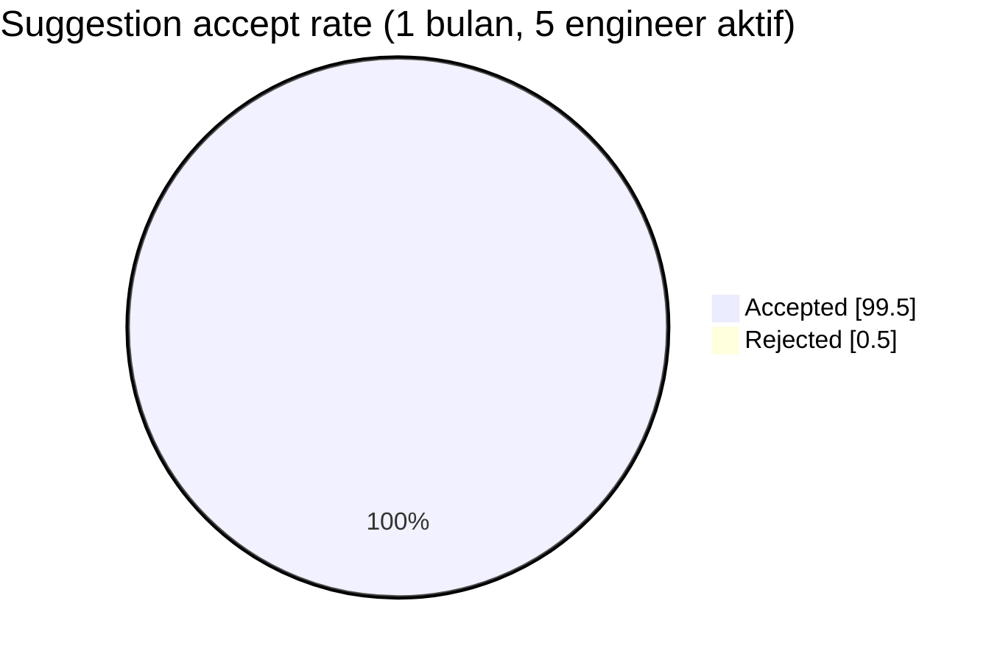

Saya bukan tipe orang yang mudah excited dengan *AI tools hype*. Sudah terlalu banyak tools yang datang dengan klaim revolusioner tapi layu sebelum berkembang di production environment.

Tapi angka ini bikin saya berhenti sejenak:

> **110,172 lines of code accepted. 99.5% suggestion accept rate.**

Itu data tim engineering kami dalam satu bulan — bukan benchmark, bukan demo environment. Production codebase, payment fintech, Java + Spring Boot + microservices.

Ini cerita jujurnya.

---

## Konteks: Siapa Kami

Kami tim engineering di perusahaan payment gateway yang menangani jutaan transaksi per hari. Stack utama kami: Java (7 sampai 21, ya semua versi itu hidup berdampingan), Spring Boot, PostgreSQL, Kafka, Kubernetes di Alibaba Cloud.

Bukan greenfield startup dengan codebase bersih. Kami punya legacy sistem yang sudah jalan lebih dari satu dekade, integrasi ke puluhan bank dan payment network, dan standar compliance PCI DSS yang tidak bisa dikompromikan.

Kondisi yang tidak ideal untuk eksperimen AI coding tools — dan justru itu yang membuat datanya menarik.

---

## Kenapa Mulai Pakai Claude Code?

Bukan karena ikut tren. Kami punya masalah nyata:

1. **Velocity lambat di repetitive tasks** — generate unit test, buat boilerplate service baru, dokumentasi internal. Semua manual, semua memakan waktu engineer yang seharusnya fokus ke problem solving.

2. **Knowledge transfer tidak efisien** — codebase lama dengan logika yang tidak terdokumentasi. Onboarding engineer baru memakan waktu berminggu-minggu hanya untuk memahami flow dasar.

3. **Code review bottleneck** — SA dan Tech Lead jadi bottleneck karena reviewer terbatas.

Claude Code masuk sebagai eksperimen — bukan mandate dari atas, tapi dari rasa ingin tahu kami sendiri.

---

## Apa yang Kami Lakukan Pertama Kali

Langkah pertama yang benar: **buat internal skill marketplace**.

Alih-alih melepas engineer pakai Claude Code tanpa arahan, kami membangun koleksi `SKILL.md` — file instruksi yang memberikan konteks spesifik tentang codebase kami kepada Claude Code. Satu plugin per use case:

- `service-test-generator` — generate unit test sesuai pattern Spring Boot kami
- `api-contract-reviewer` — review OpenAPI spec terhadap internal standard
- `migration-helper` — bantu konversi JPQL ke native PostgreSQL query

Ini game changer. Claude Code tanpa konteks domain itu pintar tapi generik. Dengan SKILL.md yang tepat, outputnya langsung relevan ke codebase spesifik kami.

---

## Datanya: Satu Bulan Pemakaian

Dari Analytics dashboard Claude Team kami:

| Metrik | Value |
|---|---|
| Lines of code accepted | 110,172 |
| Suggestion accept rate | 99.5% |
| Active members | 5 dari 10 |

Angka 99.5% accept rate ini yang paling menarik. Artinya dari setiap 200 suggestion yang diberikan Claude Code, hanya 1 yang ditolak engineer.

Apakah ini berarti Claude Code selalu benar? Tidak.

Artinya engineer kami sudah belajar **cara bertanya yang tepat**. Garbage in, garbage out masih berlaku. Tapi ketika prompt-nya spesifik dan konteksnya jelas, outputnya konsisten layak diterima.

---

## Yang Benar-Benar Membantu

**1. Unit test generation**

Ini paling signifikan. Engineer yang tadinya butuh 2-3 jam untuk menulis comprehensive test suite untuk satu service, sekarang bisa selesai dalam 30-45 menit. Bukan karena Claude Code menulis semuanya — tapi karena draft awalnya sudah 70% benar dan hanya perlu refinement.

**2. Debugging legacy code**

Memberikan Claude Code sepotong kode Java 7 yang tidak terdokumentasi dan meminta penjelasan flow-nya. Konsisten menghasilkan penjelasan yang akurat. Ini sangat membantu untuk engineer baru yang onboarding.

**3. Boilerplate untuk pattern berulang**

Kami punya pattern standar untuk membuat Kafka consumer, REST client dengan retry logic, atau DTO mapper. Claude Code dengan konteks SKILL.md bisa generate-nya sesuai standar internal kami.

---

## Yang Tidak Bekerja (Atau Belum)

**1. Complex business logic di domain payment**

QRIS reconciliation flow, settlement calculation dengan edge case bank tertentu, fee calculation dengan aturan merchant-specific — ini tidak bisa diserahkan ke Claude Code begitu saja. Outputnya terlihat benar tapi subtle error di business logic payment bisa berujung ke financial loss.

Pelajaran: Claude Code adalah *thought partner*, bukan *decision maker* untuk domain kritis.

**2. Half of the team tidak pakai**

5 dari 10 member aktif. 5 lainnya: nol usage. Bukan karena dilarang — tapi karena adoption tidak organik terjadi sendiri. Perlu effort aktif untuk onboarding, bukan sekadar kasih akses.

**3. Context window limit di legacy monolith**

Untuk codebase yang sudah besar dan saling terhubung, Claude Code kadang kehilangan konteks di tengah task. Perlu dibantu dengan file yang tepat dibuka, bukan ekspektasi bahwa Claude Code "ngerti sendiri."

---

## Pelajaran untuk SA / Tech Lead

Kalau kamu bertanggung jawab atas adopsi AI tools di tim:

**Jangan lepas tangan.** Engineer perlu diajari cara prompt yang efektif, cara validasi output, dan kapan harus tidak percaya AI.

**Buat guardrail dulu, baru buka akses.** SKILL.md kami adalah guardrail — memberikan constraint dan konteks agar output tetap sesuai standar tim.

**Ukur yang benar.** Accept rate tinggi tidak selalu berarti productivity tinggi. Ukur juga: apakah bug rate berubah? Apakah PR cycle time membaik?

**Adoptionnya tidak otomatis.** 50% tim kami masih zero usage setelah satu bulan. Ini PR problem, bukan tools problem.

---

## Kesimpulan

110,172 lines accepted bukan angka yang perlu dirayakan secara membabi buta. Tapi angka itu cukup untuk meyakinkan saya bahwa Claude Code layak diinvestasikan lebih jauh — dengan catatan yang jelas tentang batas kemampuannya.

Di industri payment fintech, kepercayaan adalah segalanya. Kami tidak akan menyerahkan keputusan kritis ke AI. Tapi untuk accelerate engineering work yang repetitif dan terdefinisi dengan baik, datanya sudah berbicara.

Eksperimen berlanjut.

---

*Firman Hanafi adalah Solution Architect di perusahaan payment gateway Indonesia dengan fokus pada financial core systems, microservices architecture, dan AI-assisted engineering practices.*
