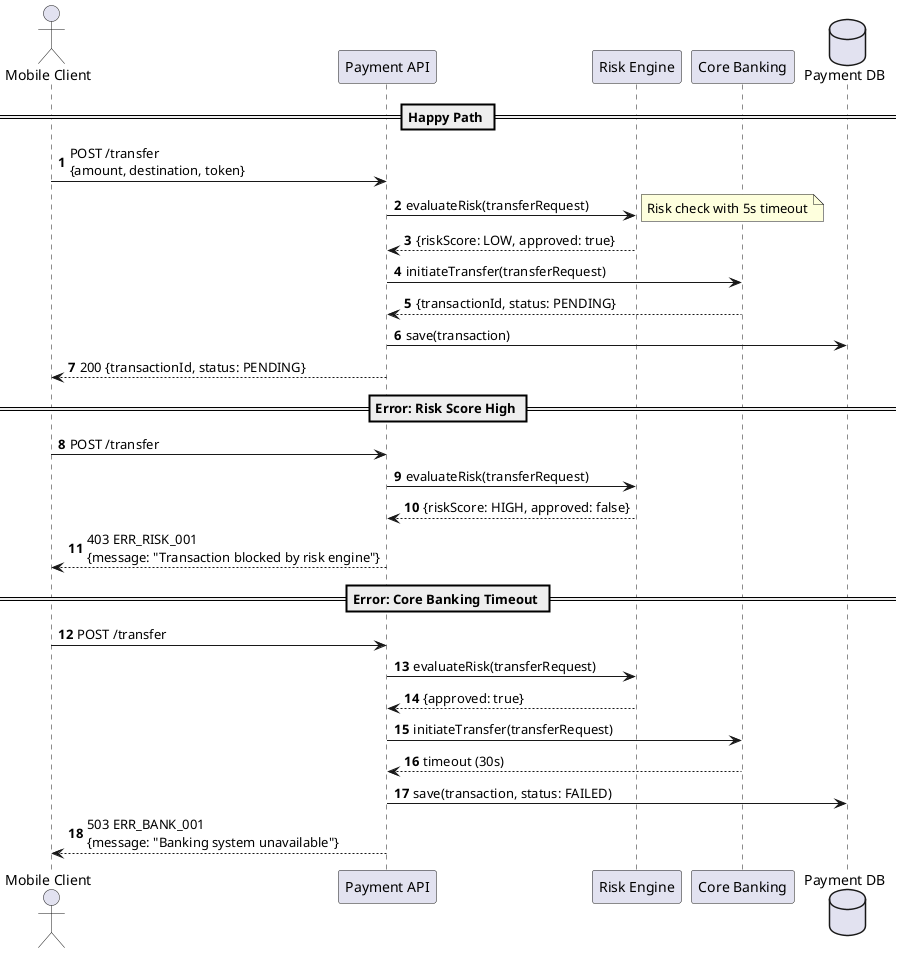

Solution design is the work most often done twice.

The first time in a rush because of a deadline. The second time because the first iteration missed some important scenarios, or the assumptions made turned out to be wrong, or the diagram format was inconsistent with team standards.

AI doesn't eliminate the need for serious solution design. But AI can eliminate the mechanical work within it — initial drafts, PlantUML formatting, error code enumeration — so energy can be focused on the decisions that truly need thinking.

---

## Solution Design Components We Produce

At DOKU, every significant new feature requires a solution design made up of four components:

**Sequence Diagram** — the interaction flow between services, including the happy path and at least two negative scenarios. PlantUML format so it can be rendered and version-controlled.

**C4 Component Diagram** — shows the new components being added and how they relate to existing components. The C4 level we typically use is Level 2 (Container) or Level 3 (Component) depending on complexity.

**API Documentation** — endpoints, request/response schemas, error codes, and example payloads. This becomes the contract between the implementing team and the integrating team.

**NFR (Non-Functional Requirements)** — latency targets, availability SLA, expected throughput. Must be in the form of measurable numbers, not general statements like "must be fast".

---

## Workflow: From PID to Solution Design

The process we follow:

1. Claude Code reads the relevant codebase via Serena (targeted, not all files)
2. PRD/PID is provided as context
3. Generate sequence diagram — happy path first, then negative scenarios
4. Generate C4 Component Diagram
5. Validate against existing architectural patterns in the codebase
6. Review by a senior engineer before implementation begins

Step 6 cannot be skipped. Human review remains mandatory — not because AI is always wrong, but because architectural decisions have long-term consequences that must be understood by the humans responsible.

---

## Prompt Template: Sequence Diagram

This is the prompt template we use. An explicit structure produces far more consistent output:

```
Create a sequence diagram in PlantUML format for [feature name].

Actors:
- [Client] — mobile app or web
- [ServiceA] — describe its responsibility
- [ServiceB] — describe its responsibility
- [ExternalSystem] — name and function

Happy Path:
1. Client sends request to ServiceA with payload [X]
2. ServiceA validates and calls ServiceB
3. ServiceB returns result
4. ServiceA returns response to Client

Error Scenarios:
- If validation fails → return 400 with error code ERR_001
- If ServiceB times out → return 503 with error code ERR_002
- If ServiceB returns unexpected status → return 500 with error code ERR_003

Style: Use autonumber, add notes at important decision points.
```

A few things that are important in this template:

**Always include error scenarios.** If not explicitly defined, AI tends to only generate the happy path. Negative scenarios are precisely what is most often missed in manual solution design.

**Define actors clearly.** "ServiceA" and "ServiceB" are too generic — give them names that match your domain and describe their responsibilities. This helps AI create contextual notes.

**Request autonumber.** PlantUML supports `autonumber` for automatic numbering — this is important when the sequence diagram needs updating because numbers don't need to be manually updated.

---

## Prompt Template: C4 Component Diagram

```
Based on the sequence diagram above and the existing [system name] architecture, 
create a C4 Component Diagram in PlantUML format (C4-PlantUML library).

Context:
- Existing systems: [list of relevant existing systems]
- New components to be added: [name and responsibility]
- External systems: [name and function]

Show:
1. New components (mark with a different color)
2. Relationships with existing components
3. Communication direction and protocol (REST, Kafka, gRPC, etc.)
4. Database used by each component

Use C4-PlantUML syntax with @startuml/@enduml.
```

For better results, also provide one example of an existing component from your codebase as a format reference.

---

## Example Output: PlantUML Sequence Diagram

The output produced is usually ready to render at `plantuml.com` or in VSCode with the PlantUML extension:



This draft was produced from a single prompt with the template above. What usually needs revision: business-specific edge cases and timeout values that match the actual SLA.

---

## Solution Design Checklist

Before solution design is declared complete and implementation can begin, we use this checklist:

- [ ] Happy path sequence diagram is complete and accurate
- [ ] At least 2 negative scenarios for the most likely to occur
- [ ] C4 Component Diagram shows new vs existing components
- [ ] API contract — all endpoints, request/response schema, error codes
- [ ] NFR with concrete numbers: latency target (p95), availability, throughput
- [ ] Validated against existing architectural patterns (not reinventing the wheel)
- [ ] Reviewed by a senior engineer or SA before coding begins

This checklist isn't a formality — each item has consequences if skipped. Negative scenarios not documented in solution design will almost certainly become bugs in production.

---

## What Still Has to Be Done by Humans

For balance: there are parts of solution design where AI *cannot* and *should not* make decisions:

**Architectural trade-offs involving business context.** Should this event be synchronous or asynchronous? Is it better to use one service or split it? These decisions require an understanding of business needs, product roadmap, and team capacity — not just technical correctness.

**Validation against undocumented production constraints.** Old codebases often have behavior not documented anywhere — "if X happens at the same time as Y, there's a race condition in Z". This is only known by engineers who have already debugged that problem.

**Final approval.** Solution designs produced by AI are drafts that need review, not final documents to be executed directly.

---

## Conclusion

AI in solution design isn't about automating architectural decisions — that remains a human responsibility. AI is about eliminating the mechanical work: PlantUML formatting, error code enumeration, consistent document structure.

The result: SAs and Tech Leads can spend more time *thinking* about architecture, not *typing* architecture.

The next article covers one of the most critical but often overlooked things: **spec before code generation**. Why a good spec is the most efficient investment in the AI-assisted development process.

---

*This article is part of the **AI-Assisted Software Development** series — field experience using Claude Code in a payment fintech engineering team.*
