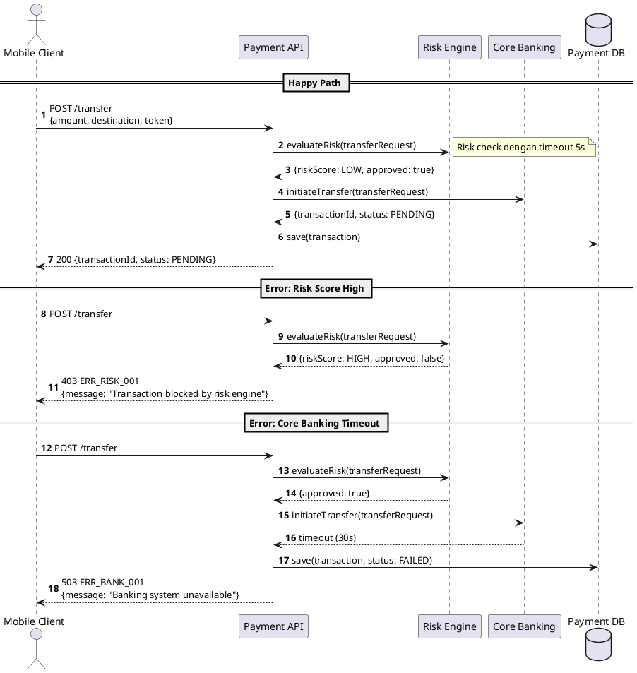

Solution design adalah pekerjaan yang paling sering dikerjakan dua kali.

Pertama kali dikerjakan dengan terburu-buru karena ada deadline. Kedua kali dikerjakan karena iterasi pertama terlewat beberapa skenario penting, atau asumsi yang dibuat ternyata salah, atau format diagram tidak konsisten dengan standar tim.

AI tidak menghilangkan kebutuhan untuk solution design yang serius. Tapi AI bisa menghilangkan pekerjaan mekanis di dalamnya — draft awal, format PlantUML, enumerasi error code — sehingga energi bisa difokuskan ke keputusan yang benar-benar perlu dipikirkan.

---

## Komponen Solution Design yang Kami Buat

Di DOKU, setiap fitur baru yang signifikan membutuhkan solution design yang terdiri dari empat komponen:

**Sequence Diagram** — alur interaksi antar service, termasuk happy path dan minimal dua negative scenario. Format PlantUML sehingga bisa di-render dan di-version control.

**C4 Component Diagram** — menunjukkan komponen baru yang ditambahkan dan bagaimana relasinya dengan komponen existing. Level C4 yang kami pakai biasanya Level 2 (Container) atau Level 3 (Component) tergantung kompleksitas.

**API Documentation** — endpoint, request/response schema, error codes, dan contoh payload. Ini yang menjadi contract antara tim yang implement dan tim yang mengintegrasikan.

**NFR (Non-Functional Requirements)** — latency target, availability SLA, throughput yang diharapkan. Harus dalam bentuk angka yang measurable, bukan pernyataan umum seperti "harus cepat".

---

## Workflow: Dari PID ke Solution Design

Proses yang kami jalankan:

1. Claude Code membaca codebase yang relevan via Serena (targeted, bukan semua file)
2. PRD/PID diberikan sebagai konteks
3. Generate sequence diagram — happy path dulu, lalu negative scenarios
4. Generate C4 Component Diagram
5. Validasi terhadap pola arsitektur yang sudah ada di codebase
6. Review oleh senior engineer sebelum implementasi dimulai

Step 6 tidak bisa di-skip. Review manusia tetap mandatory — bukan karena AI selalu salah, tapi karena keputusan arsitektur punya konsekuensi jangka panjang yang harus dipahami oleh manusia yang bertanggung jawab.

---

## Prompt Template: Sequence Diagram

Ini template prompt yang kami gunakan. Struktur yang eksplisit menghasilkan output yang jauh lebih konsisten:

```
Create a sequence diagram in PlantUML format for [nama fitur].

Actors:
- [Client] — mobile app atau web
- [ServiceA] — describe responsibility-nya
- [ServiceB] — describe responsibility-nya
- [ExternalSystem] — nama dan fungsinya

Happy Path:
1. Client mengirim request ke ServiceA dengan payload [X]
2. ServiceA validasi dan call ServiceB
3. ServiceB return result
4. ServiceA return response ke Client

Error Scenarios:
- Jika validasi gagal → return 400 dengan error code ERR_001
- Jika ServiceB timeout → return 503 dengan error code ERR_002
- Jika ServiceB return status unexpected → return 500 dengan error code ERR_003

Style: Gunakan autonumber, tambahkan notes di decision point penting.
```

Beberapa hal yang penting dalam template ini:

**Selalu sertakan error scenarios.** Kalau tidak didefinisikan secara eksplisit, AI cenderung hanya generate happy path. Negative scenarios justru yang paling sering terlewat di solution design manual.

**Definisikan actors dengan jelas.** "ServiceA" dan "ServiceB" terlalu generik — berikan nama yang sesuai dengan domain kamu dan describe responsibility-nya. Ini membantu AI membuat notes yang kontekstual.

**Minta autonumber.** PlantUML mendukung `autonumber` untuk numbering otomatis — ini penting ketika sequence diagram perlu di-update karena nomor tidak perlu di-update manual.

---

## Prompt Template: C4 Component Diagram

```
Berdasarkan sequence diagram di atas dan arsitektur existing [nama sistem], 
buat C4 Component Diagram dalam format PlantUML (C4-PlantUML library).

Context:
- System yang ada: [list sistem existing yang relevan]
- Komponen baru yang akan ditambahkan: [nama dan responsibility]
- External systems: [nama dan fungsi]

Tunjukkan:
1. Komponen baru (tandai dengan warna berbeda)
2. Relasi dengan komponen existing
3. Arah komunikasi dan protokol (REST, Kafka, gRPC, dll)
4. Database yang dipakai masing-masing komponen

Gunakan C4-PlantUML syntax dengan @startuml/@enduml.
```

Untuk hasil yang lebih baik, berikan juga contoh satu komponen existing dari codebase kamu sebagai referensi format.

---

## Contoh Output: Sequence Diagram PlantUML

Output yang dihasilkan biasanya langsung bisa di-render di `plantuml.com` atau VSCode dengan extension PlantUML:



Draft ini dihasilkan dari satu prompt dengan template di atas. Yang biasanya perlu direvisi: business-specific edge cases dan timeout value yang sesuai dengan SLA aktual.

---

## Checklist Solution Design

Sebelum solution design dinyatakan selesai dan implementasi bisa dimulai, kami pakai checklist ini:

- [ ] Happy path sequence diagram lengkap dan akurat
- [ ] Minimal 2 negative scenario yang paling likely terjadi
- [ ] C4 Component Diagram menunjukkan komponen baru vs existing
- [ ] API contract — semua endpoint, request/response schema, error codes
- [ ] NFR dengan angka konkret: latency target (p95), availability, throughput
- [ ] Validasi terhadap pola arsitektur existing (tidak reinvent wheel)
- [ ] Reviewed oleh senior engineer atau SA sebelum coding dimulai

Checklist ini bukan formalitas — setiap item punya konsekuensi kalau dilewat. Negative scenario yang tidak terdokumentasi di solution design hampir pasti akan menjadi bug di production.

---

## Hal yang Masih Harus Dilakukan Manusia

Untuk keseimbangan: ada bagian dari solution design yang AI *tidak bisa* dan *tidak seharusnya* mengambil keputusan:

**Trade-off arsitektur yang melibatkan context bisnis.** Apakah event ini perlu synchronous atau asynchronous? Apakah lebih baik pakai satu service atau dipecah? Keputusan ini membutuhkan pemahaman tentang kebutuhan bisnis, roadmap produk, dan kapasitas tim — bukan hanya technical correctness.

**Validasi terhadap constraint production yang tidak terdokumentasi.** Codebase lama sering punya behavior yang tidak terdokumentasi di manapun — "kalau X terjadi bersamaan dengan Y, ada race condition di Z". Ini hanya diketahui oleh engineer yang sudah pernah debug masalah itu.

**Final approval.** Solution design yang dihasilkan AI adalah draft yang perlu di-review, bukan dokumen final yang langsung dieksekusi.

---

## Kesimpulan

AI dalam solution design bukan tentang mengotomatisasi keputusan arsitektur — itu tetap tanggung jawab manusia. AI tentang mengeliminasi pekerjaan mekanis: format PlantUML, enumerasi error code, struktur dokumen yang konsisten.

Hasilnya: SA dan Tech Lead bisa menghabiskan lebih banyak waktu untuk *berpikir* tentang arsitektur, bukan *mengetik* arsitektur.

Artikel berikutnya membahas salah satu hal yang paling kritis tapi sering dilewat: **spec sebelum code generation**. Mengapa spec yang baik adalah investasi yang paling efisien dalam proses AI-assisted development.

---

*Artikel ini bagian dari seri **AI-Assisted Software Development** — pengalaman lapangan menggunakan Claude Code di tim engineering payment fintech.*
