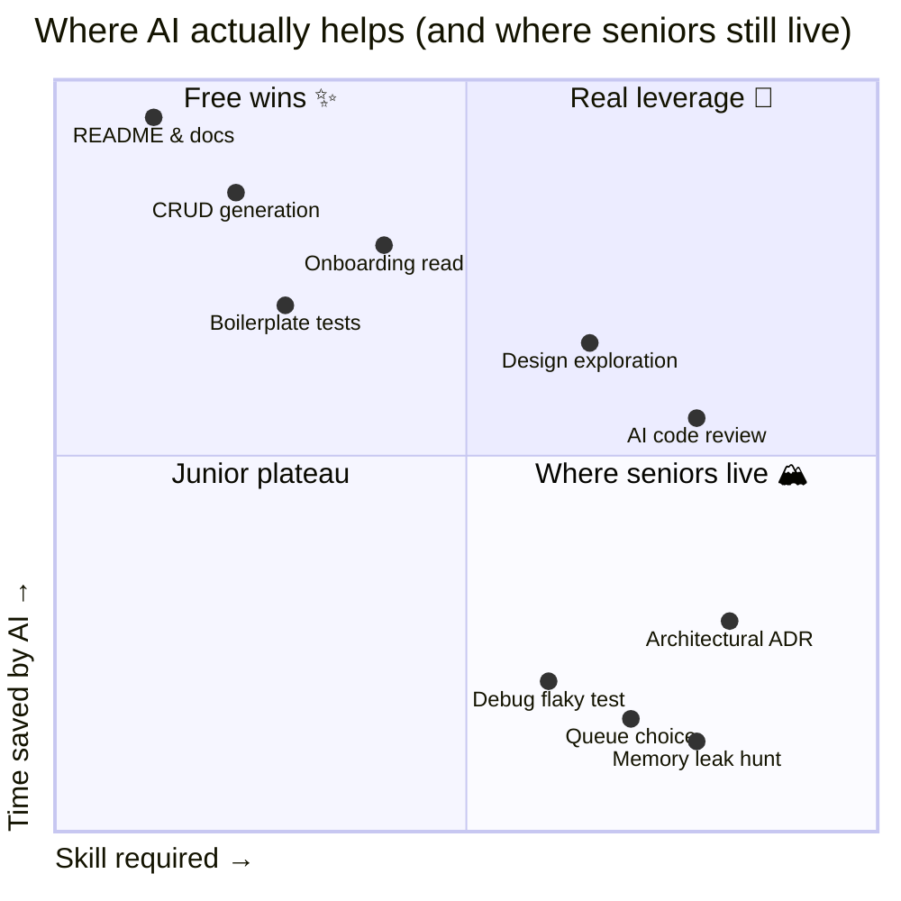
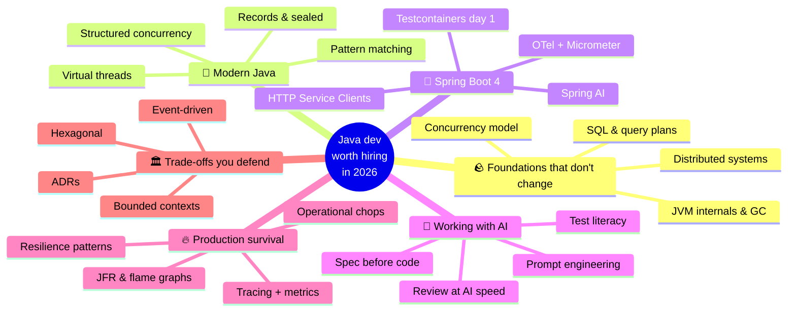
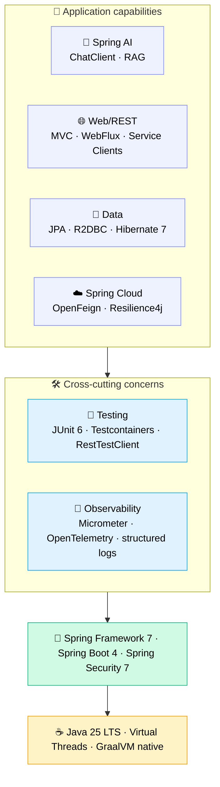
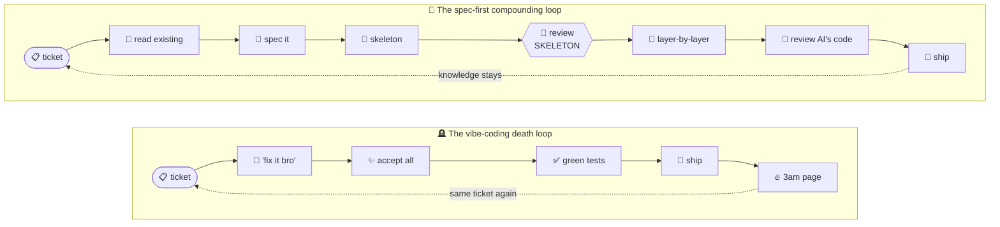
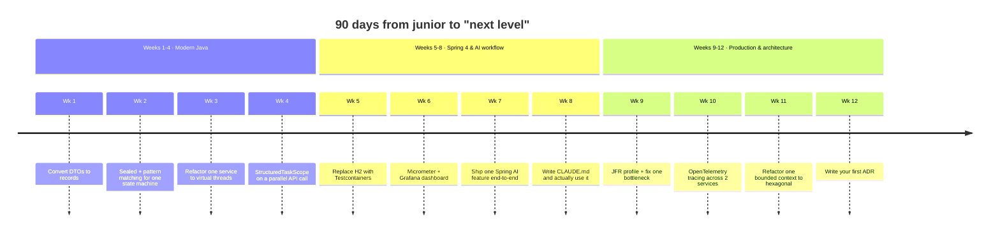

If you can already build a Spring Boot CRUD app, hit Generate in Claude Code, and ship a feature, you're sitting in the same bucket as everybody else who picked up Java a couple of months back. That bar is gone. What AI did was push the next bar higher, and most people I see haven't noticed where it landed.

I'm writing this for junior Java devs who already know the basics and want to figure out what comes next, the part where you stop being someone the team replaces and start being someone the team consults. I'm assuming you've shipped a few Spring Boot apps, you can find your way around an `application.yml`, and a stack trace doesn't make you panic. The gap I want to talk about is the one between "can finish a ticket" and "is the engineer the team wants in the room when an architecture call is being made."

This is part 1 of a series. Future posts will go deep on each phase. For now I'm just trying to lay out the map.

---

## The new bar: what shifted in 2026

A few things moved at roughly the same time.

First, boilerplate quietly stopped being a job. Generating a `@Service` class with constructor injection, four CRUD endpoints, and a paginated list isn't a skill anymore. Claude Code or Cursor will produce it in under a minute, faster than I can come up with the field names myself.

Second, reading other people's code got cheap. Onboarding into a 200k-line legacy codebase used to take three weeks. With Serena and a halfway-decent prompt, you can have architectural intuition by the end of the first day. The slow part is no longer the reading.

Third, validation didn't get any cheaper. Figuring out whether a piece of code behaves correctly under concurrency, whether it leaks resources, whether it falls over under load, whether it quietly breaks an existing contract, all of that still costs the same human hours it always did.

That third point is the one I keep coming back to. Generation maybe got 10× faster (rough estimate, depends a lot on the task). Validation didn't shift much. To be honest I'm not sure how stable this picture is over the next two or three years, because the tooling is still moving, but for now the engineers who'll matter are the ones who can validate fast.

---

## What hasn't changed (and matters more because of that)

These are the foundations AI just doesn't help with. If anything, AI raises the cost of not knowing them, since you can now ship broken code 10× faster.

**JVM internals.** Garbage collection behaviour, memory model, escape analysis. The day you get a 99th-percentile latency spike in production, no AI is going to debug a G1 pause for you if you don't even know what a G1 pause is.

**Concurrency.** Virtual threads (Loom) are the baseline now. They aren't an "advanced" topic. But virtual threads don't make race conditions disappear. Knowing the Java Memory Model, `volatile`, `synchronized`, and the difference between `CompletableFuture.thenApply` and `thenApplyAsync` is what stops you from shipping a bug AI happily produced for you.

**SQL and database internals.** Indexes, query plans, isolation levels, the classic N+1 problem. Hibernate generates beautiful queries, and sometimes catastrophic ones. You need to be able to read EXPLAIN.

**Distributed systems fundamentals.** CAP, idempotency, retries, deduplication, exactly-once illusions. Spring Cloud and Kafka let you build things, but understanding the concepts underneath is what lets you debug them when something goes wrong at 2am.

**System design.** Trade-offs between consistency and availability, when a queue is the right tool versus a database versus a cache, how to scope a bounded context. AI is fine at sketching options. The choice still has to come from you.

If you skip this layer, AI tends to turn into a footgun. You end up shipping code you can't defend in review, even when it looks fine in the test suite.

---

## What AI compresses, and what it doesn't

I find it helpful to be specific about which parts get faster, because the wins are real but very uneven:

| Task | Time before AI | Time with AI | Compression |
|---|---|---|---|
| Generate a CRUD service + tests | 2–3 hours | 20–30 min | ~5× |
| Read an unfamiliar 500-line class | 30 min | 5 min (with Serena) | ~6× |
| Write Javadoc / README | 1 hour | 5 min | ~12× |
| First-pass design exploration | 2 days | 4 hours | ~4× |
| Debug a flaky test | 1 hour | 1 hour | ~1× (no help) |
| Find a memory leak in prod | 4 hours | 4 hours | ~1× (no help) |
| Decide which queue to use | 1 day | 1 day | ~1× (no help) |

The pattern is fairly obvious in hindsight. AI compresses the parts where the answer is sitting in some training data somewhere. It doesn't compress the parts that need reasoning under uncertainty about the specific system you're working on right now.

If you plot it on two axes, how much time AI saves you against how much skill the task requires, the picture looks something like this:

Top-right is where the real leverage is. AI saves time on tasks that already required skill. Bottom-right is where senior engineers tend to live: high skill, but small time savings from AI, which means it's hard for AI to displace you there. The implication for your next year or two, if you're serious about this, is to gradually move your hours from the top-left (the easy-to-commoditize work) toward the bottom-right (the hard-to-copy work), and that shift tends to be slow enough that you only notice it after a few months have passed.

---

## The roadmap

I'd avoid thinking of this as a linear ladder. From what I've seen, the way people grow into the senior tier looks more like a set of branches that feed back into each other:

Nobody finishes "modern Java" and then moves cleanly to "Spring Boot 4." You loop. You go deep on virtual threads, then realise observability is a mess, then realise the architecture isn't quite right, then come back to Java basics with fresher eyes. The branches reinforce each other, and each one will eventually become its own follow-up post.

---

## Phase 1: Stop writing 2018 Java

Java has moved quickly over the last three years and most juniors are still writing it like it's 2018. Java 25 LTS is the current baseline. Features that used to count as "advanced" are now the default:

- **Records** can replace 90% of your DTOs and value objects. Immutable by default, and you get `equals`/`hashCode` for free.
- **Sealed classes plus pattern matching** give you something close to algebraic data types. Useful for state machines, result types, and exhaustive switch statements that genuinely compile-check.
- **Virtual threads (Loom)**: `Thread.startVirtualThread(...)` or `Executors.newVirtualThreadPerTaskExecutor()`. This is the reason most "you must use reactive" advice from 2020 has aged badly.
- **Structured concurrency** (preview, JEP 505 in Java 25). `try (var scope = new StructuredTaskScope.ShutdownOnFailure())`. Treats a group of concurrent tasks as a single unit. Replaces a lot of manual `CompletableFuture` choreography.
- **Scoped values**, the replacement for `ThreadLocal` that works correctly with virtual threads.
- **Pattern matching for switch**, including type patterns and deconstruction. Lets you stop writing `if (x instanceof Y y)` cascades.

[ANECDOTE NEEDED: a story from your own team where a junior generated something with old Java patterns because the surrounding codebase was old, and what you ended up doing about it.]

The thing worth understanding is that AI mirrors whatever style it sees in the codebase. If your codebase is full of pre-Java-17 patterns, AI will keep generating pre-Java-17 patterns. Part of the job of a more senior engineer is to nudge the codebase toward more modern patterns over time, although I'll admit I sometimes have a hard time judging when the upgrade is worth pushing for and when it's better to leave it alone for a while.

---

## Phase 2: Spring Boot 4, properly

Spring Boot 4 (latest GA: 4.0.6) shipped in late 2025 on top of Spring Framework 7, Spring Security 7, JUnit 6, Hibernate 7.1, and Jackson 3. If you're still on 3.x, the upgrade is the first thing on the list. The upgrade itself isn't difficult. The reason to do it is that most of what's interesting in 2026 lives on 4.

You probably already know Spring Web MVC, JPA, and how to write a `@RestController`. Picture the next layer up like a stack: the layers below carry the layers above, and you don't get to skip the bottom and start at the top.

What's genuinely new in Spring Boot 4 and worth your attention:

- **HTTP Service Clients (interface-based).** Define an interface, get a client. Spring writes the implementation for you. Replaces a lot of hand-written `RestClient` and `WebClient` boilerplate.
- **Virtual thread integration for HTTP clients.** Synchronous-style code with async-style scaling, end to end.
- **API versioning support.** First-class. No more bolted-on workarounds.
- **Null-safety via JSpecify.** `@Nullable` and `@NonNull` are taken seriously across the framework. Your IDE catches issues at compile time.
- **Modular codebase.** Smaller, more focused modules. Faster startup, smaller native images.
- **`RestTestClient`.** Replaces a fair bit of the `MockMvc` ceremony, and reads more cleanly.

A few opinions you're free to disagree with:

- Reactive is no longer the default answer. With virtual threads, plain MVC scales to thousands of concurrent connections without anyone having to touch callback hell. WebFlux still has a place when you genuinely have backpressure or streaming requirements. Outside of that, MVC is fine.
- Testcontainers should honestly be on the project from day one. H2 and embedded Postgres lie about behaviour. Real Postgres in a container catches real bugs.
- Observability should not be optional. Get Micrometer and OpenTelemetry in from the start. The first time you debug a production issue without traces, you'll remember why people kept telling you to.
- Spring AI is part of the platform now. `ChatClient`, structured output, RAG via `VectorStore`. If your team doesn't have at least one feature backed by an LLM by 2026, my honest sense is that you'll struggle to catch up next year, although I'd accept this is a hot take and people can reasonably disagree.

---

## Phase 3: Working with AI without losing your brain

This is the layer that didn't really exist five years ago. Most juniors don't even register it as a skill. The difference between someone who uses AI well and someone who uses it badly looks roughly like two cycles spinning in opposite directions:

Look at the dotted lines. The vibe-coding loop drops you back at the same ticket. The spec-first loop drops you back at a similar ticket but with a much better mental model of the codebase than you had last time. Both cycles accumulate, just in opposite directions.

The skills that sit inside Phase 3:

**Spec-first development.** Before you write a prompt, write a CLAUDE.md or SPEC.md that lays out the constraints, conventions, and references. Then generate. The quality of the output usually tracks the quality of the spec.

**Reviewing code at the speed AI produces it.** You're not really the author anymore. You're the reviewer, and that changes the kind of attention you have to bring. Subtle bugs, weak tests, hidden N+1 queries, patterns that don't match the surrounding codebase, all moving past you at AI's output rate.

**Test literacy.** AI tends to generate tests that pass, and that's part of the problem. A passing test that doesn't exercise the failure mode is worse than no test at all, because it gives you false confidence. You have to read what's being tested *and* what isn't.

**Prompt engineering for code.** How to provide context (Serena helps a lot), how to constrain output, how to do checkpoint-based generation, when to reach for a Skill versus an Agent.

**AI governance.** What you don't send to AI: customer PII, credentials, internal patents, competitor-sensitive architecture. In regulated domains your team probably already has policy on this, and even when the policy looks fussy, there's usually a reason somebody got bitten before.

[ANECDOTE NEEDED: a real moment from your own work where spec-first dramatically changed an output, or where vibe-coding caused a problem in prod. Be specific about what you saw, what surprised you, and what got fixed.]

---

## Phase 4: Surviving production

Code in production behaves nothing like code in your tests. Reading that gap is the skill.

- **Tracing and metrics.** OpenTelemetry across services. Custom Micrometer metrics for business KPIs. Distributed tracing in Jaeger, Tempo, or Datadog.
- **Performance.** JFR (Java Flight Recorder) for profiling, async-profiler for flame graphs, GC log analysis. The first time you fix a p99 latency issue by tuning `-XX:G1MaxNewSizePercent`, something clicks that's hard to teach beforehand.
- **Resilience patterns.** Circuit breakers, bulkheads, timeouts on every external call, idempotency keys for retries, deduplication windows.
- **Operational skills.** Reading logs across pods, querying Prometheus, writing a runbook somebody else can use under stress. None of this is glamorous, but it tends to be what separates engineers who stay calm on-call from the ones who don't.

Phase 4 is the layer where AI helps the least. Production debugging is reasoning under uncertainty about one specific system, and generic answers usually don't apply. You'll spend a lot of time here, and even though that can feel unproductive if you measure yourself by features shipped, this is also the part of the job that's hardest to commoditize, at least from what I've watched over the last couple of years.

---

## Phase 5: Trade-offs you can defend

By the time you get here, you should be willing to take opinionated calls. A non-exhaustive list of the kinds of calls you'll be making:

- **Event-driven architecture.** Kafka, outbox pattern, sagas, idempotent consumers, CDC (Debezium). When you reach for events versus when you stay with REST.
- **CQRS.** When to split read and write models, and when not to (most of the time, not).
- **Hexagonal / ports-and-adapters.** Why your business logic shouldn't import Spring annotations. Why your `@Service` becomes a code smell at scale.
- **Bounded contexts.** Conway's Law. When a microservice split represents a real boundary versus a distributed monolith dressed up.
- **API design.** REST versus gRPC versus GraphQL: actual trade-offs, usually different in different contexts, rather than blog-post-flavoured conviction.
- **Data modelling.** Event sourcing isn't always the answer. Append-only logs aren't always the answer. Boring CRUD with a clear schema is honestly the right call more often than people want to admit.

The signal that you've matured into the AI era tends to be the trade-offs you can articulate without googling, and just as much, the frequency with which you can say "I'm not sure about this case, let me check," without that bothering you.

---

## The 90-day playbook

Here's a calendar to make this less hand-wavy: twelve weeks, one shipped artefact per week. If you're serious about this, it's worth opening your calendar app right now.

Twelve commits, twelve PR descriptions, each one a piece of work you can point to in an interview a year from now and say "that's what I learnt that quarter." The thing that's harder than putting the calendar together is the discipline of auditing it at the end of each week to check the artefact is real and not still sitting on your todo list.

---

## Anti-patterns to avoid

These are the ways juniors get stuck in 2026, and AI tends to expose them faster than the older failure modes used to.

**Vibe coding.** Generating without reading, shipping without understanding. The first prod incident teaches the lesson, expensively.

**Skipping tests because the AI got it right.** It gets things right around 95% of the time, and the remaining 5% is where the bugs live. Tests are how you bound how much you trust the output rather than a ritual to skip.

**Believing AI-generated tests are real coverage.** They often test the implementation rather than the contract, and they often only cover the happy path. Read them. Don't only count the green dots.

**Stack-jumping every quarter.** Quarkus, Micronaut, and Helidon are all interesting. Mastering one (Spring Boot, in your case) is what makes you employable. Diversify later, after you have depth somewhere.

**Ignoring observability.** "It worked locally" has a very short shelf life once you're carrying the pager.

**Treating AI as authoritative.** It hallucinates Spring annotations, invents Hibernate methods, occasionally makes up JEP numbers. Building a habit of verifying against the official docs is something to do up front, because every time you get caught, the cost is much higher than the five minutes you saved.

---

## What you become

A junior Java dev in 2021 was valuable for being able to write code. A junior Java dev in 2026 is valuable for being able to validate code, instrument it, defend it in review, and articulate the trade-offs that led to it being shaped that way.

The role has moved from author to something closer to editor-architect-validator. Each of these skills sits on top of the ones underneath, and although the bar is genuinely higher than it used to be, the leverage on the other side is also higher: a competent dev with AI today ships what a five-person team used to ship two years ago.

The trap that's easy to fall into is thinking AI is doing the work for you. What it's doing is the *typing*. The judgement, the choices about what reaches production, those still belong to you, and that part isn't going to move to anyone else.

---

That's the map. Future posts in this series will go deep on each phase, starting with **Phase 1: Modern Java fluency** (records, sealed classes, virtual threads, structured concurrency in real production patterns).

If there's only one thing I'd want you to take away, it's something like this: try not to generate code you wouldn't be ready to defend in tomorrow's review. That single rule tends to guide the other decisions for you, although I'll admit I cheat on it myself when deadlines get tight, so I'm not pretending it's an easy rule to keep.
