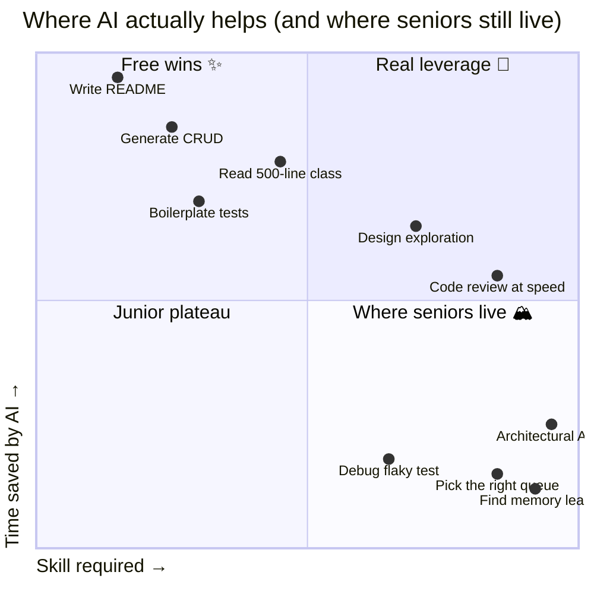
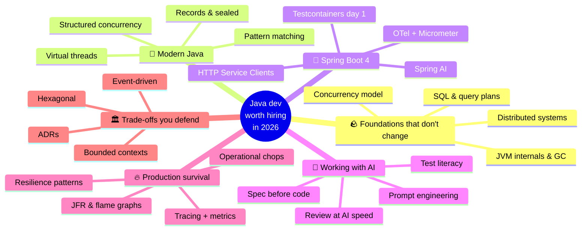
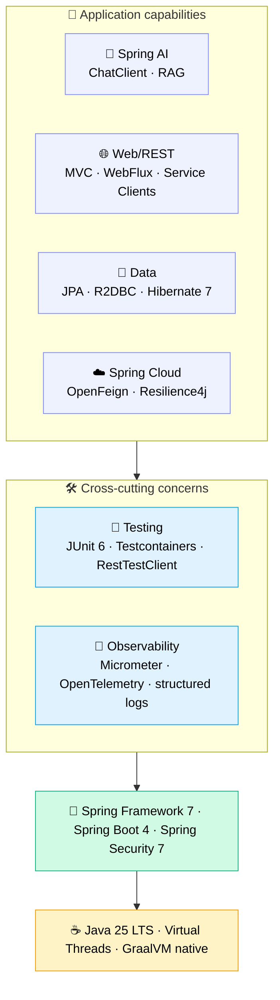
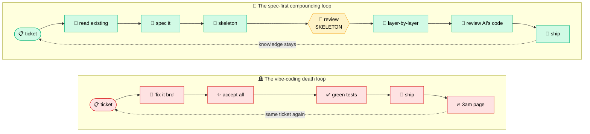
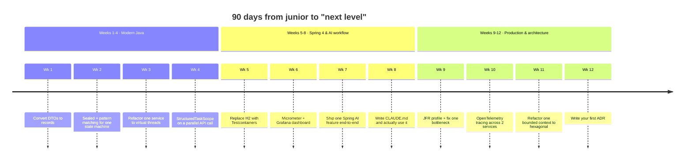

If you can already build a Spring Boot CRUD app, hit "Generate" in Claude Code, and ship a feature — congratulations, you're in the same bucket as everyone else who tried Java for two months. That bar got commoditized. AI didn't lower it; it moved.

This is a roadmap for junior Java developers who already know the basics and want to know **what to learn next** to stay valuable in 2026. It assumes you've shipped a few Spring Boot apps, know your way around an `application.yml`, and don't get scared by a stack trace. What follows is what separates "can finish a ticket" from "is the engineer the team actually wants in the room when the architecture decision is being made."

This is **part 1 of a series**. Future posts will go deep on each phase. For now, the goal is the map.

---

## The new bar: what changed in 2026

Three things changed at the same time:

1. **Boilerplate disappeared.** Generating a `@Service` class with constructor injection, four CRUD endpoints, and a paginated list isn't a skill anymore. Claude Code or Cursor produces it in 30 seconds, faster than you can think of the field names.

2. **Reading other people's code became cheap.** Onboarding to a 200k-line legacy codebase used to take three weeks. With Serena + a competent prompt, you get architectural intuition in a day. The slow part is no longer reading.

3. **Validation didn't get cheaper.** Knowing whether a piece of code is actually correct — handles concurrency right, doesn't leak resources, doesn't degrade under load, doesn't break the existing contract — still costs the same human effort it always did.

That last point is the entire game. **Generation got 10× faster. Validation didn't.** The engineers who matter in 2026 are the ones who can validate fast.

---

## What still matters (and matters more than ever)

These are the foundations that AI doesn't touch. If anything, AI raises the cost of not knowing them — because you can ship broken code 10× faster.

**JVM internals.** Garbage collection behavior, memory model, escape analysis. The day you have a 99th-percentile latency spike in production, no AI is going to debug a G1 pause for you if you don't know what a G1 pause is.

**Concurrency.** Virtual threads (Loom) are now table stakes — they're not "advanced." But virtual threads don't make race conditions disappear. Knowing the Java Memory Model, `volatile`, `synchronized`, and the difference between `CompletableFuture.thenApply` and `thenApplyAsync` is what stops you from shipping a bug AI happily generated.

**SQL and database internals.** Indexes, query plans, isolation levels, `N+1` problems. Hibernate generates queries — beautiful, sometimes catastrophic queries. You need to read EXPLAIN.

**Distributed systems fundamentals.** CAP, idempotency, retries, deduplication, exactly-once illusions. Spring Cloud and Kafka let you build things; understanding lets you debug them.

**System design.** Trade-offs between consistency and availability, when to use a queue vs a database vs a cache, how to scope a bounded context. AI can sketch options. It cannot decide for you.

If you skip this layer, AI becomes a footgun. You'll ship code you can't defend in code review.

---

## What AI actually compresses

Be specific about what becomes faster. The wins are real, but uneven:

| Task | Time before AI | Time with AI | Compression |
|---|---|---|---|
| Generate a CRUD service + tests | 2–3 hours | 20–30 min | ~5× |
| Read an unfamiliar 500-line class | 30 min | 5 min (with Serena) | ~6× |
| Write Javadoc / README | 1 hour | 5 min | ~12× |
| First-pass design exploration | 2 days | 4 hours | ~4× |
| Debug a flaky test | 1 hour | 1 hour | ~1× (no help) |
| Find a memory leak in prod | 4 hours | 4 hours | ~1× (no help) |
| Decide which queue to use | 1 day | 1 day | ~1× (no help) |

**The pattern:** AI compresses the parts where the answer exists in some training data somewhere. It doesn't compress the parts that require reasoning under uncertainty about *your* system.

Plotted on two axes — how much time AI saves you vs. how much skill the task requires — it looks like this:

Top-right is real leverage — AI saves time on tasks that already required skill. Bottom-right is where seniors live — high skill, low time savings. That's where AI doesn't displace you. The whole game is to spend less time in the top-left (free wins, easy to commoditize) and more time in the bottom-right (uncopyable, where your judgment is the value).

So your job in 2026 is simple to state, hard to do: **spend less time on the cheap parts, more time on the expensive parts.**

---

## The roadmap

Forget the linear ladder. The way you actually grow looks more like this — branches that feed each other, not phases you finish before unlocking the next:

You don't finish "modern Java" then start "Spring Boot 4." You loop. You go deep on virtual threads, then realize you need to fix observability, then notice the architecture is wrong, then come back to Java basics with new eyes. The branches reinforce each other.

Each branch is a future post. Skim it here; we'll go deep elsewhere.

---

## Phase 1 — Stop writing 2018 Java

Java moved fast in the last three years and most juniors are still writing 2018 Java. Java 25 LTS is the current baseline. The features that used to be "advanced" are now the default:

- **Records** — replace 90% of your DTOs and value objects. Immutable by default, `equals`/`hashCode` for free.
- **Sealed classes + pattern matching** — algebraic data types. Use them for state machines, result types, and exhaustive switch statements that actually compile-check.
- **Virtual threads (Loom)** — `Thread.startVirtualThread(...)` or `Executors.newVirtualThreadPerTaskExecutor()`. The reason most "must use reactive" advice from 2020 is now wrong.
- **Structured concurrency** (preview, JEP 505 in Java 25) — `try (var scope = new StructuredTaskScope.ShutdownOnFailure())`. Treats a group of concurrent tasks as a single unit. Replace most of your manual `CompletableFuture` orchestration.
- **Scoped values** — replacement for `ThreadLocal` that works correctly with virtual threads.
- **Pattern matching for switch** — including type patterns and deconstruction. Stops you from writing `if (x instanceof Y y)` cascades.

**Why this matters in the AI era:** AI generates whatever style your codebase exhibits. If your codebase is full of pre-Java-17 patterns, AI will generate more pre-Java-17 patterns. Your seniority is partly measured by the modernity of the patterns you steer the codebase toward.

---

## Phase 2 — Spring Boot 4, properly

Spring Boot 4 (latest GA: 4.0.6) shipped in late 2025 on top of Spring Framework 7, Spring Security 7, JUnit 6, Hibernate 7.1, and Jackson 3. If you're still on 3.x, the upgrade is the first thing on your list — not because the upgrade is hard, but because most of what's interesting in 2026 ships on 4.

You probably know Spring Web MVC, JPA, and how to write a `@RestController`. The next layer:

Picture it as a stack — the layers below carry the layers above. You don't get to skip the bottom and start at the top.

What's actually new in Spring Boot 4 worth your attention:

- **HTTP Service Clients (interface-based).** Define an interface, get a client. Spring generates the implementation. Replaces most hand-written `RestClient` / `WebClient` boilerplate.
- **Virtual thread integration for HTTP clients.** Synchronous-style code with async scaling characteristics, end to end.
- **API versioning support.** First-class instead of bolted on.
- **Null-safety with JSpecify.** `@Nullable` / `@NonNull` taken seriously across the framework. IDE catches issues at compile time.
- **Modular codebase.** Smaller, more focused modules. Faster startup, smaller native images.
- **`RestTestClient`.** Replaces a lot of `MockMvc` ceremony. Reads cleaner.

A few opinions:

- **Reactive is no longer the default answer.** With virtual threads, plain MVC scales to thousands of concurrent connections without callback hell. Use WebFlux when you genuinely have backpressure or streaming requirements. Otherwise stay with MVC.
- **Testcontainers should be on day one.** H2 and embedded Postgres lie about behavior. Real Postgres in a container catches real bugs.
- **Observability is non-negotiable.** Add Micrometer + OpenTelemetry from the start. The first time you debug a production issue without traces, you'll remember why.
- **Spring AI is now part of the platform.** `ChatClient`, structured output, RAG via `VectorStore`. If your team doesn't have at least one feature backed by an LLM, you're behind.

---

## Phase 3 — Working with AI without losing your brain

This is the new layer. Most juniors don't realize this is a skill in itself. Here's the difference between someone who uses AI well vs. someone who uses it poorly, sketched as a workflow comparison:

Notice the dotted lines. Vibe coding loops *back to the same ticket*; spec-first loops back with *more knowledge of the codebase*. Both cycles compound — one against you, the other for you.

The skills inside Phase 3:

**Spec-first development.** Before you write a single prompt, you write a CLAUDE.md / SPEC.md describing the constraints, conventions, and references. Then you generate. The quality of AI output is directly proportional to the spec quality.

**Code review at AI speed.** You're not the author anymore. You're the reviewer. That changes everything. You need to spot subtle bugs, weak tests, hidden N+1 queries, and patterns that don't match your codebase — at the rate AI produces them.

**Test literacy.** AI generates passing tests. That's a problem. A passing test that doesn't exercise the failure mode is worse than no test, because it gives false confidence. You need to read what was tested vs. what was *not* tested.

**Prompt engineering for code.** Specifically: how to provide context (Serena), how to constrain output, how to do checkpoint-based generation, when to use a Skill vs. an Agent.

**AI governance.** What you don't send to AI: customer PII, credentials, internal patents, competitor-sensitive architecture. This is non-negotiable in fintech, health, government.

---

## Phase 4 — Surviving production

Code in production behaves differently from code in your tests. The skill is reading that difference.

- **Tracing & metrics.** OpenTelemetry across services. Custom Micrometer metrics for business KPIs. Distributed tracing in Jaeger / Tempo / Datadog.
- **Performance.** JFR (Java Flight Recorder) for profiling, async-profiler for flame graphs, GC log analysis. The first time you fix a 99th-percentile latency by tuning `-XX:G1MaxNewSizePercent`, you graduate.
- **Resilience patterns.** Circuit breakers, bulkheads, timeouts at every external call, idempotency keys for retries, deduplication windows.
- **Operational chops.** Reading logs across pods, querying Prometheus, writing a useful runbook. Not glamorous; pays the bills.

**This is the layer where AI helps least.** Production debugging is reasoning under uncertainty about a specific system. Generic answers don't apply. You'll spend a lot of time here, and that's the point — it's the layer that's hardest to commoditize.

---

## Phase 5 — Trade-offs you can defend

By the time you're here, you should be making opinionated calls. A non-exhaustive list:

- **Event-driven architecture.** Kafka, outbox pattern, sagas, idempotent consumers, CDC (Debezium). When events vs. when REST.
- **CQRS** — when to split read/write models, when not to (most of the time, not).
- **Hexagonal / ports-and-adapters.** Why business logic shouldn't import Spring annotations. Why your `@Service` is a code smell at scale.
- **Bounded contexts.** Conway's Law. When a microservice split is a real boundary vs. a distributed monolith.
- **API design.** REST vs. gRPC vs. GraphQL — actual trade-offs, not opinions copied from a blog.
- **Data modeling.** Event sourcing isn't always right. Append-only logs aren't always right. Boring CRUD with a clear schema is often the right answer.

The signal that you're senior in the AI era isn't the tools you use — it's the trade-offs you can articulate without looking them up.

---

## The 90-day playbook

Talk is cheap. Here's the calendar — twelve weeks, one shipped artefact per week. Open your calendar app right now if you're serious.

Twelve commits. Twelve PR descriptions. Each one a thing you can point to in a job interview a year from now and say "this is what I learned that quarter." That beats most engineers' entire portfolios.

---

## Anti-patterns to avoid

These are the ways juniors get stuck in 2026. AI exposes them faster than they used to be exposed.

**Vibe coding.** Generating without reading. Shipping without understanding. The first prod incident will teach you, but at high cost.

**Skipping tests because AI got it right.** AI gets it 95% right and the 5% is exactly where bugs live. Tests aren't ceremonial; they're how you bound the trust.

**Believing AI-generated tests are real coverage.** They often test the implementation, not the contract. They often only test happy paths. Read them; don't just count the passing dots.

**Stack-jumping every quarter.** Quarkus, Micronaut, Helidon are interesting; mastering one (Spring Boot) makes you employable. Diversify after, not before.

**Ignoring observability.** "It worked locally." This phrase ages out very quickly when you carry the pager.

**Treating AI as authority.** AI hallucinates Spring annotations, makes up Hibernate methods, invents JEP numbers. Verify against official docs. Always.

---

## What you become

A junior Java dev in 2021 became valuable by being able to write code. A junior Java dev in 2026 becomes valuable by being able to **validate code, instrument it, defend it in review, and articulate the trade-offs that led to it.**

The role shifted from author to editor-architect-validator. The skills compound. The bar is higher, but the leverage is also higher: a competent dev with AI ships what a 5-person team shipped two years ago.

That's the opportunity. Don't fall into the trap of thinking AI is doing the work for you. AI is doing the *typing* for you. The work — the judgment — is still yours.

---

This was the map. The next posts in this series go deep on each phase: starting with **Phase 1: Modern Java fluency** (records, sealed classes, virtual threads, structured concurrency in production patterns).

If you want a single piece of advice to take away: **stop generating code you wouldn't be willing to defend in code review tomorrow.** That one constraint will guide every other decision.
