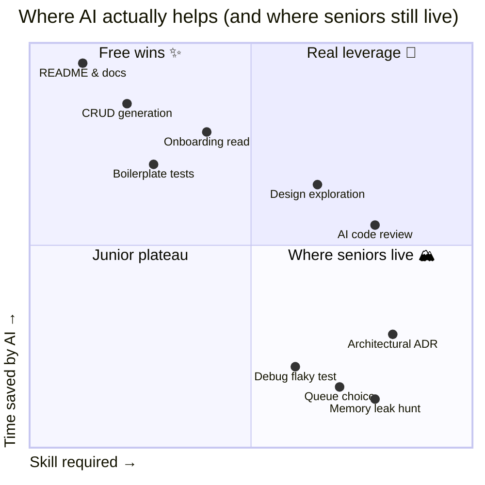
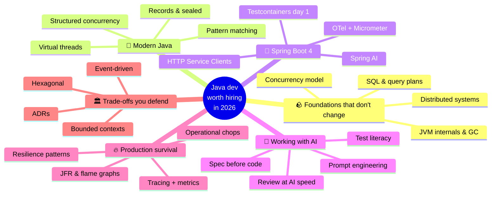
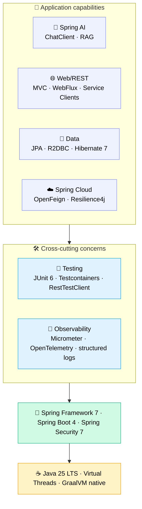
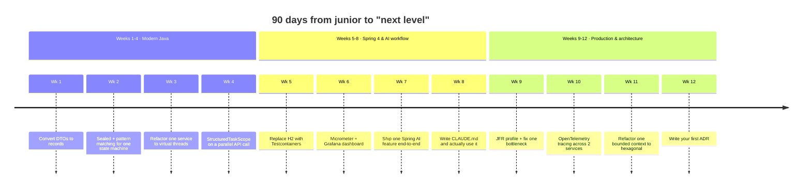

Honestly? If you can already build a Spring Boot CRUD app, hit "Generate" in Claude Code, and ship a feature, you're in the same bucket as everyone else who picked up Java a couple of months ago. That bar got commoditized. The AI just moved it higher.

This roadmap is for junior Java developers who already know the basics and want to figure out what to learn next to stay valuable in 2026. I'm assuming you've shipped a few Spring Boot apps, you know your way around an `application.yml`, and a stack trace doesn't make you panic. What I want to talk about is the gap between "can finish a ticket" and "the engineer the team actually wants in the room when an architecture decision is being made."

This is part 1 of a series. Future posts will go deep on each phase. For now I just want to get the map down.

---

## The new bar: what changed in 2026

A few things shifted at roughly the same time.

First, boilerplate basically disappeared as a job. Generating a `@Service` class with constructor injection, four CRUD endpoints, and a paginated list isn't really a skill anymore. Claude Code or Cursor will produce it in 30 seconds, faster than you can come up with the field names.

Second, reading other people's code got cheap. Onboarding into a 200k-line legacy codebase used to be a three-week affair. With Serena and a halfway-competent prompt, you'll have architectural intuition in a day. The slow part isn't the reading anymore.

Third, validation stayed exactly as expensive as before. Working out whether a piece of code actually behaves correctly under concurrency, whether it leaks resources, whether it degrades under load, whether it quietly breaks an existing contract — that still takes the same human hours it always did.

That third point is what really matters. Generation got maybe 10× faster. Validation didn't move at all. So the engineers who matter in 2026 are the ones who can validate fast.

---

## What still matters (and matters more than ever)

These are the foundations AI just doesn't touch. If anything, AI raises the cost of not knowing them, because now you can ship broken code 10× faster.

**JVM internals.** Garbage collection behavior, memory model, escape analysis. The day you get a 99th-percentile latency spike in production, no AI is going to debug a G1 pause for you if you don't even know what a G1 pause is.

**Concurrency.** Virtual threads (Loom) are baseline now. They're not "advanced" anymore. But virtual threads don't make race conditions disappear. Knowing the Java Memory Model, `volatile`, `synchronized`, and the difference between `CompletableFuture.thenApply` and `thenApplyAsync` is what stops you from shipping a bug that AI happily generated for you.

**SQL and database internals.** Indexes, query plans, isolation levels, the classic N+1. Hibernate generates beautiful queries. Sometimes catastrophic ones. You need to be able to read EXPLAIN.

**Distributed systems fundamentals.** CAP, idempotency, retries, deduplication, exactly-once illusions. Spring Cloud and Kafka let you build things. Understanding is what lets you debug them when they go wrong.

**System design.** Trade-offs between consistency and availability, when a queue is the right answer vs a database vs a cache, how to scope a bounded context. AI is fine at sketching options. The choice still has to be yours.

Skip this layer and AI becomes a footgun. You'll be shipping code you can't defend in review.

---

## What AI actually compresses

It helps to be specific about which parts get faster, because the wins are real but very uneven:

| Task | Time before AI | Time with AI | Compression |
|---|---|---|---|
| Generate a CRUD service + tests | 2–3 hours | 20–30 min | ~5× |
| Read an unfamiliar 500-line class | 30 min | 5 min (with Serena) | ~6× |
| Write Javadoc / README | 1 hour | 5 min | ~12× |
| First-pass design exploration | 2 days | 4 hours | ~4× |
| Debug a flaky test | 1 hour | 1 hour | ~1× (no help) |
| Find a memory leak in prod | 4 hours | 4 hours | ~1× (no help) |
| Decide which queue to use | 1 day | 1 day | ~1× (no help) |

The pattern is fairly obvious in retrospect. AI compresses the parts where the answer is sitting in some training data somewhere. It doesn't compress the parts that need reasoning under uncertainty about *your* specific system.

Plotted on two axes (how much time AI saves you vs. how much skill the task takes), it looks like this:

Top-right is the real leverage zone. AI saves time on tasks that already needed skill. Bottom-right is where seniors live: high skill, low time savings, AI can't really displace you there. The whole point of the next few years is to spend less time in the top-left (free wins, easy to commoditize) and more time in the bottom-right (the uncopyable part, where your judgment is the value).

Easy to say, hard to actually do: spend less time on the cheap parts, more time on the expensive parts.

---

## The roadmap

Forget the linear ladder. The way people actually grow looks more like this: branches that feed each other, not phases you finish before unlocking the next one.

Nobody actually finishes "modern Java" and then starts "Spring Boot 4." You loop. You go deep on virtual threads, then realize you need to fix observability, then notice the architecture is wrong, then come back to Java basics with fresh eyes. The branches keep reinforcing each other.

Each branch will turn into its own post eventually. For now just skim, we'll go deep elsewhere.

---

## Phase 1 — Stop writing 2018 Java

Java has moved fast in the last three years, and most juniors are still writing it like it's 2018. Java 25 LTS is the current baseline. Features that used to count as "advanced" are now just default:

- **Records** can replace 90% of your DTOs and value objects. Immutable by default, `equals`/`hashCode` for free.
- **Sealed classes plus pattern matching** give you algebraic data types. Useful for state machines, result types, exhaustive switch statements that actually compile-check.
- **Virtual threads (Loom)**: `Thread.startVirtualThread(...)` or `Executors.newVirtualThreadPerTaskExecutor()`. The reason most "you must use reactive" advice from 2020 has aged badly.
- **Structured concurrency** (preview, JEP 505 in Java 25). `try (var scope = new StructuredTaskScope.ShutdownOnFailure())`. Treats a group of concurrent tasks as a single unit. Replaces most of your manual `CompletableFuture` choreography.
- **Scoped values**, the replacement for `ThreadLocal` that actually works correctly with virtual threads.
- **Pattern matching for switch**, including type patterns and deconstruction. Means you can stop writing `if (x instanceof Y y)` cascades.

A while back I reviewed a PR from a junior on my team. Whole thing was Java 8 patterns, even though the project was already on Java 21. When I asked why, the answer was: "the AI generated it that way." Sure enough, the codebase was 80% legacy style. AI just mirrors what it sees. So if your codebase is full of pre-Java-17 patterns, AI will keep generating pre-Java-17 patterns. Like it or not, your seniority is partly measured by how modern the patterns you steer the codebase toward actually are.

---

## Phase 2 — Spring Boot 4, properly

Spring Boot 4 (latest GA: 4.0.6) shipped in late 2025 on top of Spring Framework 7, Spring Security 7, JUnit 6, Hibernate 7.1, and Jackson 3. If you're still on 3.x, the upgrade should be the first thing on your list. Not because the upgrade itself is hard, but because most of what's interesting in 2026 lives on 4.

You probably already know Spring Web MVC, JPA, and how to write a `@RestController`. The next layer up looks like this.

Picture it as a stack: the layers below carry the layers above. You don't get to skip the bottom and start at the top.

What's actually new in Spring Boot 4 worth your attention:

- **HTTP Service Clients (interface-based).** Define an interface, get a client. Spring generates the implementation. Replaces most hand-written `RestClient` / `WebClient` boilerplate.
- **Virtual thread integration for HTTP clients.** Synchronous-style code with async scaling characteristics, end to end.
- **API versioning support.** First-class instead of bolted on.
- **Null-safety with JSpecify.** `@Nullable` / `@NonNull` taken seriously across the framework. IDE catches issues at compile time.
- **Modular codebase.** Smaller, more focused modules. Faster startup, smaller native images.
- **`RestTestClient`.** Replaces a lot of `MockMvc` ceremony. Reads cleaner.

A few opinions you're free to disagree with:

- Reactive isn't the default answer anymore. With virtual threads, plain MVC will scale to thousands of concurrent connections without you ever touching callback hell. WebFlux still has a place if you genuinely have backpressure or streaming requirements. Otherwise just stick with MVC.
- Testcontainers should honestly be on day one. H2 and embedded Postgres lie about behavior. Real Postgres in a container catches real bugs.
- Observability isn't optional. Get Micrometer and OpenTelemetry in from the start. The first time you debug a production issue without traces you'll remember why people kept telling you to.
- Spring AI is part of the platform now. `ChatClient`, structured output, RAG via `VectorStore`. If your team doesn't have at least one feature backed by an LLM in 2026, you're already behind.

---

## Phase 3 — Working with AI without losing your brain

This is the layer that didn't exist five years ago. Most juniors don't even register it as a skill, but it absolutely is one. The difference between someone who uses AI well and someone who uses it badly looks something like this:

Look at the dotted lines. Vibe coding loops you back to the same ticket. Spec-first loops you back with more knowledge of the codebase than you started with. Both cycles compound. One works against you, the other works for you.

The skills inside Phase 3:

**Spec-first development.** Before you write a single prompt, write a CLAUDE.md or SPEC.md that describes the constraints, conventions, and references. Then generate. The quality of the AI output tracks closely with the quality of the spec you give it.

**Code review at AI speed.** You're not really the author anymore. You're the reviewer. That changes everything about how you work. You have to spot subtle bugs, weak tests, hidden N+1 queries, patterns that don't match your codebase, and you have to do it at the rate AI produces them.

**Test literacy.** AI tends to generate passing tests, and that's actually a problem. A passing test that doesn't exercise the failure mode is worse than no test at all, because it gives you false confidence. You have to read what was tested *and* what wasn't.

**Prompt engineering for code.** Specifically: how to provide context (Serena helps a lot), how to constrain output, how to do checkpoint-based generation, when to use a Skill versus an Agent.

**AI governance.** What you don't send to AI: customer PII, credentials, internal patents, competitor-sensitive architecture. In fintech, health, or government, this isn't a debate.

---

## Phase 4 — Surviving production

Code in production behaves nothing like code in your tests. The skill here is being able to read that difference.

- **Tracing and metrics.** OpenTelemetry across services. Custom Micrometer metrics for business KPIs. Distributed tracing in Jaeger, Tempo, or Datadog.
- **Performance.** JFR (Java Flight Recorder) for profiling, async-profiler for flame graphs, GC log analysis. The first time you fix a p99 latency issue by tuning `-XX:G1MaxNewSizePercent`, you've crossed a threshold.
- **Resilience patterns.** Circuit breakers, bulkheads, timeouts on every external call, idempotency keys for retries, deduplication windows.
- **Operational skills.** Reading logs across pods, querying Prometheus, writing a runbook somebody else can actually use. Not glamorous, but this is what pays the bills.

This is the layer where AI helps least. Production debugging is reasoning under uncertainty about one specific system. Generic answers don't apply. You'll spend a lot of time here, and honestly that's the point. It's the layer that's hardest to commoditize.

---

## Phase 5 — Trade-offs you can defend

By the time you're here you should be making opinionated calls. A non-exhaustive list:

- **Event-driven architecture.** Kafka, outbox pattern, sagas, idempotent consumers, CDC (Debezium). When you reach for events vs when you reach for REST.
- **CQRS.** When to split read and write models, when not to (most of the time, not).
- **Hexagonal / ports-and-adapters.** Why business logic shouldn't import Spring annotations. Why your `@Service` becomes a code smell at scale.
- **Bounded contexts.** Conway's Law. When a microservice split is a real boundary versus a distributed monolith dressed up.
- **API design.** REST vs gRPC vs GraphQL. Actual trade-offs, not opinions copy-pasted from a blog post.
- **Data modeling.** Event sourcing isn't always the answer. Append-only logs aren't always the answer. Boring CRUD with a clear schema is honestly the right call more often than people admit.

The signal that you're senior in the AI era is the trade-offs you can articulate without googling, not the tools you've used.

---

## The 90-day playbook

Talk is cheap, so here's a calendar. Twelve weeks, one shipped artefact per week. If you're actually serious about this, open your calendar app right now.

Twelve commits, twelve PR descriptions. Each one becomes something you can point to in an interview a year from now: "this is what I learned that quarter." That's already more than what most engineers can show.

---

## Anti-patterns to avoid

These are the ways juniors get stuck in 2026, and AI exposes them faster than the old way ever did.

**Vibe coding.** Generating without reading, shipping without understanding. The first prod incident will teach you, expensively.

**Skipping tests because the AI got it right.** It gets it 95% right, and the 5% is exactly where the bugs live. Tests aren't a formality, they're how you bound how much you trust the AI's output.

**Believing AI-generated tests are real coverage.** They often test the implementation rather than the contract, and they often only cover the happy path. Read them. Don't just count the passing dots.

**Stack-jumping every quarter.** Quarkus, Micronaut, Helidon are all interesting. Mastering one (Spring Boot, in your case) is what makes you employable. Diversify later, not before.

**Ignoring observability.** "It worked locally." That sentence has a very short shelf life once you're holding the pager.

**Treating AI as an authority.** It hallucinates Spring annotations, invents Hibernate methods, makes up JEP numbers. Verify against the official docs. Always.

---

## What you become

A junior Java dev in 2021 was valuable for being able to write code. A junior Java dev in 2026 is valuable for being able to validate code, instrument it, defend it in review, and articulate the trade-offs that led to it being shaped that way.

The role moved from author to something more like editor-architect-validator. The skills stack on each other. The bar is higher, sure, but so is the leverage. A competent dev with AI today ships what a five-person team used to ship a couple of years ago.

That's the opportunity. Just don't fall into the trap of thinking AI is doing the work for you. It's doing the *typing*. The work, meaning the judgment, is still on you.

---

That's the map. The next posts in this series go deep on each phase, starting with Phase 1: Modern Java fluency (records, sealed classes, virtual threads, structured concurrency in real production patterns).

If you only take one thing away from this whole article: stop generating code you wouldn't be willing to defend in code review tomorrow. That single constraint ends up guiding pretty much every other decision.
