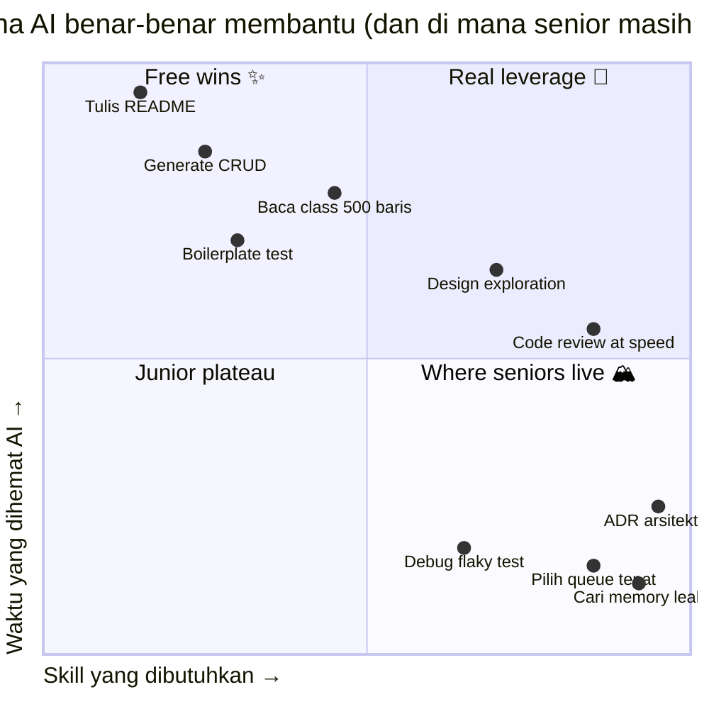
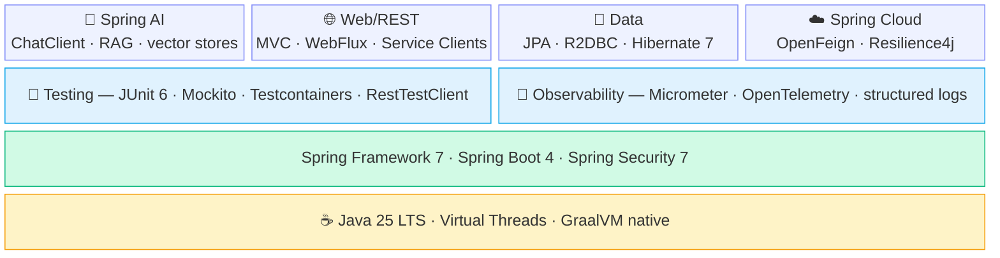

Kalau kamu sudah bisa bikin Spring Boot CRUD, klik "Generate" di Claude Code, lalu ship sebuah feature — selamat, kamu masuk bucket yang sama dengan ribuan orang yang nyoba Java dua bulan terakhir. Bar itu sudah dikomoditisasi. AI tidak menurunkan bar; AI menggesernya.

Ini roadmap untuk junior Java developer yang sudah paham basic dan ingin tahu **harus belajar apa selanjutnya** supaya tetap valuable di 2026. Asumsinya kamu sudah ship beberapa Spring Boot app, paham `application.yml`, dan tidak panik lihat stack trace. Yang akan dibahas di sini adalah pembeda antara "bisa selesain ticket" dan "engineer yang dicari tim ketika ada keputusan arsitektur."

Ini **bagian 1 dari sebuah seri**. Post-post selanjutnya akan dalam ke setiap fase. Untuk sekarang, tujuannya adalah peta-nya dulu.

---

## Bar baru: yang berubah di 2026

Tiga hal berubah bersamaan:

1. **Boilerplate menghilang.** Generate `@Service` class dengan constructor injection, empat CRUD endpoint, dan paginated list bukan skill lagi. Claude Code atau Cursor menghasilkannya dalam 30 detik, lebih cepat dari kamu memikirkan nama field-nya.

2. **Membaca kode orang lain jadi murah.** Onboarding ke codebase legacy 200rb baris dulu butuh tiga minggu. Dengan Serena + prompt yang tepat, kamu dapat intuisi arsitektural dalam sehari. Bagian lambat bukan lagi membaca.

3. **Validasi tidak ikut murah.** Memastikan satu potong kode benar-benar correct — handle concurrency dengan benar, tidak leak resources, tidak degrade di bawah load, tidak break kontrak existing — masih butuh effort manusia yang sama seperti dulu.

Poin terakhir itu intinya. **Generation jadi 10× lebih cepat. Validasi tidak.** Engineer yang penting di 2026 adalah yang bisa validasi dengan cepat.

---

## Yang tetap penting (dan jadi lebih penting)

Ini fondasi yang AI tidak sentuh. Justru AI menaikkan biaya tidak menguasainya — karena kamu bisa ship kode rusak 10× lebih cepat.

**JVM internals.** Perilaku garbage collection, memory model, escape analysis. Saat ada latency spike di p99 production, AI tidak akan debug G1 pause untuk kamu kalau kamu tidak tahu apa itu G1 pause.

**Concurrency.** Virtual threads (Loom) sekarang table stakes — bukan "advanced" lagi. Tapi virtual threads tidak menghilangkan race condition. Memahami Java Memory Model, `volatile`, `synchronized`, dan beda `CompletableFuture.thenApply` vs `thenApplyAsync` itulah yang mencegahmu ship bug yang AI dengan senang hati generate.

**SQL & database internals.** Index, query plan, isolation level, masalah N+1. Hibernate generate query — query yang cantik, kadang katastrofik. Kamu harus bisa baca EXPLAIN.

**Distributed systems fundamentals.** CAP, idempotency, retry, deduplication, ilusi exactly-once. Spring Cloud dan Kafka memungkinkanmu membangun; pemahaman memungkinkanmu debugging.

**System design.** Trade-off antara consistency dan availability, kapan pakai queue vs database vs cache, cara scope sebuah bounded context. AI bisa sketch opsi. AI tidak bisa memutuskan untukmu.

Skip layer ini, AI jadi footgun. Kamu akan ship kode yang tidak bisa kamu pertahankan di code review.

---

## Yang sebenarnya AI compress

Spesifik soal apa yang jadi lebih cepat. Wins-nya nyata, tapi tidak rata:

| Task | Sebelum AI | Dengan AI | Compression |
|---|---|---|---|
| Generate CRUD service + tests | 2–3 jam | 20–30 menit | ~5× |
| Baca class 500 baris yang asing | 30 menit | 5 menit (dengan Serena) | ~6× |
| Tulis Javadoc / README | 1 jam | 5 menit | ~12× |
| First-pass design exploration | 2 hari | 4 jam | ~4× |
| Debug flaky test | 1 jam | 1 jam | ~1× (tidak terbantu) |
| Cari memory leak di prod | 4 jam | 4 jam | ~1× (tidak terbantu) |
| Pilih message queue | 1 hari | 1 hari | ~1× (tidak terbantu) |

**Pola-nya:** AI compress bagian yang jawabannya ada di training data. AI tidak compress bagian yang butuh reasoning di bawah ketidakpastian tentang sistem *kamu*.

Kalau di-plot di dua sumbu — berapa banyak waktu yang dihemat AI vs seberapa skill yang dibutuhkan task itu — bentuknya seperti ini:

Pojok kanan-atas adalah leverage nyata — AI hemat waktu di task yang sudah butuh skill. Pojok kanan-bawah adalah tempat senior hidup — skill tinggi, waktu yang dihemat sedikit. Di situlah AI tidak menggeser kamu. Permainan-nya: lebih sedikit waktu di pojok kiri-atas (gampang dikomoditisasi), lebih banyak di pojok kanan-bawah (susah ditiru, judgment kamu yang jadi nilainya).

Jadi tugasmu di 2026 mudah disebut, susah dilakukan: **lebih sedikit waktu untuk bagian murah, lebih banyak untuk bagian mahal.**

---

## Roadmap

Lupakan tangga linier. Cara kamu sebenarnya berkembang lebih mirip ini — cabang-cabang yang saling memberi makan, bukan fase yang harus selesai sebelum unlock yang berikutnya:

Kamu tidak menyelesaikan "modern Java" lalu mulai "Spring Boot 4". Kamu loop. Kamu masuk dalam ke virtual threads, lalu sadar perlu fix observability, lalu sadar arsitekturnya salah, lalu balik ke basic Java dengan mata baru. Cabang-cabang itu saling menguatkan.

Tiap cabang nantinya jadi post terpisah. Skim dulu di sini; kita masuk dalam di tempat lain.

---

## Phase 1 — Berhenti nulis Java gaya 2018

Java bergerak cepat tiga tahun terakhir dan kebanyakan junior masih nulis Java gaya 2018. Java 25 LTS adalah baseline sekarang. Feature yang dulu "advanced" sekarang default:

- **Records** — ganti 90% DTO dan value object kamu. Immutable by default, `equals`/`hashCode` gratis.
- **Sealed classes + pattern matching** — algebraic data types. Pakai untuk state machine, result type, dan exhaustive switch yang benar-benar compile-check.
- **Virtual threads (Loom)** — `Thread.startVirtualThread(...)` atau `Executors.newVirtualThreadPerTaskExecutor()`. Alasan kenapa nasihat "harus pakai reactive" dari 2020 sekarang sebagian besar salah.
- **Structured concurrency** (preview, JEP 505 di Java 25) — `try (var scope = new StructuredTaskScope.ShutdownOnFailure())`. Memperlakukan grup concurrent task sebagai satu unit. Ganti kebanyakan orchestrasi `CompletableFuture` manual.
- **Scoped values** — pengganti `ThreadLocal` yang bekerja dengan benar di virtual threads.
- **Pattern matching for switch** — termasuk type pattern dan deconstruction. Hentikan kebiasaan nulis cascade `if (x instanceof Y y)`.

**Kenapa ini penting di era AI:** AI generate gaya apa pun yang dipakai codebase kamu. Kalau codebase masih full pattern pre-Java-17, AI akan generate lebih banyak pattern pre-Java-17. Senioritasmu sebagian diukur dari modernitas pattern yang kamu arahkan ke codebase.

---

## Phase 2 — Spring Boot 4, dengan benar

Spring Boot 4 (GA terbaru: 4.0.6) rilis di akhir 2025 di atas Spring Framework 7, Spring Security 7, JUnit 6, Hibernate 7.1, dan Jackson 3. Kalau masih di 3.x, upgrade adalah hal pertama di to-do list — bukan karena upgrade-nya susah, tapi karena kebanyakan yang menarik di 2026 ship di 4.

Kamu mungkin sudah paham Spring Web MVC, JPA, dan cara nulis `@RestController`. Layer berikutnya:

Bayangkan sebagai stack — layer di bawah menopang layer di atas. Kamu tidak bisa skip yang bawah dan langsung mulai di atas.

Yang benar-benar baru di Spring Boot 4 yang wajib diperhatikan:

- **HTTP Service Clients (interface-based).** Definisikan interface, dapat client. Spring generate implementasinya. Mengganti kebanyakan boilerplate `RestClient` / `WebClient` hand-written.
- **Virtual thread integration untuk HTTP client.** Kode bergaya synchronous dengan karakteristik scaling async, end-to-end.
- **API versioning support.** First-class, bukan ditempel-tempel.
- **Null-safety via JSpecify.** `@Nullable` / `@NonNull` diperlakukan serius di seluruh framework. IDE catch issue di compile time.
- **Modular codebase.** Module lebih kecil dan fokus. Startup lebih cepat, native image lebih kecil.
- **`RestTestClient`.** Mengganti banyak ceremony `MockMvc`. Lebih bersih dibaca.

Beberapa pendapat:

- **Reactive bukan default answer lagi.** Dengan virtual threads, plain MVC scale ke ribuan koneksi concurrent tanpa callback hell. Pakai WebFlux kalau ada kebutuhan backpressure atau streaming. Selain itu, MVC saja.
- **Testcontainers harus day-one.** H2 dan embedded Postgres bohong soal perilaku. Postgres asli di container nemu bug asli.
- **Observability non-negotiable.** Tambah Micrometer + OpenTelemetry dari awal. Saat pertama kali debug isu production tanpa traces, kamu akan ingat alasannya.
- **Spring AI sekarang bagian platform.** `ChatClient`, structured output, RAG via `VectorStore`. Kalau timmu belum punya satu pun feature yang di-back LLM, kamu ketinggalan.

---

## Phase 3 — Kerja bareng AI tanpa kehilangan otak

Ini layer baru. Kebanyakan junior tidak sadar ini skill tersendiri. Beda antara yang pakai AI dengan baik vs yang pakai dengan buruk, di-sketsa sebagai workflow comparison:

Perhatikan garis putus-putus. Vibe coding loop *balik ke ticket yang sama*; spec-first loop balik dengan *knowledge codebase yang lebih banyak*. Kedua siklus compound — yang satu melawan kamu, yang lain bekerja untuk kamu.

Skill di dalam Phase 3:

**Spec-first development.** Sebelum nulis prompt, tulis CLAUDE.md / SPEC.md yang mendeskripsikan constraint, konvensi, dan referensi. Lalu generate. Kualitas output AI berbanding lurus dengan kualitas spec.

**Code review at AI speed.** Kamu bukan author lagi. Kamu reviewer. Itu mengubah segalanya. Kamu harus bisa spot bug halus, test lemah, hidden N+1, dan pattern yang tidak match codebase — secepat AI memproduksinya.

**Test literacy.** AI generate test yang lulus. Itu masalah. Test yang lulus tapi tidak menguji failure mode lebih buruk dari tidak ada test, karena memberi confidence palsu. Kamu harus baca apa yang diuji vs apa yang *tidak* diuji.

**Prompt engineering for code.** Spesifik: cara provide konteks (Serena), cara constrain output, cara checkpoint-based generation, kapan pakai Skill vs Agent.

**AI governance.** Yang TIDAK kamu kirim ke AI: PII customer, credentials, paten internal, arsitektur sensitif kompetitor. Non-negotiable di fintech, health, government.

---

## Phase 4 — Bertahan hidup di production

Kode di production berperilaku berbeda dari kode di test. Skill-nya adalah membaca beda itu.

- **Tracing & metrics.** OpenTelemetry across services. Custom Micrometer metrics untuk business KPI. Distributed tracing di Jaeger / Tempo / Datadog.
- **Performance.** JFR (Java Flight Recorder) untuk profiling, async-profiler untuk flame graph, analisis GC log. Saat pertama kali kamu fix p99 latency dengan tuning `-XX:G1MaxNewSizePercent`, kamu lulus.
- **Resilience patterns.** Circuit breaker, bulkhead, timeout di tiap external call, idempotency key untuk retry, deduplication window.
- **Operational chops.** Baca log across pod, query Prometheus, tulis runbook yang berguna. Tidak glamor; bayar tagihan.

**Ini layer paling sedikit dibantu AI.** Production debugging adalah reasoning di bawah ketidakpastian tentang sistem spesifik. Jawaban generic tidak applicable. Kamu akan banyak waktu di sini, dan itu poinnya — ini layer paling sulit dikomoditisasi.

---

## Phase 5 — Trade-off yang bisa kamu bela

Sampai di sini, kamu sudah harus bisa bikin keputusan opinionated. Daftar tidak lengkap:

- **Event-driven architecture.** Kafka, outbox pattern, saga, idempotent consumer, CDC (Debezium). Kapan event vs kapan REST.
- **CQRS** — kapan split read/write model, kapan tidak (kebanyakan, tidak).
- **Hexagonal / ports-and-adapters.** Kenapa business logic tidak boleh import Spring annotation. Kenapa `@Service`-mu adalah code smell di skala besar.
- **Bounded context.** Conway's Law. Kapan microservice split itu boundary yang benar vs distributed monolith.
- **API design.** REST vs gRPC vs GraphQL — trade-off nyata, bukan opini copy-paste dari blog.
- **Data modeling.** Event sourcing tidak selalu benar. Append-only log tidak selalu benar. CRUD biasa dengan schema jelas sering jadi jawaban benar.

Sinyal kamu senior di era AI bukan tools yang dipakai — tapi trade-off yang bisa kamu artikulasikan tanpa googling.

---

## 90-day playbook

Talk is cheap. Ini kalender — 12 minggu, satu artefak yang di-ship per minggu. Buka aplikasi calendar sekarang kalau kamu serius.

Dua belas commit. Dua belas PR description. Tiap satu adalah hal yang bisa kamu tunjuk di interview setahun lagi: "ini yang gue pelajari kuartal itu." Itu sudah lebih banyak dari portfolio kebanyakan engineer.

---

## Anti-pattern yang harus dihindari

Ini cara junior nyangkut di 2026. AI mengekspos lebih cepat dari sebelumnya.

**Vibe coding.** Generate tanpa baca. Ship tanpa paham. Insiden production pertama akan mengajari, tapi mahal.

**Skip test karena AI sudah benar.** AI benar 95%, dan 5%-nya persis di mana bug hidup. Test bukan ceremony; test adalah cara membatasi trust.

**Percaya AI-generated tests adalah coverage real.** Sering test implementation, bukan kontrak. Sering hanya happy path. Baca; jangan cuma hitung dot lulus.

**Stack-jumping setiap kuartal.** Quarkus, Micronaut, Helidon menarik; menguasai satu (Spring Boot) bikin kamu employable. Diversifikasi setelah, bukan sebelum.

**Mengabaikan observability.** "Lokal jalan kok." Frasa ini cepat usang saat kamu pegang pager.

**Memperlakukan AI sebagai authority.** AI berhalusinasi Spring annotation, bikin Hibernate method yang tidak ada, mengarang JEP number. Verifikasi di docs official. Selalu.

---

## Yang kamu menjadi

Junior Java dev di 2021 jadi valuable karena bisa nulis kode. Junior Java dev di 2026 jadi valuable karena bisa **validasi kode, instrument-nya, mempertahankannya di review, dan mengartikulasikan trade-off yang membawa ke sana.**

Peran bergeser dari author ke editor-architect-validator. Skill-nya compound. Bar lebih tinggi, tapi leverage juga lebih tinggi: dev competent dengan AI ship apa yang tim 5 orang ship dua tahun lalu.

Itu peluangnya. Jangan terjebak mengira AI mengerjakan kerjaan untukmu. AI mengerjakan *typing* untukmu. Kerjanya — judgment-nya — masih milikmu.

---

Itu peta-nya. Post-post selanjutnya di seri ini akan dalam ke setiap fase: dimulai dari **Phase 1: Modern Java fluency** (records, sealed classes, virtual threads, structured concurrency dalam pattern production).

Kalau mau satu nasihat untuk dibawa pulang: **berhenti generate kode yang tidak siap kamu pertahankan di code review besok.** Satu constraint itu akan memandu setiap keputusan lain.
