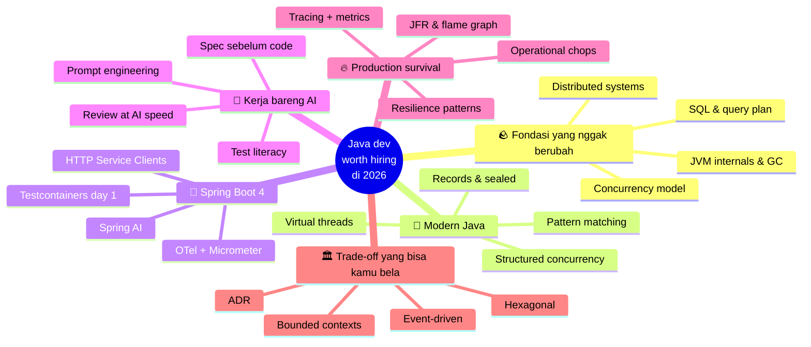
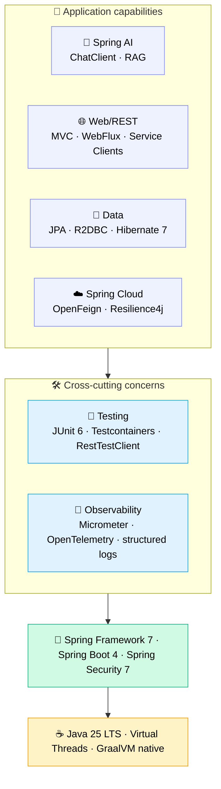
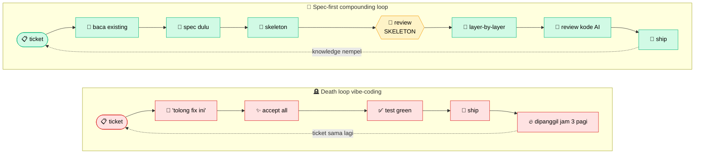
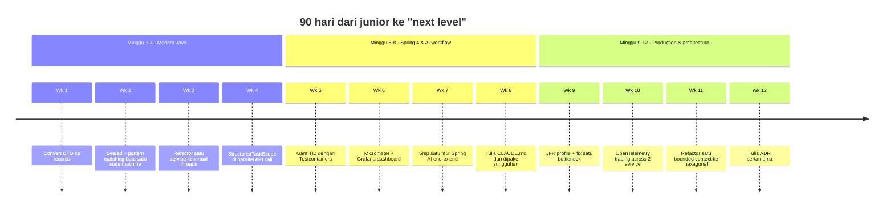

Kalau kamu udah bisa bikin CRUD pakai Spring Boot, klik "Generate" di Claude Code, lalu ship satu fitur, ya selamat. Kamu sekelas sama ribuan orang yang baru nyemplung ke Java dua bulan terakhir. Standar lama udah jadi komoditas. AI bukannya nurunin standar, tapi nggeser standarnya ke atas.

Tulisan ini buat junior Java developer yang udah ngerti basic dan pengen tahu **selanjutnya belajar apa** biar tetap relevan di 2026. Asumsinya kamu udah pernah ship beberapa Spring Boot app, paham `application.yml`, dan nggak panik lihat stack trace. Yang dibahas di sini: apa pembedanya antara "bisa nyelesaiin ticket" sama "engineer yang dicariin tim pas ada keputusan arsitektur."

Ini bagian 1 dari satu seri. Post-post berikutnya bakal masuk dalam ke tiap fase. Sekarang fokusnya nyusun peta-nya dulu.

---

## Standar baru: yang berubah di 2026

Tiga hal kejadian bareng.

Pertama, **boilerplate udah nggak ada nilainya**. Bikin `@Service` dengan constructor injection, empat CRUD endpoint, paginated list, itu nggak lagi disebut skill. Claude Code atau Cursor ngeluarinnya 30 detik, lebih cepat dari kamu mikirin nama field-nya.

Kedua, **baca kode orang jadi murah**. Onboarding ke codebase legacy 200rb baris dulu butuh tiga minggu. Pakai Serena plus prompt yang bener, sehari udah dapat intuisi arsitektur. Bagian lambatnya bergeser; baca kode bukan lagi yang makan waktu.

Ketiga, **validasi tetap mahal**. Mastiin satu potong kode bener-bener jalan; handle concurrency, gak bocor resource, gak ngedrop pas load tinggi, gak break kontrak existing. Itu masih makan waktu kepala manusia yang sama kayak dulu.

Poin ketiga itu yang penting buat dimengerti. Generation 10× lebih cepat, validasi nggak ikutan cepat. Yang akhirnya jadi pembeda di 2026 adalah seberapa cepat kamu bisa validasi output yang udah keluar; tapi pertanyaan yang sebenernya, kalau jujur sih, gw juga belum yakin gimana ini bakal stabil dalam dua-tiga tahun ke depan, soalnya tooling-nya masih gerak terus.

---

## Yang nggak berubah (dan justru tambah penting)

Ini fondasi yang nggak disentuh AI. Malah, AI bikin biaya nggak nguasain ini jadi lebih mahal, soalnya kamu sekarang bisa ship kode ngaco 10× lebih cepat juga.

**JVM internals.** Perilaku GC, memory model, escape analysis. Pas suatu hari latency p99 production loncat tiba-tiba, AI nggak bakal bantu kamu debug G1 pause kalau kamu sendiri nggak ngerti G1 pause itu apa.

**Concurrency.** Virtual threads (Loom) sekarang udah jadi baseline. Tapi virtual threads nggak ngilangin race condition. Paham Java Memory Model, `volatile`, `synchronized`, dan beda `CompletableFuture.thenApply` vs `thenApplyAsync`. Ini yang nyegah kamu ship bug yang AI dengan senang hati generate-in.

**SQL & internals database.** Index, query plan, isolation level, masalah N+1. Hibernate suka generate query cantik. Kadang juga catastrophic. Kamu wajib bisa baca EXPLAIN.

**Distributed systems.** CAP, idempotency, retry, deduplication, ilusi exactly-once. Spring Cloud sama Kafka bantu kamu bangun sistem. Pemahaman bantu kamu nge-debug pas bermasalah.

**System design.** Trade-off consistency vs availability, kapan pake queue/database/cache, cara nge-scope bounded context. AI bisa kasih opsi. Yang milih tetap kamu.

Kalau kamu skip layer ini, AI gampang berubah jadi senjata makan tuan, dan kamu bakal sering ship kode yang pas di review nggak bisa kamu pertanggungjawabin sendiri, sekalipun kelihatan jalan di test.

---

## Yang AI sungguh-sungguh kompres

Konkretnya, bagian mana yang jadi cepat. Win-nya nyata, tapi nggak rata:

| Task | Sebelum AI | Pakai AI | Kompresi |
|---|---|---|---|
| Generate CRUD service + tests | 2–3 jam | 20–30 menit | ~5× |
| Baca class 500 baris yang asing | 30 menit | 5 menit (pakai Serena) | ~6× |
| Tulis Javadoc / README | 1 jam | 5 menit | ~12× |
| Eksplorasi desain awal | 2 hari | 4 jam | ~4× |
| Debug flaky test | 1 jam | 1 jam | ~1× (nggak kebantu) |
| Cari memory leak di prod | 4 jam | 4 jam | ~1× (nggak kebantu) |
| Milih message queue | 1 hari | 1 hari | ~1× (nggak kebantu) |

Polanya jelas. AI ngompres bagian yang jawabannya udah ada di training data. Yang dia gak bisa kompres adalah bagian yang butuh nalar di tengah ketidakpastian soal sistem yang khusus kamu ngerjainnya.

Kalau di-plot di dua sumbu, berapa banyak waktu yang dihemat AI vs seberapa skill yang dibutuhin, bentuknya kayak gini:

Pojok kanan-atas itu leverage betulan. AI ngirit waktu di task yang emang udah butuh skill. Pojok kanan-bawah, tempat senior nongkrong: skill tinggi, hemat waktunya kecil. Di situ AI nggak bisa ngegantiin kamu. Implikasinya buat hari-hari kerja kamu, kalau kamu serius ambil arah ini, adalah perlahan menggeser jam kerja dari pojok kiri-atas (yang gampang dikomoditisasi) ke pojok kanan-bawah (yang susah ditiru), walaupun pergeseran itu sering pelan dan kadang baru kelihatan setelah beberapa bulan.

---

## Roadmap

Lupain tangga linear. Yang sebenernya terjadi waktu kamu mulai berkembang itu lebih kayak gini, cabang-cabang yang saling kasih makan, dan urutan pasti bukan keharusan:

Kamu nggak bakal nyelesain "modern Java" terus baru pindah ke "Spring Boot 4". Kamu bakal loop. Masuk dalem ke virtual threads, terus sadar observability-nya kacau, terus sadar arsitekturnya kurang pas, balik ke basic Java dengan mata baru. Cabang-cabangnya saling nguatin, dan tiap cabang nantinya bakal jadi post sendiri.

---

## Phase 1: Berhenti nulis Java gaya 2018

Java gerak cepet tiga tahun terakhir, dan kebanyakan junior masih nulis Java gaya 2018. Java 25 LTS sekarang baseline. Fitur yang dulu dibilang "advanced" sekarang udah default:

- **Records** buat ganti 90% DTO sama value object kamu. Immutable by default, `equals`/`hashCode` udah dapet gratis.
- **Sealed classes + pattern matching**, algebraic data types. Pakai buat state machine, result type, dan exhaustive switch yang bener-bener compile-check.
- **Virtual threads (Loom)**: `Thread.startVirtualThread(...)` atau `Executors.newVirtualThreadPerTaskExecutor()`. Inilah alasan kenapa nasihat "harus pake reactive" dari 2020 sekarang sebagian besar udah nggak relevan.
- **Structured concurrency** (preview, JEP 505 di Java 25). `try (var scope = new StructuredTaskScope.ShutdownOnFailure())`. Sekumpulan task paralel diperlakukan satu kesatuan. Bisa ganti kebanyakan orchestrasi `CompletableFuture` manual.
- **Scoped values**, pengganti `ThreadLocal` yang jalan bener di virtual threads.
- **Pattern matching for switch**, termasuk type pattern dan deconstruction. Bikin kamu berhenti nulis cascade `if (x instanceof Y y)`.

[ANECDOTE NEEDED: cerita junior di tim kamu yang ngegenerate kode dengan pattern Java lama gara-gara codebase-nya emang masih lama, dan apa yang akhirnya dilakuin buat dorong upgrade gaya kode-nya.]

Yang penting dipahami: AI nyontek gaya yang dia lihat di codebase. Kalau codebase masih full pattern pre-Java-17, AI bakal generate pattern pre-Java-17 lagi. Sebagian dari maturity kamu sebagai engineer diukur dari seberapa modern pattern yang kamu giring ke codebase, walaupun gw sendiri jujur kadang masih bingung kapan worth-it push upgrade vs kapan biarin aja sampai timing-nya pas.

---

## Phase 2: Spring Boot 4, dengan benar

Spring Boot 4 (GA terbaru: 4.0.6) keluar akhir 2025, dibangun di atas Spring Framework 7, Spring Security 7, JUnit 6, Hibernate 7.1, dan Jackson 3. Kalau kamu masih di 3.x, upgrade jadi prioritas pertama. Bukan karena upgrade-nya susah ya, tapi karena kebanyakan hal menarik di 2026 mendarat di 4.

Mestinya kamu udah ngerti Spring Web MVC, JPA, dan cara nulis `@RestController`. Layer berikutnya bisa dibayangin kayak stack: layer di bawah nyangga layer di atas, dan kamu nggak bisa skip yang bawah terus loncat ke atas.

Yang sungguh-sungguh baru di Spring Boot 4 dan wajib kamu lirik:

- **HTTP Service Clients (interface-based).** Bikin interface, dapat client. Spring yang generate implementasinya. Ngegantiin kebanyakan boilerplate `RestClient` atau `WebClient` yang ditulis tangan.
- **Virtual thread integration buat HTTP client.** Kode bergaya synchronous, scaling-nya kayak async, end-to-end.
- **API versioning.** First-class. Udah nggak ditempel-tempelin lagi.
- **Null-safety pakai JSpecify.** `@Nullable` / `@NonNull` dipakai serius di seluruh framework. IDE catch issue di compile time.
- **Modular codebase.** Module lebih kecil dan fokus. Startup lebih cepat, native image-nya lebih ramping.
- **`RestTestClient`.** Ngegantiin banyak ceremony `MockMvc`. Lebih enak dibaca.

Beberapa pendapat (boleh nggak setuju):

- **Reactive udah bukan default.** Pake virtual threads, plain MVC udah scale ke ribuan koneksi concurrent tanpa drama callback hell. WebFlux pakai kalau emang ada kebutuhan backpressure atau streaming. Selain itu, MVC aja.
- **Testcontainers wajib day-one.** H2 sama embedded Postgres bohong soal perilaku database aslinya. Postgres asli di container nemuin bug yang asli.
- **Observability harus wajib.** Micrometer + OpenTelemetry dari awal. Pertama kali kamu nge-debug isu prod tanpa traces, kamu bakal inget alasannya.
- **Spring AI udah jadi bagian platform.** `ChatClient`, structured output, RAG pakai `VectorStore`. Kalau tim kamu belum punya satu pun fitur yang di-back LLM, gw rasa kalian bakal kerepotan ngejar di tahun depan, walau ya, ini opini gw aja sih.

---

## Phase 3: Kerja bareng AI tanpa kehilangan akal sehat

Ini layer baru yang lima tahun lalu belum ada. Kebanyakan junior nggak sadar ini skill tersendiri. Beda antara yang make AI dengan benar vs yang asal pake, kalau di-plot kelihatan kayak dua workflow yang sama-sama sirkular tapi arahnya beda:

Perhatiin garis putus-putus. Vibe coding loop balik ke ticket yang sama. Spec-first loop balik dengan pengetahuan codebase yang nambah. Kedua siklus ini sama-sama bekerja akumulatif, hanya saja yang satu ngelawan kamu, yang satu kerja buat kamu.

Skill yang masuk di Phase 3:

**Spec-first development.** Sebelum nulis prompt, tulis CLAUDE.md atau SPEC.md yang ngelist constraint, konvensi, dan referensi. Baru generate. Kualitas output AI sebanding sama kualitas spec yang kamu kasih.

**Code review pas AI lagi nggencet output.** Posisi kamu udah geser; sebelumnya author, sekarang reviewer. Itu ngubah semuanya. Kamu harus bisa nangkep bug halus, test yang lemah, hidden N+1, dan pattern yang nggak match codebase, dengan kecepatan yang sebanding sama AI memproduksinya.

**Test literacy.** AI generate test yang lulus. Itu masalahnya. Test lulus tapi nggak nge-cover failure mode lebih bahaya dari nggak ada test sama sekali, soalnya bikin confidence palsu. Baca apa yang diuji *dan* apa yang nggak diuji.

**Prompt engineering buat kode.** Cara provide konteks (Serena), cara constrain output, cara checkpoint-based generation, kapan pake Skill vs Agent.

**AI governance.** Yang tidak boleh dikirim ke AI: PII customer, credentials, paten internal, arsitektur kompetitif. Di domain regulated kayak fintech, health, atau government, biasanya tim sudah punya policy soal ini, dan walaupun kadang policy-nya kelihatan ribet, biasanya policy itu ada karena beberapa orang sebelumnya udah pernah ke-trap di situ.

[ANECDOTE NEEDED: pengalaman pribadi pas spec-first ngubah hasil generation, atau sebaliknya pas vibe-coding bikin masalah di prod. Bisa cerita timing-nya, apa yang kelihatan di review, apa yang akhirnya ke-fix.]

---

## Phase 4: Survive di production

Kode di prod kelakuannya beda sama kode di test. Skill di sini bisa baca beda itu.

- **Tracing & metrics.** OpenTelemetry across services. Custom Micrometer metrics buat KPI bisnis. Distributed tracing di Jaeger / Tempo / Datadog.
- **Performance.** JFR (Java Flight Recorder) buat profiling, async-profiler buat flame graph, baca GC log. Pertama kali kamu nge-fix p99 latency dengan tuning `-XX:G1MaxNewSizePercent`, ada momen "ah gini toh".
- **Resilience patterns.** Circuit breaker, bulkhead, timeout di tiap external call, idempotency key buat retry, deduplication window.
- **Skill operasional.** Baca log across pod, query Prometheus, nulis runbook yang nggak cuma kelihatan rapi tapi sungguh-sungguh kepake. Sederhana, tapi skill ini yang sering misahin engineer yang on-call jadi tenang vs panik.

Layer ini yang paling sedikit dibantu AI. Production debugging itu nalar di tengah ketidakpastian soal sistem spesifik yang lagi kamu pegang, dan jawaban generic biasanya nggak applicable. Banyak waktu kamu di sini, walaupun kelihatannya nggak produktif kalau diukur dari "berapa banyak fitur yang di-ship", justru itu yang paling lambat dikomoditisasi sama tooling AI manapun, setidaknya berdasarkan apa yang gw lihat sampai sekarang.

---

## Phase 5: Trade-off yang bisa kamu pertanggungjawabin

Sampe sini, kamu mestinya udah berani ambil keputusan opinionated. Daftar (nggak lengkap):

- **Event-driven architecture.** Kafka, outbox pattern, saga, idempotent consumer, CDC (Debezium). Kapan pake event vs kapan REST.
- **CQRS.** Kapan pisah read/write model, kapan jangan (kebanyakan, jangan).
- **Hexagonal / ports-and-adapters.** Kenapa business logic nggak boleh import Spring annotation. Kenapa `@Service`-mu jadi code smell pas di scale gede.
- **Bounded context.** Conway's Law. Kapan pemisahan microservice itu boundary asli vs cuma distributed monolith berkedok.
- **API design.** REST vs gRPC vs GraphQL: trade-off-nya nyata, dan opini blog biasanya cuma ekstrak dari satu konteks doang.
- **Data modeling.** Event sourcing nggak selalu jawaban. Append-only log nggak selalu jawaban. CRUD biasa dengan schema jelas malah sering yang paling pas, asal kamu nggak gengsi makainya.

Tanda kamu mature di era AI lebih kelihatan dari trade-off yang bisa kamu jelasin tanpa googling, dan biasanya kelihatan juga dari frekuensi kamu jujur soal "kayaknya kasus ini gw belum yakin, perlu cek lagi".

---

## 90-day playbook

Ini kalendernya, biar lebih konkret: 12 minggu, satu artefak yang di-ship per minggu. Kalau kamu serius, nggak salah buat langsung buka aplikasi calendar.

Dua belas commit dan dua belas PR description, masing-masing jadi hal yang bisa kamu tunjuk di interview setahun lagi: "ini yang gue pelajarin kuartal itu." Bagian yang sering luput, sebenernya bukan bikin kalender-nya, tapi disiplin buat re-audit tiap akhir minggu apakah artefaknya sungguh-sungguh ada atau masih jadi todo terus-menerus.

---

## Anti-pattern yang harus dihindari

Ini cara junior nyangkut di 2026. AI ngebongkar lebih cepet dari sebelumnya.

**Vibe coding.** Generate tanpa baca, ship tanpa paham. Insiden prod pertama bakal ngajarin, tapi mahal banget.

**Skip test gara-gara "AI udah bener."** AI bener 95%, dan sisanya itu tepat di tempat bug suka ngumpet. Test fungsinya buat ngebatasin seberapa banyak kamu percaya output AI, jadi kalau dilewatin, kamu ship sesuatu tanpa tahu batas-nya.

**Percaya test yang di-generate AI itu coverage utuh.** Sering yang diuji implementasinya doang, kontraknya nggak. Sering juga cuma happy path. Baca isinya, jangan cuma itungin titik ijo.

**Stack-jumping tiap kuartal.** Quarkus, Micronaut, Helidon menarik. Tapi nguasain satu (Spring Boot) yang bikin kamu employable. Diversifikasi belakangan, jangan duluan.

**Cuek sama observability.** "Lokal jalan kok." Frasa ini umurnya pendek banget pas kamu pegang pager.

**Anggep AI itu otoritas.** AI suka halusinasi Spring annotation, ngarang Hibernate method, bahkan ngasi JEP number palsu. Kebiasaan verifikasi ke docs official perlu kamu bangun lebih awal; setiap kali ke-trap, biaya-nya lebih mahal daripada lima menit waktu yang dihemat.

---

## Yang kamu jadi

Junior Java dev di 2021 berharga karena bisa nulis kode. Junior Java dev di 2026 berharga karena bisa **validasi kode, instrument-in, pertahanin di review, dan jelasin trade-off yang bawa ke sana.**

Peran-nya geser dari author ke editor-architect-validator. Skill-nya saling tumpuk di atas satu sama lain, dan walaupun standar lebih tinggi sekarang, leverage juga ikut tinggi: dev kompeten plus AI bisa ship apa yang dulu butuh tim 5 orang.

Salah satu hal yang gampang kebawa keliru adalah ngira AI udah ngerjain kerjaan kamu. Padahal yang dia ngerjain itu bagian *ngetik*-nya. Bagian lain, terutama judgment dan keputusan apa yang masuk ke production, tetap kamu yang nanggung; dan justru itu bagian yang nggak bakal pernah pindah ke siapapun selain kamu.

---

Itu peta-nya. Post-post selanjutnya di seri ini bakal masuk dalem ke tiap fase, mulai dari **Phase 1: Modern Java fluency** (records, sealed classes, virtual threads, structured concurrency dalam pattern produksi).

Kalau ada satu hal saja yang mau gw titipin dari tulisan ini, kira-kira begini: cobain berhenti generate kode yang besok pas review kamu nggak siap pertanggungjawabin sendiri. Aturan sederhana itu biasanya cukup buat ngarahin keputusan-keputusan lain di hari kerja, walaupun ya, gw juga sering cheat sendiri pas deadline mepet, jadi pastinya nggak gampang.
