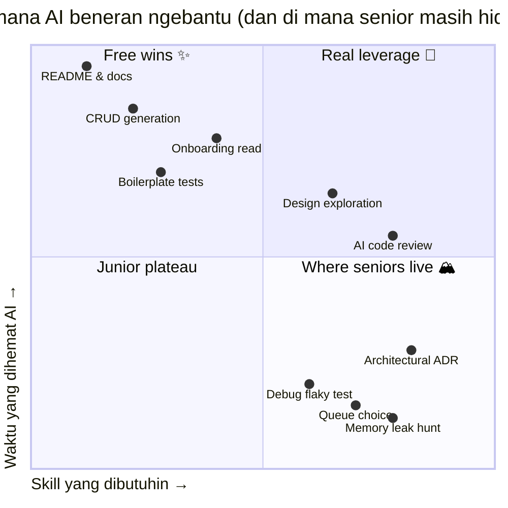
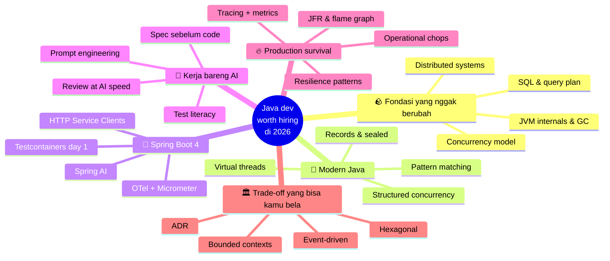
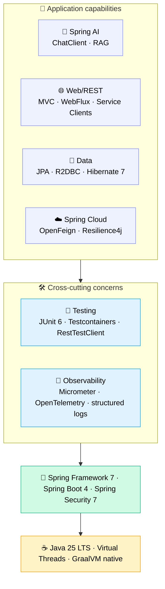

Kalau kamu udah bisa bikin CRUD pakai Spring Boot, klik "Generate" di Claude Code, lalu ship satu fitur, selamat. Kamu sekelas sama ribuan orang yang baru nyemplung ke Java dua bulan terakhir. Standar lama udah jadi komoditas. AI gak nurunin standar, dia geserin ke atas.

Tulisan ini buat junior Java developer yang udah ngerti basic dan pengen tahu **selanjutnya belajar apa** biar tetap relevan di 2026. Asumsinya kamu udah pernah ship beberapa Spring Boot app, paham `application.yml`, dan nggak panik lihat stack trace. Yang dibahas di sini: pembeda antara "bisa nyelesaiin ticket" dan "engineer yang dicariin tim pas ada keputusan arsitektur."

Ini **bagian 1 dari satu seri**. Post-post berikutnya bakal masuk dalam ke tiap fase. Sekarang, fokusnya bikin peta dulu.

---

## Standar baru: yang berubah di 2026

Tiga hal kejadian bareng.

Pertama, **boilerplate udah nggak ada nilainya**. Bikin `@Service` dengan constructor injection, empat CRUD endpoint, paginated list, itu bukan skill lagi. Claude Code atau Cursor ngeluarinnya 30 detik, lebih cepat dari kamu mikirin nama field-nya.

Kedua, **baca kode orang jadi murah**. Onboarding ke codebase legacy 200rb baris dulu butuh tiga minggu. Pakai Serena plus prompt yang bener, sehari udah dapat intuisi arsitektur. Bagian lambatnya bukan "baca kode" lagi sekarang.

Ketiga, **validasi tetap mahal**. Mastiin satu potong kode bener-bener jalan; handle concurrency, gak bocor resource, gak ngedrop pas load tinggi, gak break kontrak existing. Itu masih makan waktu kepala manusia yang sama kayak dulu.

Poin ketiga itu intinya. Generation 10× lebih cepat, validasi nggak ikutan cepat. Engineer yang bernilai di 2026 adalah yang validasinya kencang.

---

## Yang nggak berubah (dan justru tambah penting)

Ini fondasi yang nggak disentuh AI. Malah, AI bikin biaya nggak nguasain ini jadi lebih mahal, soalnya kamu sekarang bisa ship kode ngaco 10× lebih cepat juga.

**JVM internals.** Perilaku GC, memory model, escape analysis. Pas suatu hari latency p99 production loncat tiba-tiba, AI nggak bakal bantu kamu debug G1 pause kalau kamu sendiri nggak ngerti G1 pause itu apa.

**Concurrency.** Virtual threads (Loom) sekarang udah jadi baseline, bukan "advanced" lagi. Tapi virtual threads nggak ngilangin race condition. Paham Java Memory Model, `volatile`, `synchronized`, dan beda `CompletableFuture.thenApply` vs `thenApplyAsync` itu yang nyegah kamu ship bug yang AI dengan senang hati generate-in.

**SQL & internals database.** Index, query plan, isolation level, masalah N+1. Hibernate suka generate query cantik. Kadang juga catastrophic. Kamu wajib bisa baca EXPLAIN.

**Distributed systems.** CAP, idempotency, retry, deduplication, ilusi exactly-once. Spring Cloud sama Kafka bantu kamu bangun sistem. Pemahaman bantu kamu nge-debug pas bermasalah.

**System design.** Trade-off consistency vs availability, kapan pake queue/database/cache, cara nge-scope bounded context. AI bisa kasih opsi. AI nggak bisa milih buat kamu.

Skip layer ini, AI berubah jadi senjata makan tuan. Kamu bakal ship kode yang nggak bisa kamu pertanggungjawabin pas review.

---

## Yang AI beneran kompres

Konkretnya, bagian mana yang jadi cepat. Win-nya nyata, tapi nggak rata:

| Task | Sebelum AI | Pakai AI | Kompresi |
|---|---|---|---|
| Generate CRUD service + tests | 2–3 jam | 20–30 menit | ~5× |
| Baca class 500 baris yang asing | 30 menit | 5 menit (pakai Serena) | ~6× |
| Tulis Javadoc / README | 1 jam | 5 menit | ~12× |
| Eksplorasi desain awal | 2 hari | 4 jam | ~4× |
| Debug flaky test | 1 jam | 1 jam | ~1× (nggak kebantu) |
| Cari memory leak di prod | 4 jam | 4 jam | ~1× (nggak kebantu) |
| Milih message queue | 1 hari | 1 hari | ~1× (nggak kebantu) |

Polanya jelas. AI ngompres bagian yang jawabannya udah ada di training data. Yang dia gak bisa kompres: bagian yang butuh nalar di tengah ketidakpastian soal sistem *kamu sendiri*.

Kalau di-plot di dua sumbu, berapa banyak waktu yang dihemat AI vs seberapa skill yang dibutuhin, bentuknya kayak gini:

Pojok kanan-atas itu leverage beneran. AI ngirit waktu di task yang emang udah butuh skill. Pojok kanan-bawah, tempat senior nongkrong: skill tinggi, hemat waktunya kecil. Di situ AI nggak bisa ngegantiin kamu. Permainannya gampang dijelasin sih, susah dijalanin: kurangin waktu di pojok kiri-atas (gampang dikomoditisasi), tambahin di pojok kanan-bawah (susah ditiru, judgment kamu yang jadi nilai).

Jadi PR-mu di 2026 cuma satu kalimat: lebih sedikit waktu di hal murah, lebih banyak di hal mahal.

---

## Roadmap

Lupain tangga linear. Yang sebenernya terjadi waktu kamu naik kelas itu lebih kayak gini — cabang-cabang yang saling kasih makan, bukan fase yang harus selesai dulu sebelum unlock yang berikutnya:

Kamu nggak bakal nyelesain "modern Java" terus baru pindah ke "Spring Boot 4". Kamu bakal loop. Masuk dalem ke virtual threads, terus sadar observability-nya kacau, terus sadar arsitekturnya nggak pas, balik ke basic Java dengan mata baru. Cabang-cabangnya saling nguatin.

Tiap cabang nanti ada post sendiri. Sekarang skim dulu di sini; bahas lebih dalem di tempat lain.

---

## Phase 1 — Berhenti nulis Java gaya 2018

Java gerak cepet tiga tahun terakhir, dan kebanyakan junior masih nulis Java gaya 2018. Java 25 LTS sekarang baseline. Fitur yang dulu dibilang "advanced" sekarang udah default:

- **Records** buat ganti 90% DTO sama value object kamu. Immutable by default, `equals`/`hashCode` udah dapet gratis.
- **Sealed classes + pattern matching**, algebraic data types. Pakai buat state machine, result type, dan exhaustive switch yang beneran compile-check.
- **Virtual threads (Loom)**: `Thread.startVirtualThread(...)` atau `Executors.newVirtualThreadPerTaskExecutor()`. Inilah alasan kenapa nasihat "harus pake reactive" dari 2020 sekarang sebagian besar udah nggak relevan.
- **Structured concurrency** (preview, JEP 505 di Java 25). `try (var scope = new StructuredTaskScope.ShutdownOnFailure())`. Sekumpulan task paralel diperlakukan satu kesatuan. Bisa ganti kebanyakan orchestrasi `CompletableFuture` manual.
- **Scoped values**, pengganti `ThreadLocal` yang jalan bener di virtual threads.
- **Pattern matching for switch**, termasuk type pattern dan deconstruction. Bikin kamu berhenti nulis cascade `if (x instanceof Y y)`.

Pernah suatu kali gw ikut review PR junior, full pattern Java 8 padahal projectnya udah Java 21. Pas ditanya kenapa, jawabannya: "AI yang generate begitu". Gw cek codebasenya, ternyata 80% file masih gaya lama. AI cuma niru apa yang dia lihat. Kalau codebase masih full pattern pre-Java-17, AI bakal generate pattern pre-Java-17 lagi. Senior atau nggak, sebagian dinilai dari seberapa modern pattern yang kamu giring ke codebase.

---

## Phase 2 — Spring Boot 4, beneran

Spring Boot 4 (GA terbaru: 4.0.6) keluar akhir 2025, dibangun di atas Spring Framework 7, Spring Security 7, JUnit 6, Hibernate 7.1, dan Jackson 3. Kalau kamu masih di 3.x, upgrade jadi prioritas pertama. Bukan karena upgrade-nya susah ya, tapi karena kebanyakan hal menarik di 2026 mendarat di 4.

Mestinya kamu udah ngerti Spring Web MVC, JPA, dan cara nulis `@RestController`. Layer berikutnya:

Anggep aja kayak stack: layer di bawah nyangga layer di atas. Nggak bisa skip yang bawah terus loncat ke atas.

Yang beneran baru di Spring Boot 4 dan wajib kamu lirik:

- **HTTP Service Clients (interface-based).** Bikin interface, dapat client. Spring yang generate implementasinya. Ngegantiin kebanyakan boilerplate `RestClient` / `WebClient` yang ditulis tangan.
- **Virtual thread integration buat HTTP client.** Kode bergaya synchronous, scaling-nya kayak async, end-to-end.
- **API versioning.** First-class, bukan ditempel-tempelin lagi.
- **Null-safety pakai JSpecify.** `@Nullable` / `@NonNull` diserius-in di seluruh framework. IDE catch issue di compile time.
- **Modular codebase.** Module lebih kecil dan fokus. Startup lebih cepat, native image-nya lebih ramping.
- **`RestTestClient`.** Ngegantiin banyak ceremony `MockMvc`. Lebih enak dibaca.

Beberapa pendapat (boleh nggak setuju):

- **Reactive udah bukan default.** Pake virtual threads, plain MVC udah scale ke ribuan koneksi concurrent tanpa drama callback hell. WebFlux pakai kalau emang ada kebutuhan backpressure atau streaming. Selain itu, MVC aja.
- **Testcontainers wajib day-one.** H2 sama embedded Postgres bohong soal perilaku database aslinya. Postgres beneran di container nemuin bug beneran.
- **Observability nggak bisa ditawar.** Micrometer + OpenTelemetry dari awal. Pertama kali kamu nge-debug isu prod tanpa traces, kamu bakal inget alasannya.
- **Spring AI udah jadi bagian platform.** `ChatClient`, structured output, RAG pakai `VectorStore`. Kalau tim kamu belum punya satu pun fitur yang di-back LLM, kamu udah ketinggalan.

---

## Phase 3 — Kerja bareng AI tanpa kehilangan akal sehat

Ini layer baru. Kebanyakan junior nggak sadar ini skill tersendiri. Beda antara yang make AI dengan bener vs yang asal pake, di-plot sebagai dua workflow:

Perhatiin garis putus-putus. Vibe coding loop balik ke ticket yang sama. Spec-first loop balik dengan pengetahuan codebase yang nambah. Dua siklus ini sama-sama compound. Yang satu ngelawan kamu, yang satu kerja buat kamu.

Skill yang masuk di Phase 3:

**Spec-first development.** Sebelum nulis prompt, tulis CLAUDE.md atau SPEC.md yang ngelist constraint, konvensi, dan referensi. Baru generate. Kualitas output AI sebanding sama kualitas spec.

**Code review at AI speed.** Kamu bukan author lagi, sekarang reviewer. Itu ngubah semuanya. Kamu harus bisa nangkep bug halus, test yang lemah, hidden N+1, dan pattern yang nggak match codebase, secepat AI memproduksinya.

**Test literacy.** AI generate test yang lulus. Itu masalahnya. Test lulus tapi nggak nge-cover failure mode lebih bahaya dari nggak ada test sama sekali, soalnya bikin confidence palsu. Baca apa yang diuji *dan* apa yang nggak diuji.

**Prompt engineering buat kode.** Cara provide konteks (Serena), cara constrain output, cara checkpoint-based generation, kapan pake Skill vs Agent.

**AI governance.** Yang nggak boleh dikirim ke AI: PII customer, credentials, paten internal, arsitektur kompetitif. Di fintech, health, government, ini nggak bisa ditawar.

---

## Phase 4 — Survive di production

Kode di prod kelakuannya beda sama kode di test. Skill di sini: bisa baca beda itu.

- **Tracing & metrics.** OpenTelemetry across services. Custom Micrometer metrics buat KPI bisnis. Distributed tracing di Jaeger / Tempo / Datadog.
- **Performance.** JFR (Java Flight Recorder) buat profiling, async-profiler buat flame graph, baca GC log. Pertama kali kamu nge-fix p99 latency dengan tuning `-XX:G1MaxNewSizePercent`, kamu naik kelas.
- **Resilience patterns.** Circuit breaker, bulkhead, timeout di tiap external call, idempotency key buat retry, deduplication window.
- **Skill operasional.** Baca log across pod, query Prometheus, nulis runbook yang beneran kepake. Nggak glamor, tapi inilah yang bayar tagihan.

**Ini layer yang AI paling sedikit ngebantu.** Production debugging itu nalar di tengah ketidakpastian soal sistem spesifik. Jawaban generic nggak bisa dipake. Kamu bakal banyak waktu di sini, dan emang ini poinnya: layer paling susah dikomoditisasi.

---

## Phase 5 — Trade-off yang bisa kamu pertanggungjawabin

Sampe sini, kamu mestinya udah berani ambil keputusan opinionated. Daftar (nggak lengkap):

- **Event-driven architecture.** Kafka, outbox pattern, saga, idempotent consumer, CDC (Debezium). Kapan pake event vs kapan REST.
- **CQRS.** Kapan pisah read/write model, kapan jangan (kebanyakan, jangan).
- **Hexagonal / ports-and-adapters.** Kenapa business logic nggak boleh import Spring annotation. Kenapa `@Service`-mu jadi code smell pas di scale gede.
- **Bounded context.** Conway's Law. Kapan pemisahan microservice itu boundary beneran vs cuma distributed monolith berkedok.
- **API design.** REST vs gRPC vs GraphQL: trade-off beneran, bukan opini copy-paste blog.
- **Data modeling.** Event sourcing nggak selalu bener. Append-only log nggak selalu bener. CRUD biasa dengan schema jelas malah sering yang paling pas.

Tanda kamu udah senior di era AI itu trade-off yang bisa kamu jelasin tanpa googling, bukan daftar tools yang kamu pake.

---

## 90-day playbook

Talk is cheap. Ini kalendernya: 12 minggu, satu artefak yang di-ship per minggu. Buka aplikasi calendar sekarang kalau kamu serius.

Dua belas commit. Dua belas PR description. Tiap satu jadi hal yang bisa kamu tunjuk di interview setahun lagi: "ini yang gue pelajarin kuartal itu." Itu udah lebih banyak dari portfolio kebanyakan engineer.

---

## Anti-pattern yang harus dihindari

Ini cara junior nyangkut di 2026. AI ngebongkar lebih cepet dari sebelumnya.

**Vibe coding.** Generate tanpa baca, ship tanpa paham. Insiden prod pertama bakal ngajarin, tapi mahal banget.

**Skip test karena "AI udah bener."** AI bener 95%, dan 5%-nya tepat di tempat bug suka ngumpet. Test itu cara kamu ngebatasin trust, bukan formalitas.

**Percaya test yang di-generate AI itu coverage beneran.** Sering yang diuji implementasi, bukan kontrak. Sering cuma happy path. Baca isinya; jangan cuma itungin titik ijo.

**Stack-jumping tiap kuartal.** Quarkus, Micronaut, Helidon menarik; tapi nguasain satu (Spring Boot) yang bikin kamu employable. Diversifikasi belakangan, jangan duluan.

**Cuek sama observability.** "Lokal jalan kok." Frasa ini umurnya pendek banget pas kamu pegang pager.

**Anggep AI itu otoritas.** AI suka halusinasi Spring annotation, ngarang Hibernate method, bahkan ngasi JEP number palsu. Verifikasi di docs official. Selalu.

---

## Yang kamu jadi

Junior Java dev di 2021 berharga karena bisa nulis kode. Junior Java dev di 2026 berharga karena bisa **validasi kode, instrument-in, pertahanin di review, dan jelasin trade-off yang bawa ke sana.**

Peran-nya geser dari author ke editor-architect-validator. Skill-nya compound. Standar lebih tinggi, tapi leverage juga lebih tinggi: dev kompeten plus AI bisa ship apa yang dulu butuh tim 5 orang.

Jangan kejebak ngira AI yang ngerjain kerjaan kamu. AI cuma ngerjain *ngetik*-nya. Kerjaannya, alias judgment-nya, tetep punya kamu.

---

Itu peta-nya. Post-post selanjutnya di seri ini bakal masuk dalem ke tiap fase, mulai dari **Phase 1: Modern Java fluency** (records, sealed classes, virtual threads, structured concurrency dalam pattern produksi).

Satu nasihat kalau cuma boleh dibawa pulang satu: **stop generate kode yang besok pas review nggak siap kamu pertanggungjawabin.** Constraint kayak gitu doang udah cukup buat ngarahin keputusan-keputusan lain.
