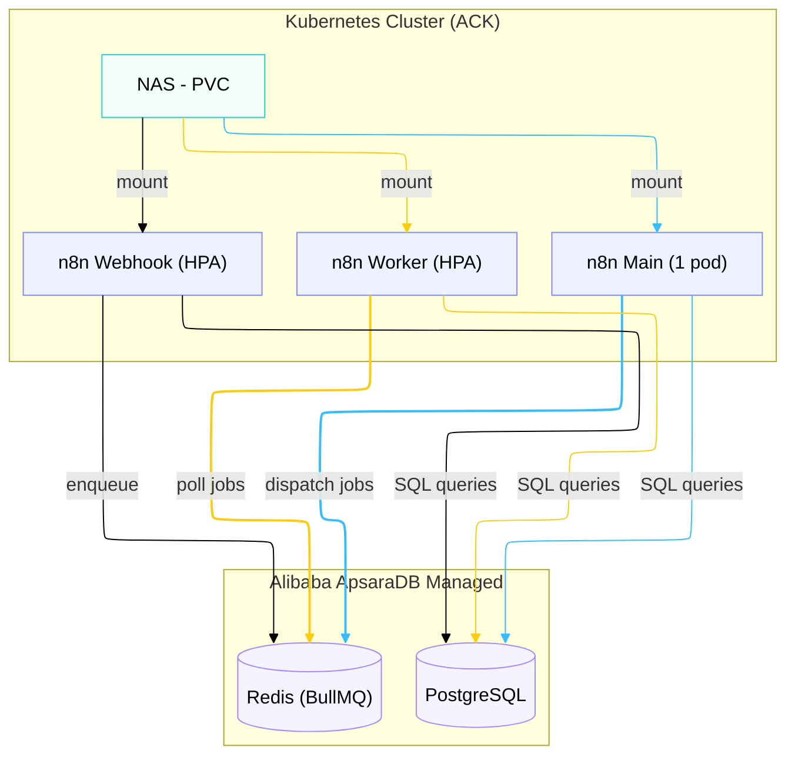
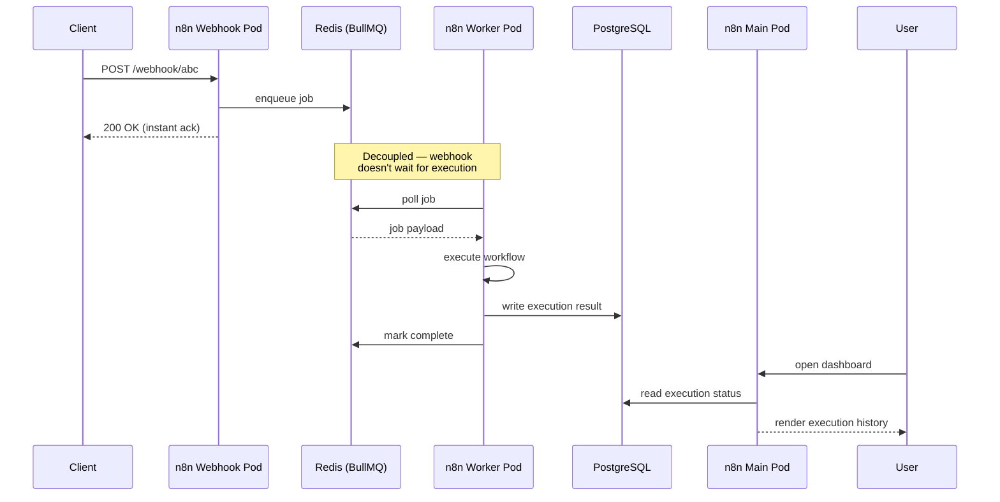
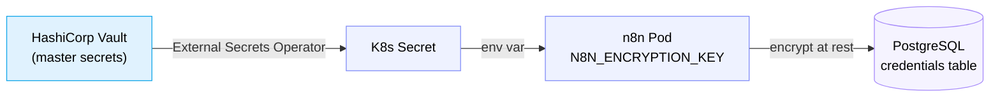
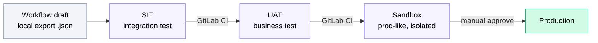

At DOKU, we use **n8n** as our internal *workflow automation platform*. It handles many critical processes such as data synchronization, notifications to Slack/Email, and *file transfer automation* with external parties.

When the scale of automation started growing, running `docker-compose up` on a single VM was no longer robust enough for *production* at a *finance company*. We needed something *scalable*, *highly available*, and secure.

This article covers the architecture we use to deploy n8n in a centralized, *self-hosted* manner on top of Kubernetes.

## Why n8n?

Before choosing n8n, I evaluated three main options for the internal team:

| Criteria | n8n | Airflow | Jenkins |
|----------|-----|---------|---------|
| Visual UI for *workflow* | ✅ Drag & drop | ⚠️ Available, but DAG-centric | ❌ Pipeline as code |
| Learning curve for ops | Low | High (Python DAG) | Medium |
| Built-in Integrations | ✅ (800+ nodes) | ❌ (Custom operator) | ⚠️ Plugin |

n8n wins on UI clarity. Operations engineers (*ops*) and the *product* team can even read the flow without needing to understand *code*.

> **Trade-off:** n8n is less suited for heavy data pipelines (ETL at GB scale). For that, Airflow or Spark is far more appropriate. But for *event-driven workflows*, n8n is squarely in its comfort zone.

## Architecture: Queue Mode on Kubernetes (ACK)

We deploy n8n on Alibaba Cloud Container Service for Kubernetes (ACK). Rather than running databases inside the K8s *cluster*, we shift *stateful* components to *managed services* (ApsaraDB).



### Core Components

The "Queue Mode" architecture splits n8n into several pod types:

1. **Main pod (1 replica):** Runs the editor UI, API server, and scheduler (*cron jobs*). This pod doesn't run heavy *workflows*; it only *dispatches* work to Redis.
2. **Worker pods (2–6 replicas, HPA):** The main *workhorse*. If 100 executions are running simultaneously, these *workers* pull tasks from Redis and execute them. We use *Horizontal Pod Autoscaler* based on memory and CPU.
3. **Webhook pods (1–5 replicas, HPA):** Dedicated to handling *incoming HTTP requests*. Separating webhooks prevents *traffic spikes* from affecting Main pod UI responsiveness.
4. **Managed PostgreSQL:** Stores *credentials*, *workflow* configurations, and execution history.
5. **Managed Redis:** Acts as the *message broker* (BullMQ) between Main, Webhook, and Worker.
6. **NAS (Network Attached Storage):** Used as a `ReadWriteMany` *Persistent Volume*. Its primary function is sharing the `binaryData` folder across all pods, enabling large *files* to be processed without entering the database.

### Queue Mode in Action

The key insight of Queue Mode: **the Webhook pod doesn't wait for execution to finish**. It enqueues the job and returns 200 OK instantly — Workers pick it up asynchronously. This is what lets us handle traffic spikes without blocking incoming requests.



## Helm Values Configuration

Here is a snippet of *Helm values* for the *Production* environment, enabling Queue mode and connecting it to external components:

```yaml
# values-prod.yaml (simplified)
main:
  extraEnv:
    # Enable queue architecture
    EXECUTIONS_MODE:
      value: "queue"
    QUEUE_MODE:
      value: "redis"
    QUEUE_BULL_REDIS_HOST:
      value: "redis.example.internal"
      
    # Database connection
    DB_TYPE:
      value: "postgresdb"
    DB_POSTGRESDB_HOST:
      value: "postgres.example.internal"
      
    # File storage optimization
    N8N_DEFAULT_BINARY_DATA_MODE:
      value: "filesystem"
    N8N_BINARY_DATA_STORAGE_PATH:
      value: "/home/node/.n8n/binaryData"
      
    # Old execution pruning (Critical)
    EXECUTIONS_DATA_PRUNE:
      value: "true"
    EXECUTIONS_DATA_MAX_AGE:
      value: "72" # Delete execution data after 3 days

worker:
  enabled: true
  concurrency: 10
  replicaCount: 2
  autoscaling:
    enabled: true
    minReplicas: 2
    maxReplicas: 6

webhook:
  enabled: true
  autoscaling:
    enabled: true
    minReplicas: 1
    maxReplicas: 5
```

## Operational Tips at Scale

After this platform went live in *production*, we observed several management areas requiring special attention:

### 1. Credential Encryption
n8n encrypts all sensitive data (such as API Keys, database passwords) using `N8N_ENCRYPTION_KEY`. If this *environment variable* value is lost, all *credentials* become locked and must be re-entered. In an *enterprise* environment, we don't store it as *plain text* — we store it in an external secret manager like **HashiCorp Vault**, which is then automatically injected into Kubernetes Secrets.



### 2. Execution Pruning
Without *pruning*, the `execution_entity` table in the PostgreSQL database can balloon to tens of GB, slowing down n8n execution overall. Via `EXECUTIONS_DATA_MAX_AGE=72`, we delete data older than 3 days. For long-term auditing, there's a separate node in the *workflow* that ships logs to an external system (such as Datadog or ELK).

### 3. Staging Environments and CI/CD
All Helm installations go through a GitLab CI *pipeline*. We separate testing stages into SIT, UAT, Sandbox, and Production. *Workflows* are designed in SIT, exported as `.json`, then imported incrementally until they reach Production.



In the next article, I'll cover the main case study: how we use this n8n cluster to manage and automate the *file transfer (SFTP)* process with third parties.
