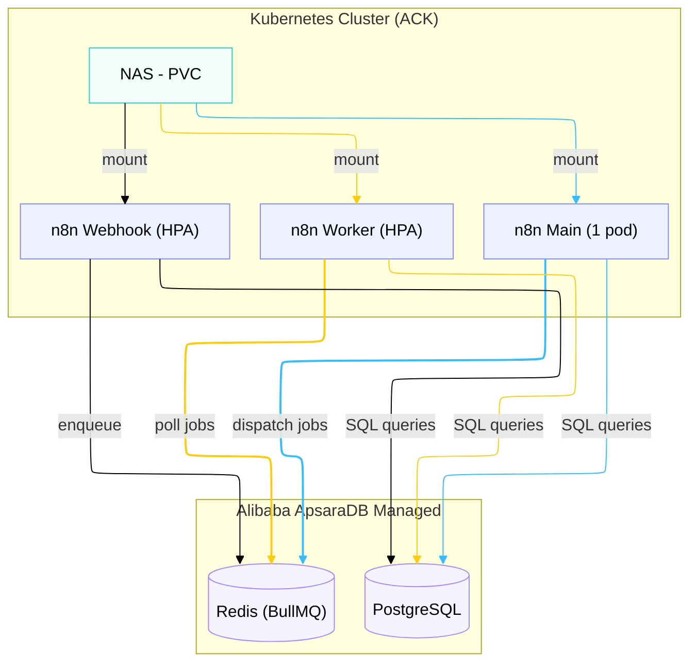

Di DOKU, kita menggunakan **n8n** sebagai *workflow automation platform* internal. Platform ini menangani banyak proses kritis seperti sinkronisasi data, notifikasi ke Slack/Email, hingga *file transfer automation* dengan pihak eksternal. 

Ketika skala otomasi mulai membesar, menjalankan `docker-compose up` di satu VM tidak lagi cukup tangguh untuk *production* di *finance company*. Kita butuh sesuatu yang *scalable*, *highly available*, dan aman.

Artikel ini membahas arsitektur yang kita gunakan untuk men-deploy n8n secara terpusat dan *self-hosted* di atas Kubernetes.

## Kenapa n8n?

Sebelum memilih n8n, saya mengevaluasi tiga opsi utama untuk tim internal:

| Kriteria | n8n | Airflow | Jenkins |
|----------|-----|---------|---------|
| UI visual untuk *workflow* | ✅ Drag & drop | ⚠️ Ada, tapi DAG-centric | ❌ Pipeline as code |
| Learning curve untuk ops | Rendah | Tinggi (Python DAG) | Sedang |
| Built-in Integration | ✅ (800+ nodes) | ❌ (Custom operator) | ⚠️ Plugin |

n8n menang di kejelasan UI. Teknisi operasi (*ops*) dan tim *product* bahkan bisa membaca alurnya tanpa harus memahami *code*.

> **Trade-off:** n8n kurang cocok untuk heavy data pipeline (ETL berukuran GB). Untuk itu, Airflow atau Spark jauh lebih tepat. Tapi untuk *event-driven workflow*, n8n berada di zona nyamannya.

## Arsitektur: Queue Mode di Kubernetes (ACK)

Kita men-*deploy* n8n di Alibaba Cloud Container Service for Kubernetes (ACK). Alih-alih menjalankan database di dalam *cluster* K8s, kita menggeser komponen *stateful* ke *managed services* (ApsaraDB).



### Komponen Utama

Arsitektur "Queue Mode" membagi n8n menjadi beberapa tipe pod:

1. **Main pod (1 replica):** Menjalankan UI editor, API server, dan scheduler (*cron job*). Pod ini tidak menjalankan *workflow* yang berat; ia hanya melempar pekerjaan (*dispatch*) ke Redis.
2. **Worker pods (2-6 replicas, HPA):** *Workhorse* utama. Jika ada 100 eksekusi berjalan bersamaan, *worker* inilah yang menarik tugas dari Redis dan menjalankannya. Kita menggunakan *Horizontal Pod Autoscaler* berdasarkan memori dan CPU.
3. **Webhook pods (1-5 replicas, HPA):** Khusus menangani *incoming HTTP request*. Memisahkan webhook mencegah *spike traffic* mengganggu responsivitas UI di Main pod.
4. **Managed PostgreSQL:** Menyimpan *credential*, pengaturan *workflow*, dan histori eksekusi.
5. **Managed Redis:** Bertindak sebagai *message broker* (BullMQ) di antara Main, Webhook, dan Worker.
6. **NAS (Network Attached Storage):** Digunakan sebagai *Persistent Volume* mode `ReadWriteMany`. Fungsi utamanya adalah berbagi folder `binaryData` ke semua pod, memungkinkan *file* raksasa diproses tanpa masuk ke dalam database.

## Helm Values Configuration

Berikut adalah potongan *Helm values* untuk environment *Production*, yang mengaktifkan Queue mode dan menyambungkannya ke komponen eksternal:

```yaml
# values-prod.yaml (simplified)
main:
  extraEnv:
    # Aktifkan arsitektur queue
    EXECUTIONS_MODE:
      value: "queue"
    QUEUE_MODE:
      value: "redis"
    QUEUE_BULL_REDIS_HOST:
      value: "redis.example.internal"
      
    # Koneksi Database
    DB_TYPE:
      value: "postgresdb"
    DB_POSTGRESDB_HOST:
      value: "postgres.example.internal"
      
    # Optimasi Penyimpanan File
    N8N_DEFAULT_BINARY_DATA_MODE:
      value: "filesystem"
    N8N_BINARY_DATA_STORAGE_PATH:
      value: "/home/node/.n8n/binaryData"
      
    # Pruning Eksekusi Lama (Krusial)
    EXECUTIONS_DATA_PRUNE:
      value: "true"
    EXECUTIONS_DATA_MAX_AGE:
      value: "72" # Hapus data eksekusi setelah 3 hari

worker:
  enabled: true
  concurrency: 10
  replicaCount: 2
  autoscaling:
    enabled: true
    minReplicas: 2
    maxReplicas: 6

webhook:
  enabled: true
  autoscaling:
    enabled: true
    minReplicas: 1
    maxReplicas: 5
```

## Tips Operasional Skala Besar

Setelah platform ini aktif di *production*, kami mengamati beberapa area pengelolaan yang menuntut perhatian khusus:

### 1. Enkripsi Credential
n8n mengenkripsi semua data sensitif (seperti API Keys, password database) menggunakan `N8N_ENCRYPTION_KEY`. Jika nilai *environment variable* ini hilang, seluruh *credential* macet dan harus diulang. Di lingkungan *enterprise*, kami tidak menyimpannya dalam bentuk *plain text*, melainkan menyimpannya di pengelola rahasia eksternal seperti **HashiCorp Vault**, yang kemudian diinjeksi secara otomatis ke Kubernetes Secret.

### 2. Execution Pruning
Tanpa *pruning*, tabel `execution_entity` pada database PostgreSQL dapat membengkak menjadi puluhan GB yang melambatkan eksekusi n8n secara keseluruhan. Melalui variabel `EXECUTIONS_DATA_MAX_AGE=72`, kami menghapus data yang lebih lama dari 3 hari. Untuk audit jangka panjang, ada node terpisah dalam *workflow* yang menembak log ke sistem eksternal (seperti Datadog atau ELK).

### 3. Lingkungan *Staging* dan CI/CD
Semua instalasi Helm melalui *pipeline* GitLab CI. Kita memisahkan tahap pengujian menjadi SIT, UAT, Sandbox, dan Production. *Workflow* didesain di SIT, diekspor sebagai `.json`, lalu diimpor secara bertahap sampai masuk ke ranah Production.

Dalam artikel selanjutnya, saya akan membahas studi kasus utamanya: bagaimana kita menggunakan klaster n8n ini untuk mengelola dan mengotomasi proses *file transfer (SFTP)* dengan pihak ketiga.
