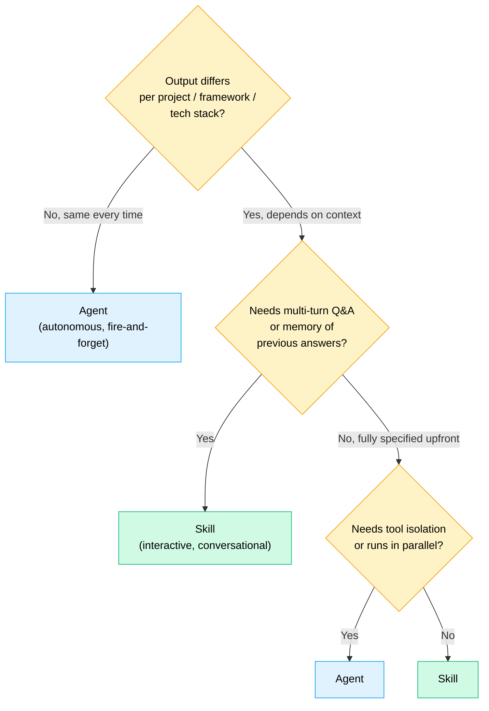

When first reading the Claude Code documentation, Skills and Agents look like two names for the same thing, both "extend" Claude's capabilities, both can be configured per project, both can be invoked during a work session.

In reality, the two work in fundamentally different ways. And using the wrong one for the wrong task produces a frustrating experience, either because AI doesn't "remember" context that was already provided, or because a task that should be autonomous keeps asking for confirmation.

---

## The Most Fundamental Difference

The easiest way to understand the difference: **where they run and what they remember**.

**A Skill** runs inside the same conversation. It can see the entire conversation history, everything already discussed, everything already answered, all context already provided. It's multi-turn: it can ask several questions, remember the answers, and generate output based on those answers.

**An Agent** runs in a separate, isolated context window. It doesn't see the conversation history. It receives one task, works autonomously, and returns a result. When done, it "remembers" nothing, its instance ends.

Simple visualization:

```
Main Conversation
├── History: [entire conversation]
├── Skill System Prompt
├── Conversation Q&A
└── ← Skill runs here, sees all ↑

vs.

Main Conversation
└── spawns → [Agent Context Window]
                ├── Task description only
                ├── Allowed tools: [limited]
                └── Does not see main conversation history
```

---

## When to Use a Skill

A Skill is the right choice when:

**Output differs per project/stack.** A skill that generates an integration layer for a banking partner needs to know: what framework is used (WebFlux? MVC? Play Framework?), what Java version, what base package. This information differs per project and needs to be discovered interactively.

**The task needs multi-turn Q&A.** A Skill can ask "Which framework is used?" → wait for answer → "What Java version?" → wait for answer → generate output based on all answers. This can't be done with an Agent because Agents aren't multi-turn.

**Access to conversation history is needed.** If a task depends on context already discussed earlier in the session ("generate tests for the service we just created"), a Skill is the right choice because it can see that history.

**Shared across teams via registry.** Skills are installed from a git registry and can be shared among engineers. This ensures all engineers on the team use the same prompt template for repetitive tasks.

**Example Skills we have:**

`rem-bank-connector`, Before generating, this skill asks: framework (WebFlux/MVC/Play), Java version, base package, auth pattern used. Then generates boilerplate consistent with other bank integrations already in the codebase.

`service-test-generator`, Generates Cucumber scenarios + Testcontainers setup from a spec or CSV. This skill asks about the test patterns used in the project before generating, so the output fits directly with the existing test infrastructure.

---

## When to Use an Agent

An Agent is the right choice when:

**The task is autonomous and well-defined.** Generate CRUD for a `Transaction` entity with fields [X, Y, Z], this is a task that can be fully specified upfront. Agent receives the instructions, works, finishes. No back-and-forth needed.

**Input can be fully specified upfront.** No discovery is needed. All required information can be provided in the task description.

**Tool isolation is needed.** An Agent can be restricted to only use certain tools, for example, read-only file access, no writes. This is useful for tasks that need security constraints, or to prevent an Agent from accidentally modifying things it shouldn't.

**Can run in parallel.** Because an Agent runs in a separate context, multiple agents can run in parallel for independent tasks. This can't be done with a Skill.

**How to define an Agent:** Create a `.md` file in `.claude/agents/`, no installation required. Just commit to the repository, and everyone who clones the repo already has the same Agent.

Example:

```markdown
---
name: spring-crud-generator
description: Generate CRUD boilerplate for a Spring Boot entity
allowed-tools: Read, Write, Bash
---

Generate CRUD boilerplate for the provided entity.
Stack: Java 21, Spring Boot 3, R2DBC, PostgreSQL.
Follow the pattern from the existing TransactionService.

Required input:
- Entity name
- Field list with types
- Base package

Generate: Entity, DTO, Repository, Service, Controller, Unit Tests.
```

---

## Decision Framework

The key question we always use:

> **"Does the output differ per project/framework/stack, AND does it need to be discovered interactively?"**



Comparison table for more specific cases:

| Task Characteristic | Skill | Agent |
|---|---|---|
| Needs multi-turn Q&A | ✓ | ✗ |
| Needs to remember previous answers | ✓ | ✗ |
| Autonomous task, fire-and-forget | ✗ | ✓ |
| Input can be fully specified upfront | ✗ | ✓ |
| Needs tool isolation/restriction | ✗ | ✓ |
| Can run in parallel | ✗ | ✓ |
| Shared via git registry | ✓ | via repo commit |

---

## Comparison: Claude Code vs Codex CLI vs Gemini CLI

Since I'm often asked for this comparison, here's a brief overview of the broader ecosystem:

| Feature | Claude Code | Codex CLI | Gemini CLI |
|---|---|---|---|
| Interactive Skills (Q&A plugin) | ✅ Native | ❌ | ❌ (web Gems only) |
| Agent persona files (.md) | ✅ Native | ⚠️ SDK-based | ✅ via Extensions |
| Plugin/extension marketplace | ✅ Native | ❌ | ✅ Extension Gallery |
| Multi-agent orchestration | ✅ Native | ✅ Agents SDK | ✅ via Extensions |
| MCP tool support | ✅ | ✅ | ✅ |
| Project instructions file | CLAUDE.md | AGENTS.md | GEMINI.md |
| Tool restriction per agent | ✅ | ❌ | ❌ |

MCP is common ground, all three tools support it. But for Skills (interactive Q&A plugin) and tool restriction per agent, Claude Code currently has the most mature ecosystem.

This isn't a claim that Claude Code is "best" in absolute terms, the AI coding tools ecosystem moves fast and the situation can change. But for teams investing in a Skills and Agents ecosystem, Claude Code has the strongest foundation right now.

---

## Building Skills and Agents for the Team

For SAs or Tech Leads who want to build an internal Skills and Agents library:

**Build a Skill when:**
- Output differs per project (framework, stack, conventions)
- Discovery Q&A is needed before generating
- The team needs consistency, all engineers generate with the same patterns
- Will be shared via registry to multiple projects

**Build an Agent when:**
- Repetitive task with well-defined input
- Can be fully autonomous, no confirmation needed
- Needs tool isolation for security
- Can be parallelized with other agents

Teams share Agents by committing `.claude/agents/` to the project repository, immediately available to everyone who clones the repo.

Teams share Skills via git registry, engineers install with one command, auto-updates when a new version is available.

---

## Series Conclusion

This is the final article in the **AI-Assisted Software Development** series. If there's one takeaway from the entire series:

**AI is most effective not when used ad hoc, but when integrated into a structured workflow with clear ownership and well-defined checkpoints.**

Good PRD → detailed PID → solid solution design → explicit spec → incremental code generation. Each stage depends on the previous one. Shortcuts at one stage will pay an expensive price at the next.

Skills and Agents are a way to codify this knowledge, turning "how we work" from unread documents into tools that are used every day.

Good luck, and I hope it's useful.

---

*Firman Hanafi is a Solutions Architect at an Indonesian payment gateway company, focused on financial core systems, microservices architecture, and AI-assisted engineering practices.*

*Full series: [01 - Why AI in PRDs?] · [02 - Serena + MCP] · [03 - Solution Design] · [04 - Spec Before Code] · [05 - Structured Code Generation] · [06 - Token Efficiency] · [07 - Skills vs Agents]*
