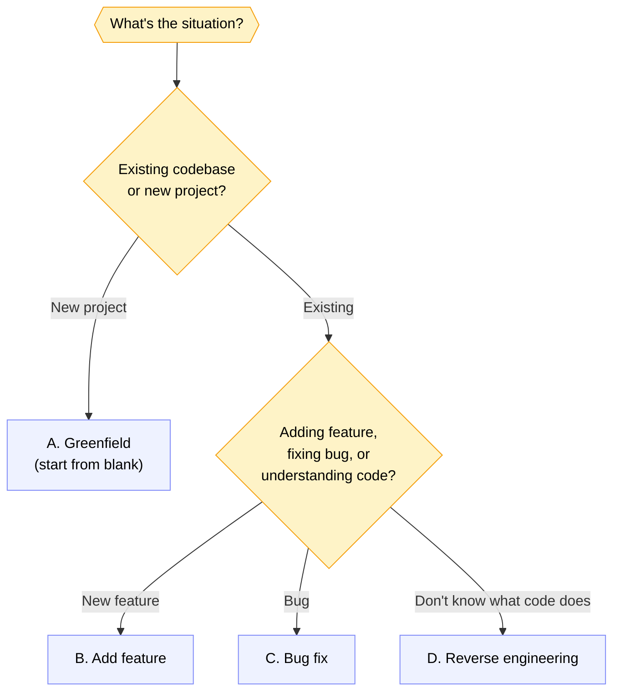

There is one principle that applies consistently in AI-assisted development:

> *Output Quality = f(Input Quality)*

This isn't a metaphor. It's an empirical observation from hundreds of Claude Code sessions on our production codebase.

When an engineer provides a specific prompt with clear context, AI output is almost always a solid starting point. When the prompt is ambiguous and context-free, AI will guess — and AI's guesses about your tech stack, the patterns in use, or specific business logic are almost always wrong.

Imagine hiring a contractor for home renovation. The more detailed the brief you provide — materials, dimensions, budget constraints, aesthetic preferences — the fewer revisions are needed. AI works with the same logic.

The 4 scenarios in this article cover the spectrum:



Each scenario needs a different spec format — that's why one-size-fits-all prompts produce inconsistent output.

---

## CLAUDE.md: A Permanent Contract with AI

Before diving into the 4 scenarios, there's one setup to do once that applies permanently for the entire project: **CLAUDE.md**.

CLAUDE.md is a file that Claude Code reads at the start of every session. Its contents are project context that doesn't need to be repeated in every prompt — tech stack, code conventions, patterns in use, and things AI is not allowed to do without explicit approval.

Example CLAUDE.md for our Spring Boot project:

```markdown
# Project: payment-service-api

## Tech Stack
- Java 21, Spring Boot 3 WebFlux, R2DBC, PostgreSQL, Kafka

## Conventions
- Use DatabaseClient (not Spring Data repositories)
- Constructor injection only — no @Autowired field injection
- All public service methods must have unit tests

## Do Not
- Don't add new dependencies without explicit approval
- Don't use Pageable — use Flux<T> streaming
- Don't change existing API contracts without discussion

## Reference Patterns
- See PaymentService for reactive service layer pattern
- See TransferRepository for database query patterns
```

With CLAUDE.md, Claude Code doesn't need to be told every session that this project uses WebFlux not MVC, or that we don't use Spring Data repositories. This context is persistent.

This saves significant tokens and — more importantly — reduces the chance of Claude producing code with the wrong patterns.

---

## Scenario A: Greenfield Project

A new project from scratch is the most open-ended scenario, and therefore the most prone to going wrong if the spec isn't clear.

**What needs to be defined before generating code:**

- Explicit stack and versions: Java 21, Spring Boot 3.x, PostgreSQL 15, Kafka 3.x
- Desired folder structure and package layout
- Naming conventions, error handling, and logging format
- Module list with priorities — what gets built first

**Effective prompt pattern:**

```
Project: [project name]
Stack: Java 21, Spring Boot 3, R2DBC, PostgreSQL, Kafka

Package structure:
com.company.service
  ├── domain/
  ├── infrastructure/
  │   ├── persistence/
  │   └── messaging/
  ├── application/
  └── api/

Conventions:
- Reactive: WebFlux + R2DBC
- No Spring Data repositories — use DatabaseClient
- Constructor injection only

Step 1: Setup skeleton — create folder structure and empty classes.
DO NOT start implementing business logic yet.
```

The key here is **"Step 1"** and **"DO NOT start implementing"**. Without these instructions, Claude tends to jump straight to implementation code — which looks productive but is dangerous because a wrong direction only becomes apparent after a lot of code has been written.

Review the skeleton first, confirm the direction is correct, then proceed to implementation.

---

## Scenario B: Adding a New Feature

This is the most common scenario in our team. There's a service already running, and a new capability needs to be added.

**What needs to be defined:**

- What's new: new endpoint, new table, new event
- What's modified: existing classes or tables that need to change
- What's deleted or deprecated
- Error scenarios: what conditions return errors, what HTTP code, what internal error code

**Effective prompt pattern:**

```
Feature: [feature name]
Reference: See [ServiceName] as a pattern reference

What's new:
- Endpoint POST /api/v1/[resource]
- New table: [table_name] with columns [column list]
- Kafka event: [TOPIC_NAME] published after success

What's modified:
- [ExistingService]: add method [methodName]
- [ExistingTable]: add column [column_name]

Error scenarios:
- [Condition A] → 400 ERR_XXX_001
- [Condition B] → 409 ERR_XXX_002

Constraint: Don't change existing API contracts.
Backward compatible with previous version.

Before generating code: show the change plan first.
I'll confirm before you start editing files.
```

The **"show the change plan first"** instruction is the most important one here. Claude will list all the files it will modify and what changes it will make — this is the opportunity to catch wrong assumptions before code is written.

---

## Scenario C: Bug Fix

Bug fixes have different characteristics: the constraints are very tight. The fix must be minimally invasive, must not change behavior that's already working, and must not change the API contract.

**What needs to be defined:**

- Bug ID and severity
- Explicit reproduction steps
- Expected behavior vs actual behavior
- Relevant logs or stack traces
- Constraint: how "invasive" a fix is permitted to be

**Effective prompt pattern:**

```
Bug: [BUG-ID] - [short description]
Severity: [Critical/High/Medium/Low]

Reproduction steps:
1. [Step 1]
2. [Step 2]
3. [What actually happens]

Expected: [what should happen]
Actual: [what happens]

Stack trace:
[paste stack trace here]

Constraint:
- Fix must be minimally invasive
- Don't change API contract
- Don't add new dependencies

Step: Provide a hypothesis about root cause first.
I'll confirm the hypothesis before you propose a fix.
```

"Provide a hypothesis first" is the key for bug fixes. AI that immediately proposes a fix without a hypothesis usually fixes the symptom, not the root cause. By requesting and confirming a hypothesis, we ensure we're fixing the right problem.

---

## Scenario D: Reverse Engineering

This is the most underrated scenario — and extremely useful for teams with legacy codebases.

The situation: there's code that has been running for years, no documentation, the engineer who wrote it is long gone, and you need to understand how it works before refactoring or adding a feature.

**Use cases:**
- Onboarding new engineers to complex systems
- Pre-refactoring analysis
- Security audits
- Creating documentation that never existed

**Prompt 1 — Architecture overview:**
```
Use Serena to navigate this project.
Provide an architecture overview:
- What layers exist
- What patterns are used (MVC, hexagonal, etc.)
- Main entry points
- Important external dependencies
```

**Prompt 2 — Trace one feature:**
```
Trace the [feature name] flow from entry point to database.
Format: PlantUML sequence diagram.
Include actual class names and method names from the codebase.
```

**Prompt 3 — Security audit:**
```
Review [ServiceName] for potential security issues:
- SQL injection
- Missing authentication/authorization
- Weak input validation
- Sensitive data exposure

Format: list of findings with severity and specific code locations.
```

The output from reverse engineering becomes documentation that previously didn't exist — and can go directly into the repository as part of onboarding documentation.

---

## Anti-Patterns to Avoid

From our experience, here are the things that most often cause AI to generate useless code:

**Prompt too short.** "Create a service for money transfer" is too open-ended an instruction for a production payment system. AI doesn't know your tech stack, the patterns in use, or what constraints exist.

**No reference to existing code.** If the project already has established patterns, always point AI to one example. "Follow the same pattern as in PaymentService" produces output far more consistent with the codebase.

**Asking for everything at once.** Asking AI to generate an entire feature at once almost always produces inconsistent code. Incremental is far better — skeleton first, review, then implementation layer by layer.

**Not providing constraints.** Without explicit constraints, AI makes assumptions. In payment systems, wrong assumptions can lead to financial loss or compliance issues.

**Not reviewing the hypothesis before the fix.** Specifically for bug fixes: always confirm the root cause hypothesis before Claude starts writing fix code.

---

## Conclusion

A good spec is the best investment in AI-assisted development. Time spent writing a detailed spec will come back multiplied in the form of immediately relevant output, fewer revisions, and code that's consistent with team standards.

CLAUDE.md is a foundation that only needs to be created once. The four spec scenarios above are a framework that can be directly applied to almost any development situation encountered daily.

Next article: **structured code generation** — why a skeleton must always come before implementation, and how checkpoint-based generation produces code that is more consistent and easier to review.

---

*This article is part of the **AI-Assisted Software Development** series — field experience using Claude Code in a payment fintech engineering team.*
