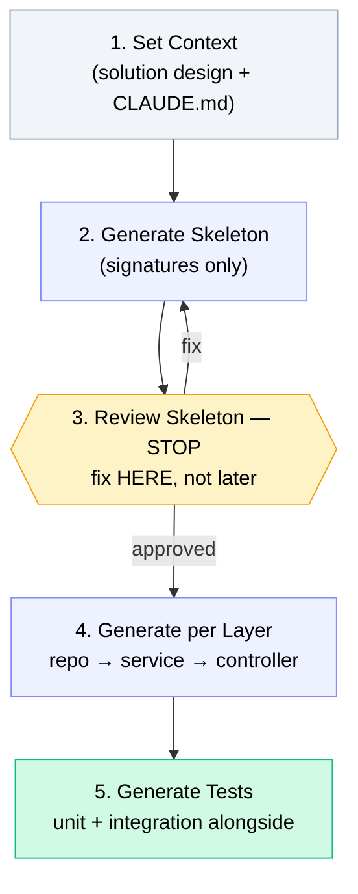

There's a temptation that's almost impossible to avoid when first using Claude Code: asking AI to generate an entire feature all at once.

The prompt looks efficient: "Create a complete service for feature X with controller, service, repository, and unit tests."

The result? Code that looks complete, compiles without errors, but:
- Its pattern is inconsistent with other code in the project
- Important edge cases aren't handled
- Unit tests only test the happy path
- Hidden bugs that only surface after running

The problem isn't the AI. The problem is the "all at once" approach that leaves no room for review and correction at critical points.

---

## The Code Generation Hierarchy

A more effective approach is to think about code generation as a hierarchy — from the most abstract to the most detailed:

```
Level 4: Review & Refinement
      ↑
Level 3: Method / Function Implementation
      ↑
Level 2: Component / Class
      ↑
Level 1: Overview / Skeleton
```

The principle: **always start from the top, move down incrementally**.

Why is this better? Because a wrong direction detected at Level 1 (skeleton) has near-zero cost — you only need to revise a class signature. A wrong direction detected at Level 3 (after hundreds of lines are written) has a much higher cost.

---

## Workflow: 5-Step Code Generation

This is the workflow we consistently use:



**Step 1: Set Context**

Provide the solution design + constraints + reference to relevant existing code. This input determines the quality of all subsequent output.

```
Context:
- See PaymentService as a reference for the service layer pattern
- Tech stack: Java 21, Spring Boot 3 WebFlux, R2DBC
- Solution design: [paste sequence diagram or API spec]
- Constraints: [paste relevant sections from CLAUDE.md]
```

**Step 2: Generate Skeleton**

Request class signatures and method signatures only — no implementation.

```
Generate skeleton for TransferService:
- Class signature with constructor injection
- Method signatures per the solution design above
- Relevant annotations (@Service, @Transactional, etc.)
- Import statements
DO NOT fill in method implementations. Return signatures only.
```

**Step 3: Review Skeleton — STOP**

This is the most important point that's most often skipped.

Review the generated skeleton: do the method signatures make sense? Are the parameter types correct? Is there a missing method? Is the dependency injection pattern following team standards?

Fixing the skeleton here has minimal cost. Fixing it after implementation has been written costs far more.

**Step 4: Generate per Layer**

After the skeleton is approved, implement layer by layer — not all at once.

```
Repository layer first → review → run tests
Service layer → review → run tests  
Controller layer → review → run tests
```

**Step 5: Generate Tests**

Unit tests and integration tests are generated alongside production code — not after. This ensures test coverage doesn't become an afterthought.

---

## Checkpoint-Based Generation

We use a more formal checkpoint structure for sufficiently complex features:

| Checkpoint | Deliverable | Gate |
|---|---|---|
| CP1 | Domain model (entity, DTO) | Review → commit |
| CP2 | Repository layer | Review → run unit tests |
| CP3 | Service layer | Review → run unit tests |
| CP4 | Controller + API | Review → run unit tests |
| CP5 | Integration tests | Review → PR |

**The non-negotiable rule: zero tolerance for regressions.**

At every checkpoint, run the entire test suite — not just tests for new code. If any test that was previously passing is now failing, it must be fixed at the same checkpoint before moving to the next one.

---

## Claude Skills: Installable Prompt Templates

Beyond manually written prompts, we use **Claude Skills** — prompt templates configured for repetitive tasks that can be installed as plugins.

How it works:
- Skills are stored in an internal git registry
- Engineers install with: `claude plugin install skill-name@registry`
- Auto-trigger: Claude detects a matching task and activates the relevant skill
- Or manual trigger: "Use `service-test-generator` to generate a test suite"

Example skills we have at DOKU:

**`rem-bank-connector`** — Scaffolds a new integration layer for a banking partner. This skill asks: what framework (WebFlux/MVC/Play), Java version, base package, auth pattern used. Then generates boilerplate consistent with other bank integrations already in place.

**`service-test-generator`** — Generates test scenarios from CSV or specs. Output: Cucumber scenarios + Testcontainers setup matching our test infrastructure.

The main benefit of skills: **consistency**. A junior engineer who just joined can generate code with the same patterns as a senior engineer — because the patterns have been codified in a skill.

---

## Code Generation Anti-Patterns

**Asking for everything at once.** Output looks complete but is inconsistent and bug-prone. Always incremental.

**Not providing references to existing code.** Without references, AI doesn't know the team's patterns. The result: code that's technically correct but stylistically foreign in the codebase.

**Skipping the skeleton review.** Wrong-direction errors found at the skeleton level have a low cost. After implementation? Expensive.

**Not running tests at every checkpoint.** Regressions not detected at early checkpoints accumulate and become harder to debug at later checkpoints.

**Letting AI assume the tech stack.** Without CLAUDE.md or explicit context, AI might generate code for Spring MVC when you use WebFlux, or use JPA when you use R2DBC. The result won't compile.

---

## How This Differs from "Vibe Coding"

There's a term that's been getting popular lately: *vibe coding* — let AI generate whatever, just accept and iterate.

For personal projects or prototypes, that's fine. For a production payment system handling the financial transactions of millions of users, that's not an option.

What distinguishes structured code generation from vibe coding:

1. **Review at every checkpoint** — not blind acceptance
2. **Tests at every layer** — before moving to the next layer
3. **Explicit context** — AI knows exactly the constraints and patterns that apply
4. **The engineer remains responsible** — AI is a tool, not a decision maker

Data from our team: with the structured approach, the suggestion accept rate is indeed high (99.5%) — but because engineers already know *when* and *how* to ask AI to produce something that's directly acceptable. Not because they accept everything without review.

---

## Conclusion

Structured code generation isn't about controlling AI — it's about using AI in a way that produces the most useful output.

Skeleton first isn't about not trusting AI. It's about creating an opportunity to correct direction before too much time has been invested.

Checkpoint-based generation isn't about being slow. It's about ensuring each layer is solid before building the next layer on top of it.

Code produced with the structured approach is easier to review, more consistent with team standards, and less likely to have hidden bugs that only surface in production.

Next article: **token efficiency** — how to work economically but accurately, and why this matters for long working sessions with Claude Code.

---

*This article is part of the **AI-Assisted Software Development** series — field experience using Claude Code in a payment fintech engineering team.*
