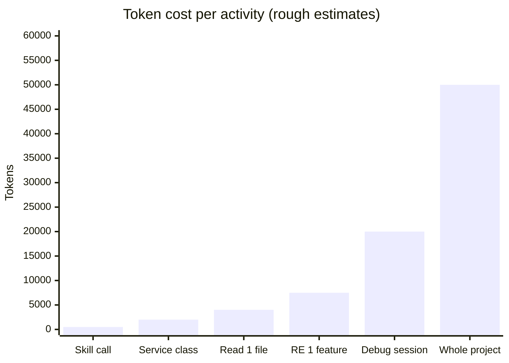

There's a behavior in Claude Code that not everyone notices: the fuller the context window, the lower the quality of its output.

This isn't a weakness that can be patched, it's a fundamental property of how LLMs work. As the context window approaches its limit, the model starts "forgetting" details from the beginning of the conversation, its focus becomes diluted, and output becomes more generic.

For short sessions this isn't an issue. But for long debugging sessions, or for analyzing large codebases, it becomes immediately apparent, Claude starts giving less precise answers, forgetting constraints that were already provided, or repeating suggestions it already gave.

Token efficiency isn't just about saving costs. It's about keeping output quality consistent throughout a working session.

---

## Core Principle: Precision over Volume

The inefficient pattern:

> "Read all files in the `service/` folder and explain how they work."

Claude will read all the files, load all the contents into context, and spend thousands of tokens on content that's likely mostly irrelevant to your question.

The efficient pattern:

> "Use Serena to find `TransferService`. Explain only the `processTransfer` method and its dependencies."

Claude uses Serena for semantic navigation, reads only what's relevant, and the context window stays lean.

The same principle applies to output: if you don't need a long explanation, request a specific format. "Give me only the 3 main points" or "return only the method signature, no explanation" significantly reduces unnecessary output tokens.

---

## 5 Token Efficiency Strategies

**1. Serena for Targeted Reading**

Already covered in a previous article, but worth repeating because it's the most impactful: Serena saves 60–80% of tokens for code analysis tasks.

Without Serena, reading one 500-line Java file = ~4,000 tokens. With Serena and targeted symbol lookup, analyzing a specific method can be just ~400 tokens. If you do 10 such operations in one session, the difference is 36,000 tokens, almost an entire session.

**2. CLAUDE.md for Project Conventions**

Every time you explain "this project uses Java 21, Spring Boot 3, WebFlux not MVC, R2DBC not JPA..." that's burning tokens on context that should already be stored.

CLAUDE.md eliminates this repetition. Write it once, it applies permanently to all sessions in the same project.

Rule of thumb: any information you catch yourself repeating in prompts → put it in CLAUDE.md.

**3. `/compact` When Context Starts Getting Full**

This is a built-in Claude Code command that's underused. When the context window is heavily loaded from a long conversation history, `/compact` asks Claude to summarize that history into a much more concise summary, while retaining active and relevant context.

When to use `/compact`:
- After completing one "chapter" of work (e.g., finishing implementing one layer)
- When Claude starts "forgetting" details provided at the beginning
- Before moving to a new and different task within the same session

Don't wait until the context window is full, `/compact` is most effective when done proactively.

**4. Skills for Repetitive Tasks**

Every skill invocation has an overhead of ~500 tokens for its system prompt. That sounds like a lot, but compare it to the alternative: writing the same context manually in every prompt for repeating tasks.

For tasks repeated exactly the same way multiple times (generating test suites, scaffolding integration layers), a skill is always more efficient than a manual prompt, and the results are more consistent.

**5. Explicit Output Format**

This is the easiest to implement and most often forgotten.

| Prompt | Tokens used |
|---|---|
| "Explain how this service works" | High, Claude will write a long explanation |
| "Explain this service in 3 bullet points" | Low, output is bounded |
| "Return only the method signature, no explanation" | Minimal |
| "Create a table: method name \| purpose \| return type" | Structured and concise |

When you know what format you need, define it explicitly.

---

## Token Usage Estimates

Rough reference for planning a working session:

| Activity | Estimated Tokens | Notes |
|---|---|---|
| Read 1 large Java file (500 lines) | ~4,000 | Consider Serena |
| Generate 1 service class | ~2,000 | Normal, proceed |
| Analyze the entire project | ~50,000+ | Scope to module first |
| Invoke 1 skill | ~500 | Worth it for repetitive tasks |
| Long debugging session | ~20,000+ | Use `/compact` periodically |
| Reverse engineer 1 feature | ~5,000–10,000 | With Serena |

These numbers aren't exact, they depend on code complexity and prompt length. But they're useful as a reference for deciding when to `/compact` or when to scope down the analysis.

---

## Checklist: Before Starting a Claude Code Session

Three questions to answer before starting:

**Before the first prompt:**
- [ ] CLAUDE.md already set up with project conventions?
- [ ] Serena active and finished indexing?
- [ ] Context window from the previous session already compacted or starting a fresh session?

**During prompting:**
- [ ] Question specific enough, not open-ended?
- [ ] Output format defined if there's a preference?
- [ ] For repetitive tasks, is there a skill that can be used?

---

## Signs the Context Window Is Starting to Cause Problems

These are signals that it's time for `/compact` or even a fresh session:

- Claude gives advice that was already given several prompts ago
- Claude "forgets" constraints provided at the beginning of the session
- Responses become more generic and less specific to your codebase
- Claude repeats clarification questions that were already answered

When this happens, drop the ego of "it would be a waste to lose the context", `/compact` or a fresh session will produce output that's far better.

---

## Conclusion

Token efficiency isn't premature optimization, it's quality assurance for AI output. A lean context window produces more precise and more consistent responses.

The five most impactful strategies, ordered by impact:

1. **Serena**: biggest effect, 60–80% reduction for code analysis
2. **CLAUDE.md**: eliminates unnecessary context repetition
3. **/compact**: maintains quality in long sessions
4. **Skills**: efficiency for repetitive tasks
5. **Explicit output format**: easy to implement, immediately noticeable

The last article in this series: **Skills vs Agents**: two different-purpose extensibility mechanisms in Claude Code, and a framework for deciding when to use which.

---

*This article is part of the **AI-Assisted Software Development** series, field experience using Claude Code in a payment fintech engineering team.*
