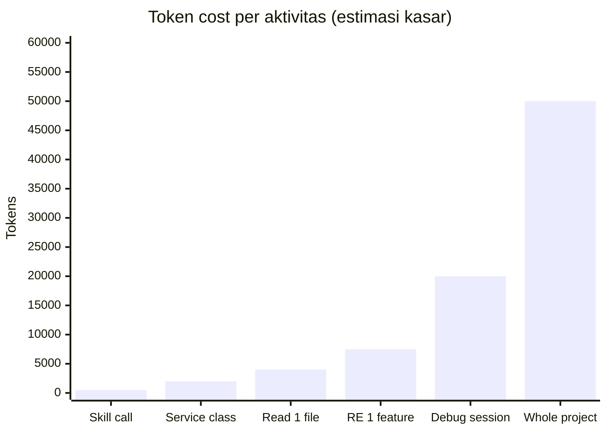

Ada behavior Claude Code yang tidak semua orang sadari: semakin penuh context window-nya, semakin menurun kualitas output-nya.

Ini bukan kelemahan yang bisa di-patch, ini sifat dasar dari bagaimana LLM bekerja. Ketika context window mendekati batas, model mulai "melupakan" detail dari awal conversation, fokusnya terdilusi, dan output menjadi lebih generic.

Untuk sesi kerja yang pendek ini tidak jadi masalah. Tapi untuk sesi debugging yang panjang, atau untuk analisis codebase yang besar, ini langsung terasa, Claude mulai memberikan jawaban yang kurang presisi, melupakan constraint yang sudah diberikan, atau mengulang saran yang sudah diberikan sebelumnya.

Token efficiency bukan hanya tentang hemat biaya. Ini tentang menjaga kualitas output tetap konsisten sepanjang sesi kerja.

---

## Prinsip Dasar: Precision over Volume

Pola yang tidak efisien:

> "Baca semua file di folder `service/` dan jelaskan cara kerjanya."

Claude akan membaca semua file, memuat semua konten ke context, dan menghabiskan ribuan token untuk konten yang mungkin sebagian besar tidak relevan dengan pertanyaan kamu.

Pola yang efisien:

> "Gunakan Serena untuk cari `TransferService`. Jelaskan hanya method `processTransfer` dan dependency-nya."

Claude menggunakan Serena untuk navigasi semantik, membaca hanya yang relevan, dan context window tetap lean.

Prinsip yang sama berlaku untuk output: kalau kamu tidak butuh penjelasan panjang, minta format yang spesifik. "Berikan hanya 3 poin utama" atau "kembalikan hanya method signature, tanpa penjelasan" secara signifikan mengurangi output token yang tidak perlu.

---

## 5 Strategi Token Efficiency

**1. Serena untuk Targeted Reading**

Sudah dibahas di artikel sebelumnya, tapi worth diulang karena ini yang paling impactful: Serena menghemat 60–80% token untuk code analysis tasks.

Tanpa Serena, membaca satu file Java 500 baris = ~4,000 token. Dengan Serena dan targeted symbol lookup, analisis method yang spesifik bisa hanya ~400 token. Kalau kamu melakukan 10 operasi semacam ini dalam satu sesi, perbedaannya adalah 36,000 token, hampir satu session penuh.

**2. CLAUDE.md untuk Project Conventions**

Setiap kali kamu menjelaskan "project ini pakai Java 21, Spring Boot 3, WebFlux, bukan MVC, pakai R2DBC bukan JPA..." itu membuang token untuk konteks yang seharusnya sudah tersimpan.

CLAUDE.md menghilangkan repetisi ini. Tulis sekali, berlaku permanen untuk semua sesi di project yang sama.

Rule of thumb: semua informasi yang kamu temukan diri sendiri mengulangi di prompt → masukkan ke CLAUDE.md.

**3. `/compact` Ketika Context Mulai Penuh**

Ini command built-in Claude Code yang underused. Ketika context window sudah terisi banyak dari history conversation panjang, `/compact` meminta Claude untuk merangkum history tersebut menjadi summary yang jauh lebih ringkas, sambil mempertahankan context yang aktif dan relevant.

Kapan pakai `/compact`:
- Setelah selesai satu "chapter" pekerjaan (misalnya selesai implement satu layer)
- Ketika Claude mulai terasa "lupa" detail yang sudah diberikan di awal
- Sebelum masuk ke task baru yang berbeda dalam sesi yang sama

Jangan tunggu sampai context window penuh, `/compact` paling efektif ketika dilakukan proaktif.

**4. Skills untuk Repetitive Tasks**

Setiap skill yang di-invoke punya overhead ~500 token untuk system prompt-nya. Terdengar banyak, tapi bandingkan dengan alternatifnya: menulis konteks yang sama secara manual di setiap prompt untuk task yang berulang.

Untuk task yang sama-persis diulang berkali-kali (generate test suite, scaffold integration layer), skill selalu lebih efisien dari prompt manual, dan hasilnya lebih konsisten.

**5. Explicit Output Format**

Ini yang paling mudah diimplementasi dan sering dilupakan.

| Prompt | Token yang digunakan |
|---|---|
| "Jelaskan cara kerja service ini" | Tinggi, Claude akan tulis penjelasan panjang |
| "Jelaskan service ini dalam 3 bullet point" | Rendah, output bounded |
| "Kembalikan hanya method signature, tanpa penjelasan" | Minimal |
| "Buat tabel: method name \| purpose \| return type" | Terstruktur dan ringkas |

Ketika kamu tahu format apa yang kamu butuhkan, definisikan secara eksplisit.

---

## Estimasi Token Usage

Referensi kasar untuk planning sesi kerja:

| Aktivitas | Estimasi Token | Catatan |
|---|---|---|
| Baca 1 file Java besar (500 baris) | ~4,000 | Pertimbangkan Serena |
| Generate 1 service class | ~2,000 | Normal, lanjutkan |
| Analisis seluruh project | ~50,000+ | Scope ke module dulu |
| Invoke 1 skill | ~500 | Worth it untuk task berulang |
| Sesi debugging panjang | ~20,000+ | Gunakan `/compact` periodik |
| Reverse engineering 1 feature | ~5,000–10,000 | Dengan Serena |

Angka ini bukan exact, tergantung kompleksitas kode dan panjang prompt. Tapi berguna sebagai referensi untuk memutuskan kapan perlu `/compact` atau kapan perlu scope down analisis.

---

## Checklist: Sebelum Mulai Sesi Claude Code

Tiga pertanyaan yang perlu dijawab sebelum mulai:

**Sebelum prompt pertama:**
- [ ] CLAUDE.md sudah di-setup dengan project conventions?
- [ ] Serena sudah aktif dan selesai indexing?
- [ ] Context window dari sesi sebelumnya sudah di-compact atau mulai fresh session?

**Selama prompting:**
- [ ] Pertanyaan sudah cukup spesifik, bukan open-ended?
- [ ] Output format sudah didefinisikan kalau ada preferensi format tertentu?
- [ ] Untuk task berulang, ada skill yang bisa dipakai?

---

## Tanda-tanda Context Window Mulai Bermasalah

Ini sinyal bahwa sudah waktunya `/compact` atau bahkan mulai fresh session:

- Claude memberikan saran yang sudah diberikan beberapa prompt sebelumnya
- Claude "melupakan" constraint yang sudah diberikan di awal sesi
- Respons mulai lebih generic dan kurang spesifik ke codebase kamu
- Claude mengulang pertanyaan klarifikasi yang sudah dijawab

Ketika ini terjadi, buang ego "sayang kalau context-nya hilang", /compact atau fresh session akan menghasilkan output yang jauh lebih baik.

---

## Kesimpulan

Token efficiency bukan optimasi prematur, ini quality assurance untuk output AI. Context window yang lean menghasilkan respons yang lebih presisi dan lebih konsisten.

Lima strategi yang paling impactful, diurutkan dari yang paling berdampak:

1. **Serena**: efek terbesar, 60–80% pengurangan untuk code analysis
2. **CLAUDE.md**: eliminasi repetisi konteks yang tidak perlu
3. **/compact**: jaga kualitas di sesi yang panjang
4. **Skills**: efisiensi untuk task berulang
5. **Explicit output format**: mudah diimplementasi, langsung terasa

Artikel terakhir dalam seri ini: **Skills vs Agents**: dua mekanisme extensibility Claude Code yang berbeda tujuan, dan framework untuk memutuskan kapan pakai yang mana.

---

*Artikel ini bagian dari seri **AI-Assisted Software Development**: pengalaman lapangan menggunakan Claude Code di tim engineering payment fintech.*
